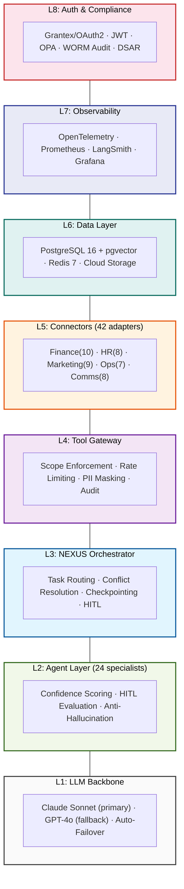
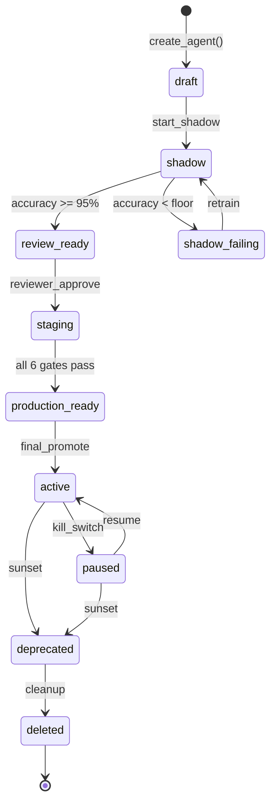
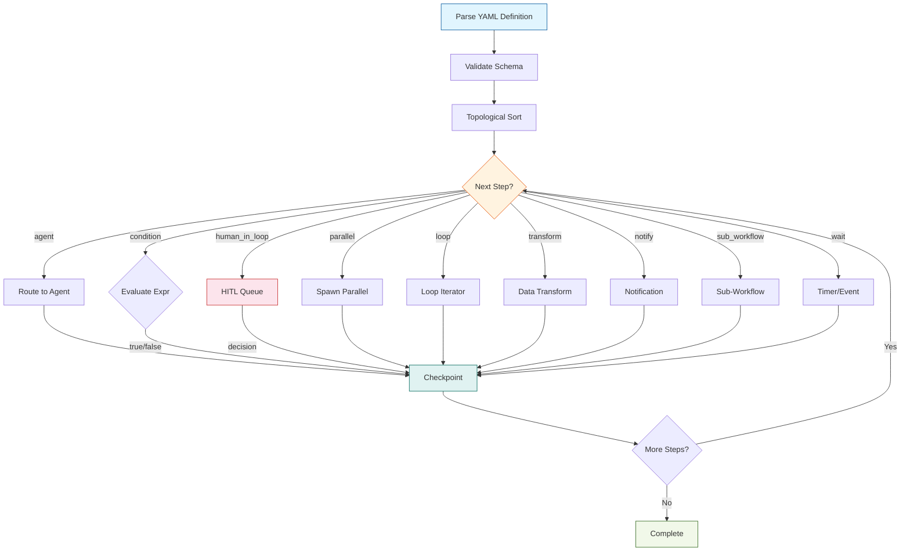

# AgenticOrg

**Enterprise Agent Swarm Platform** -- 24 specialist AI agents orchestrated by NEXUS, connected to 42 enterprise systems, with full governance, compliance, and unlimited scaling.

[](LICENSE)
[](https://python.org)
[](https://react.dev)
[](.github/workflows/deploy.yml)

---

## What is AgenticOrg?

AgenticOrg deploys **24 specialist AI agents** across Finance, HR, Marketing, Operations, and Back Office -- coordinated by the **NEXUS orchestrator** -- to automate enterprise workflows end-to-end. Each agent has scoped tool access, confidence-based HITL escalation, and full audit trails.

### Key Numbers

| Metric | Value |
|--------|-------|
| Specialist Agents | 24 + NEXUS orchestrator |
| Enterprise Connectors | 42 (typed, with circuit breakers) |
| Workflow Step Types | 9 (agent, condition, HITL, parallel, loop, transform, notify, sub-workflow, wait) |
| JSON Schema Templates | 18 (Invoice, Employee, Contract, etc.) |
| Test Cases | 161 (unit, integration, security, scaling) |
| Database Tables | 18 (PostgreSQL + pgvector + RLS) |
| Prometheus Metrics | 13 |
| OpenTelemetry Spans | 7 |

---

## Architecture



> See [docs/architecture.md](docs/architecture.md) for the full architecture guide with detailed diagrams.

### Agent Domains

| Domain | Agents | Examples |
|--------|--------|----------|
| **Finance** | 6 | AP Processor, AR Collections, Reconciliation, Tax Compliance, Close Agent, FP&A |
| **HR** | 6 | Talent Acquisition, Onboarding, Payroll Engine, Performance Coach, L&D, Offboarding |
| **Marketing** | 5 | Content Factory, Campaign Pilot, SEO Strategist, CRM Intelligence, Brand Monitor |
| **Operations** | 5 | Support Triage, Contract Intelligence, Compliance Guard, IT Operations, Vendor Manager |
| **Back Office** | 3 | Risk Sentinel, Legal Ops, Facilities Agent |

---

## Quick Start

### Prerequisites

- Python 3.12+
- Node.js 20+
- Docker & Docker Compose

### 1. Clone and configure

```bash
git clone https://github.com/your-org/agenticorg.git
cd agenticorg
cp .env.example .env
# Edit .env with your API keys (ANTHROPIC_API_KEY is required)
```

### 2. Start infrastructure

```bash
docker compose up -d postgres redis minio
```

### 3. Run migrations

```bash
# Migrations auto-run via Docker volume mount to initdb.d
# Or manually:
psql -h localhost -U agenticorg -d agenticorg -f migrations/001_extensions.sql
psql -h localhost -U agenticorg -d agenticorg -f migrations/002_core.sql
psql -h localhost -U agenticorg -d agenticorg -f migrations/003_operational.sql
psql -h localhost -U agenticorg -d agenticorg -f migrations/004_scaling.sql
psql -h localhost -U agenticorg -d agenticorg -f migrations/005_rls.sql
psql -h localhost -U agenticorg -d agenticorg -f migrations/006_partitions.sql
```

### 4. Start the API

```bash
pip install -e ".[dev]"
uvicorn api.main:app --host 0.0.0.0 --port 8000 --reload
```

### 5. Start the UI

```bash
cd ui
npm install
npm run dev
```

### 6. Or use Docker Compose for everything

```bash
docker compose up -d
# API: http://localhost:8000
# UI:  http://localhost:3000
# API docs: http://localhost:8000/docs
```

---

## Project Structure

```
agenticorg/
├── api/                    # FastAPI REST API (32 endpoints + WebSocket)
│   ├── v1/                 # Versioned route modules
│   └── websocket/          # Real-time agent activity feed
├── auth/                   # OAuth2/Grantex, JWT, Token Pool, OPA, Scopes
├── connectors/             # 42 typed enterprise connectors
│   ├── finance/            # Oracle Fusion, SAP, GSTN, Banking AA, Stripe, etc.
│   ├── hr/                 # Darwinbox, Greenhouse, Okta, EPFO, etc.
│   ├── marketing/          # HubSpot, Salesforce, Google Ads, Ahrefs, etc.
│   ├── ops/                # Jira, Zendesk, ServiceNow, PagerDuty, etc.
│   ├── comms/              # Slack, SendGrid, Twilio, WhatsApp, Cloud Storage (GCS), GitHub
│   └── framework/          # BaseConnector, auth adapters, circuit breaker
├── core/
│   ├── agents/             # 24 agent implementations + prompts
│   │   ├── prompts/        # Production system prompts (versioned)
│   │   └── base.py         # BaseAgent with LLM execution, HITL, confidence
│   ├── orchestrator/       # NEXUS: task routing, conflict resolution, state
│   ├── llm/                # LLM router (Claude primary, GPT-4o fallback)
│   ├── models/             # SQLAlchemy models (18 tables)
│   ├── schemas/            # Pydantic: API, errors (50 codes), events, messages
│   └── tool_gateway/       # Scope enforcement, rate limiting, PII masking, audit
├── workflows/              # YAML workflow engine
│   ├── engine.py           # Dependency graph, timeouts, retry, HITL pause/resume
│   ├── step_types.py       # 9 step type handlers
│   ├── condition_evaluator.py  # Safe expression evaluator (no eval)
│   └── trigger.py          # 5 trigger types (manual, webhook, email, API, cron)
├── scaling/                # Agent Factory, lifecycle FSM, shadow comparator, HPA, costs
├── observability/          # OpenTelemetry (7 spans), Prometheus (13 metrics), LangSmith
├── audit/                  # DSAR handler, evidence package, HMAC signer
├── migrations/             # 6 PostgreSQL DDL files (extensions, core, ops, scaling, RLS, partitions)
├── schemas/                # 18 JSON Schema data templates
├── tests/                  # 161 test cases (unit, security, scaling)
├── ui/                     # React 18 + TypeScript + Shadcn/ui + Tailwind
│   └── src/
│       ├── pages/          # 10 pages (Dashboard, Agents, Workflows, Approvals, etc.)
│       └── components/     # AgentCard, ApprovalCard, KillSwitch, LiveFeed, etc.
├── helm/                   # Kubernetes Helm charts
├── docker-compose.yml      # Full local dev environment
├── Dockerfile              # API container
└── Dockerfile.ui           # UI container
```

---

## API Reference

The API runs at `http://localhost:8000`. Full OpenAPI docs at `/docs`.

### Core Endpoints

| Method | Path | Description |
|--------|------|-------------|
| `GET` | `/api/v1/health` | Health check |
| `POST` | `/api/v1/agents` | Create agent (starts in shadow mode) |
| `GET` | `/api/v1/agents` | List agents (filterable by domain, status) |
| `GET` | `/api/v1/agents/{id}` | Get agent details |
| `PUT` | `/api/v1/agents/{id}` | Replace agent config |
| `PATCH` | `/api/v1/agents/{id}` | Partial update |
| `POST` | `/api/v1/agents/{id}/pause` | Kill switch (revokes token, stops tasks) |
| `POST` | `/api/v1/agents/{id}/resume` | Resume paused agent |
| `POST` | `/api/v1/agents/{id}/clone` | Clone with scope inheritance |
| `POST` | `/api/v1/agents/{id}/promote` | Promote through lifecycle stages |
| `POST` | `/api/v1/agents/{id}/rollback` | Rollback to prior version |
| `GET` | `/api/v1/workflows` | List workflow definitions |
| `POST` | `/api/v1/workflows` | Create workflow |
| `POST` | `/api/v1/workflows/{id}/run` | Trigger workflow run |
| `GET` | `/api/v1/workflows/runs/{id}` | Get workflow run details |
| `GET` | `/api/v1/approvals` | List HITL approval queue |
| `POST` | `/api/v1/approvals/{id}/decide` | Submit HITL decision |
| `GET` | `/api/v1/audit` | Query audit log |
| `POST` | `/api/v1/connectors` | Register connector |
| `GET/PUT` | `/api/v1/config/fleet_limits` | Fleet governance limits |
| `POST` | `/api/v1/schemas` | Create data schema |
| `POST` | `/api/v1/dsar/access` | GDPR/DPDP data access request |
| `POST` | `/api/v1/dsar/erase` | Right to erasure |
| `POST` | `/api/v1/dsar/export` | Data portability export |
| `GET` | `/api/v1/compliance/evidence-package` | SOC2 evidence package |
| `WS` | `/api/v1/ws/feed/{tenant_id}` | Real-time agent activity feed |

---

## Agent Lifecycle

Every new agent follows a governed promotion path:



- **Shadow mode** is mandatory for new agents (read-only, compared against reference agent)
- **6 quality gates** must pass: output accuracy (>=95%), confidence calibration (r>=0.70), HITL rate (within +-5pp), hallucination rate (0%), tool error rate (<2%), latency (<=1.3x reference)
- **Kill switch** pauses any agent in <30 seconds, revokes token immediately
- **Cost controls** enforce daily token budgets and monthly cost caps with auto-pause

---

## Workflow Execution



---

## Security & Compliance

| Feature | Implementation |
|---------|---------------|
| **Tenant isolation** | PostgreSQL RLS on all 18 tables, Redis key namespacing, Cloud Storage (GCS) prefix isolation |
| **Token scoping** | Per-agent OAuth2 tokens with fine-grained tool:connector:action scopes |
| **PII masking** | Default-on masking of email, phone, Aadhaar, PAN, bank accounts |
| **Audit trail** | Append-only, HMAC-SHA256 signed, 7-year retention, WORM storage |
| **Error taxonomy** | 50 typed error codes (E1001-E5005) with severity, retry, and escalation rules |
| **HITL gates** | Orchestrator-level enforcement -- agents cannot bypass their own gates |
| **Compliance** | SOC2 Type II, GDPR, India DPDP Act, RBI controls built-in |
| **DSAR** | Automated access, erasure, and export endpoints |

---

## Testing

```bash
# Run all tests
pytest tests/

# Run by category
pytest tests/unit/                    # Unit tests
pytest tests/security/                # Security + scaling tests

# Run with coverage
pytest tests/ --cov=. --cov-report=html
```

### Test Coverage

| Category | Tests | Covers |
|----------|-------|--------|
| Finance functional | 15 | Invoice processing, reconciliation, GST, month-end close |
| HR functional | 12 | Hiring, onboarding, payroll, offboarding |
| Ops/Marketing functional | 13 | Vendor management, support triage, campaigns |
| Performance | 9 | Concurrency, latency, scaling, memory |
| Reliability | 7 | Failover, chaos, rolling deploy, backup restore |
| Security (Auth + LLM) | 22 | Brute force, scope enforcement, prompt injection |
| Security (Data + Infra) | 25 | PII masking, encryption, tenant isolation, WORM |
| Agent Scaling | 31 | Lifecycle, shadow, clone, HPA, cost caps |
| Core (auth, gateway, workflow) | 27 | Scopes, conditions, parsing, PII |
| **Total** | **161** | |

---

## Deployment

### Docker Compose (Dev/POC)

```bash
docker compose up -d
```

### Kubernetes (Production)

```bash
helm upgrade --install agenticorg ./helm \
  --namespace agenticorg-prod \
  --set image.tag=latest \
  --set postgresql.enabled=true \
  --set redis.enabled=true \
  -f helm/values.yaml
```

### CI/CD Pipeline (9 stages)

```mermaid
flowchart LR
    Lint["1. Lint<br/><i>ruff + mypy + eslint</i>"] --> Unit["2. Unit Tests<br/><i>pytest + coverage</i>"]
    Unit --> Integration["3. Integration<br/><i>PG + Redis</i>"]
    Integration --> Security["4. Security Scan<br/><i>bandit + pip-audit</i>"]
    Security --> Build["5. Build<br/><i>Docker images</i>"]
    Build --> Staging["6. Staging Deploy<br/><i>Helm</i>"]
    Staging --> Smoke["7. Smoke Tests<br/><i>Playwright + API</i>"]
    Smoke --> Approval["8. Approval Gate<br/><i>Manual</i>"]
    Approval --> Prod["9. Production<br/><i>Canary rollout</i>"]

    style Lint fill:#e1f5fe,stroke:#01579b
    style Unit fill:#e1f5fe,stroke:#01579b
    style Integration fill:#e8eaf6,stroke:#283593
    style Security fill:#fce4ec,stroke:#c62828
    style Build fill:#fff3e0,stroke:#e65100
    style Staging fill:#f3e5f5,stroke:#6a1b9a
    style Smoke fill:#e8eaf6,stroke:#283593
    style Approval fill:#fce4ec,stroke:#c62828
    style Prod fill:#f1f8e9,stroke:#33691e
```



---

## Configuration

See [`.env.example`](.env.example) for the complete configuration reference. Key settings:

| Variable | Required | Description |
|----------|----------|-------------|
| `ANTHROPIC_API_KEY` | Yes | Claude API key for agent reasoning |
| `AGENTICORG_DB_URL` | Yes | PostgreSQL connection string |
| `AGENTICORG_REDIS_URL` | Yes | Redis connection string |
| `GRANTEX_TOKEN_SERVER` | Yes | OAuth2 authorization server |
| `AGENTICORG_PII_MASKING` | No | Default: `true`. Never disable in production. |
| `AGENTICORG_DATA_REGION` | No | Default: `IN`. Options: IN, EU, US |
| `AGENTICORG_DEFAULT_HITL_THRESHOLD_INR` | No | Default: `500000` (5L INR) |

---

## India-Specific Features

AgenticOrg includes first-class support for Indian enterprise systems:

- **GSTN Portal** -- e-Invoice IRN generation, GSTR-1/2A/3B/9 filing
- **EPFO Portal** -- ECR filing, UAN verification, passbook download
- **Income Tax Portal** -- TDS 26Q/24Q filing, Form 16A, 26AS credit check
- **Banking Account Aggregator** -- RBI-compliant AA framework (no scraping)
- **MCA Portal** -- Annual returns, director KYC, charge satisfaction
- **PineLabs Plural** -- Payment processing, payouts, settlements
- **Darwinbox** -- HRMS integration (payroll, attendance, performance)
- **Keka HR** -- Payroll, leave, reimbursement, TDS workings

---

## Documentation

| Guide | Description |
|-------|-------------|
| [Architecture](docs/architecture.md) | 8-layer system design, ER diagram, auth flow |
| [API Reference](docs/api-reference.md) | All 32 endpoints with examples |
| [Agent Guide](docs/agents.md) | 24 agents, prompt structure, confidence model |
| [Agent Workflows](docs/agent-workflows.md) | Visual step-by-step flows for key agents from every department |
| [Deployment](docs/deployment.md) | Docker, GKE lean ($50/mo), GKE production |
| [Why AgenticOrg?](docs/why-agenticorg.md) | Comparison vs manual ops, custom builds, and competitors |

## Contributing

See [CONTRIBUTING.md](CONTRIBUTING.md) for guidelines. Key points:

- Fork, branch, test, PR
- Python: ruff + mypy strict
- TypeScript: eslint + tsc --noEmit
- Minimum 80% code coverage
- All agents require shadow mode validation before production

## Security

See [SECURITY.md](SECURITY.md) for vulnerability reporting.

## License

Apache License 2.0 -- free for commercial self-hosting, white-labelling, and modification. See [LICENSE](LICENSE).
