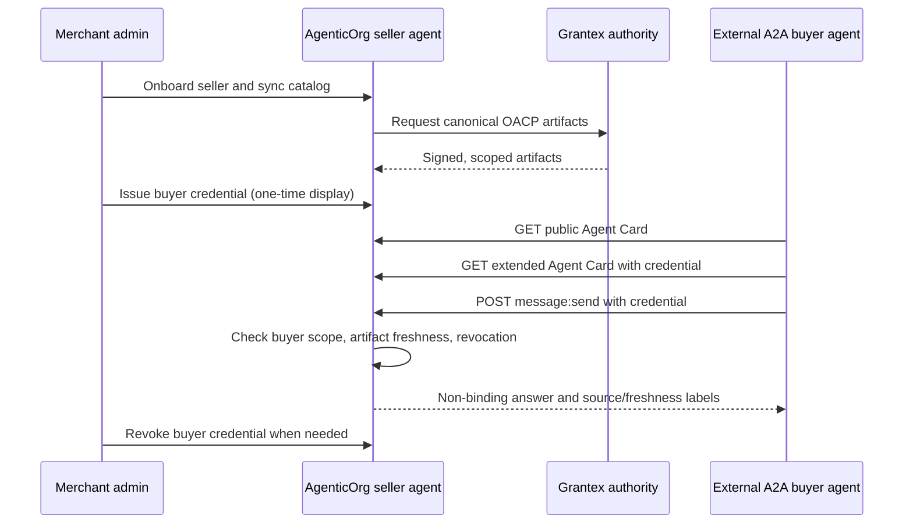

# A2A interoperability and seller commerce access

For product ownership and contact, see [the canonical notice](OWNERSHIP.md).
This guide describes repository source as of 2026-09-30; verify the deployed
commit before using these routes in production.

AgenticOrg hosts the seller and buyer agent runtime. A buyer agent may run on
AgenticOrg or on another platform. The platform name is not the authorization
decision: the merchant must approve a scoped credential, and AgenticOrg binds
that credential to one tenant, merchant, seller agent, and buyer-agent subject.



The seller answers from its durable OACP cache. It does not route each
non-binding question through Grantex. Shopify and other merchant systems own
operational facts; Grantex owns trust, policy, and artifact authority; the
payment provider owns mandate and payment execution. An A2A answer never
creates an order, hold, payment, mandate, refund, or other commitment.

## Supported wire contract

The new route implements the synchronous text subset of [A2A v1 HTTP+JSON](https://a2a-protocol.org/latest/specification/):

| Route | Caller | Behavior |
| --- | --- | --- |
| `GET /.well-known/agent-card.json` | Public | Generic card; no merchant-specific skills or secrets |
| `GET /api/v1/a2a/extendedAgentCard` | Merchant-issued buyer credential | Seller-specific card for that credential's merchant |
| `POST /api/v1/a2a/message:send` | Buyer credential | Non-binding, sourced seller answer; direct A2A Message response |
| `POST /api/v1/a2a/message:send` | Tenant API key or delegated grant with `a2a:write` or admin scope | Run an existing non-commerce agent by `agentType` and `companyId` |
| `POST /api/v1/a2a/commerce/buyer-access` | Tenant admin | Issue a buyer credential, returned only on creation |
| `GET /api/v1/a2a/commerce/buyer-access?merchant_id=...` | Tenant admin | List approvals without token material |
| `DELETE /api/v1/a2a/commerce/buyer-access/{id}` | Tenant admin | Revoke immediately |

The earlier `/api/v1/a2a/tasks`, `/api/v1/a2a/agents`, and
`/api/v1/a2a/agent-card` are AgenticOrg legacy task/discovery APIs, **not**
standard A2A v1 messages. Adapter payloads and A2A-shaped commerce metadata
are likewise not an authenticated A2A transport. Existing legacy clients are
unchanged; new clients should use the routes above.

## Merchant setup

1. Onboard the Seller Commerce Agent and synchronize merchant catalog
   evidence. See [seller onboarding](oacp/seller-commerce-agent-onboarding.md).
2. Obtain verified, fresh Grantex OACP artifacts in the AgenticOrg cache. A
   token alone does not make missing or stale catalog evidence answerable.
3. As the tenant admin, issue a credential for one buyer agent:

```http
POST /api/v1/a2a/commerce/buyer-access
Authorization: Bearer <tenant-admin-credential>
Content-Type: application/json

{"merchant_id":"merchant-123","seller_agent_id":"seller-123","buyer_agent_id":"external-buyer-123","expires_days":7}
```

Store the returned `ao_buyer_...` token in the buyer agent's secret store and
deliver it over a protected channel. The database stores only its SHA-256
digest. It expires after 1-30 days and can be revoked immediately. A merchant
should issue separate credentials per buyer agent and rotate a compromised
credential by revoking and reissuing it. The `buyer_agent_id` is a merchant-
assigned subject label; the current implementation authenticates possession
of the issued bearer token, **not** the external vendor's brand or a DID/OIDC
identity. Do not describe it as verified Claude, Codex, Muse, Instinct, Dots,
or any other vendor identity.

## External buyer request

A client supporting synchronous direct A2A v1 HTTP+JSON Messages can read the
generic card, then use its assigned credential to fetch the extended card and
send a text question:

```http
POST /api/v1/a2a/message:send
Authorization: Bearer <merchant-issued-buyer-credential>
Content-Type: application/a2a+json
Accept: application/a2a+json
A2A-Version: 1.0

{"message":{"messageId":"request-123","role":"ROLE_USER","parts":[{"text":"Is the canvas tote available?"}]}}
```

The response is an A2A `message` with `ROLE_AGENT`, one text part, and
metadata containing `status`, `sourceLabel`, `freshnessLabel`, `refusalReason`,
`allowedToExecute: false`, and `nonAuthoritativeForTransaction: true`. The
server derives merchant, seller, and buyer scope from the token, not from
client-provided fields. Mismatched fields or a commitment intent are refused.
An external buyer token cannot call task, catalog-admin, or other tenant APIs.

For non-commerce agents, send the same message shape with a tenant credential
carrying `a2a:write` and message metadata such as
`{"agentType":"support_triage","companyId":"<company-uuid>"}`. The company
must belong to that tenant, and ordinary agent/tool grants still apply.
`commerce_sales_agent` is excluded from this generic path.

## Limits and rollout

- Synchronous `message:send` text only. No JSON-RPC, gRPC, streaming, push
  notifications, file parts, task continuation, or durable A2A conversation
  state is claimed. `contextId` is echoed, not stored.
- Requests to `message:send` and `extendedAgentCard` must declare
  `A2A-Version: 1.0`; unsupported or omitted versions receive a version error.
- This is a protocol endpoint, not automatic distribution into ChatGPT,
  Claude, Gemini, Perplexity, Codex, Muse, Instinct, Dots, or any marketplace.
  Each client still needs configuration, permission to use the endpoint, and
  the merchant-issued credential. Do not claim vendor certification.
- Merchant card details are private until credential validation. The root
  Agent Card must be proxied by the UI ingress to the API; verify this path in
  every deployment. The database migration must run before enabling access.
- Before rollout, validate migration, root-card ingress, tenant isolation,
  revocation, Redis-backed rate limiting, source/freshness refusals, and the
  exact deployed SHA. This source change alone is not proof of production
  availability.
