# Agent Workflow Visualizations

Step-by-step visual flows for key agents across all 5 departments. Each diagram shows exactly how the agent processes a real-world task — from trigger to completion.

---

## Finance

### AP Processor — Invoice Processing

When an invoice arrives via email, the AP Processor handles everything from OCR extraction to payment posting.

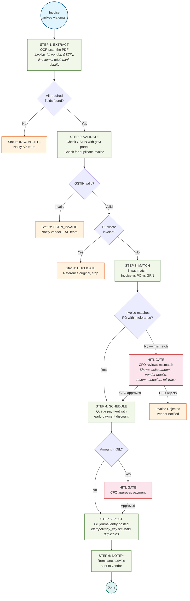

### Reconciliation Agent — Daily Bank Recon

Every day at T+0, the Recon Agent matches every bank transaction to a GL entry automatically.

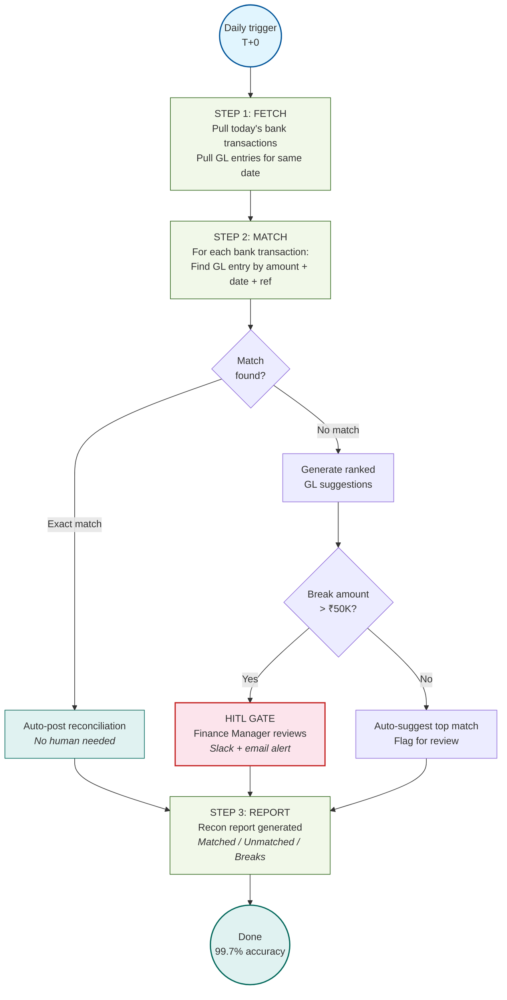

---

## Human Resources

### Talent Acquisition — Hiring Pipeline

From job description to offer letter — the full hiring flow automated with bias-free screening.

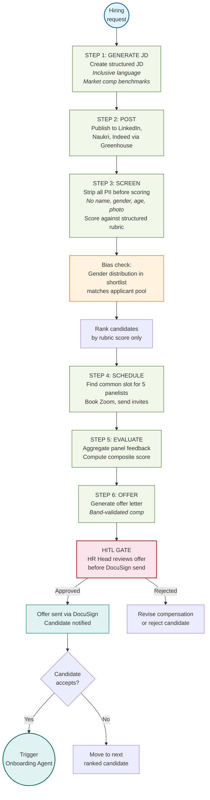

### Payroll Engine — Monthly Payroll Run

The most critical HR agent — computes salary for every employee with zero tolerance for error.

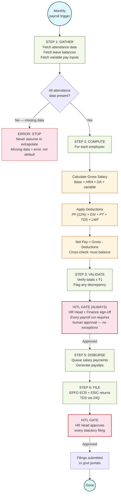

### Onboarding Agent — Day-0 Provisioning

New employee starts today. Every system provisioned automatically before they walk in.

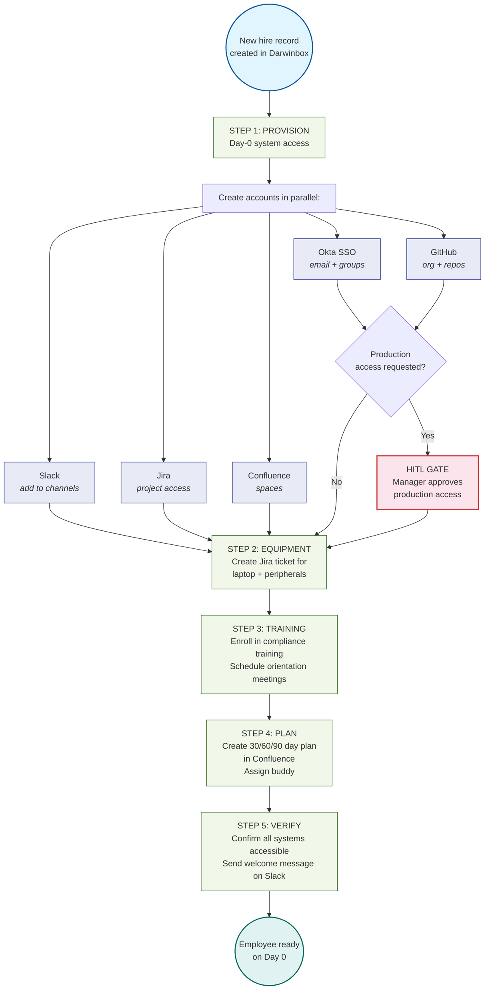

---

## Marketing

### Campaign Pilot — Budget Optimization

Monitors ad campaigns across Google, Meta, and LinkedIn — automatically reallocates spend to top performers.

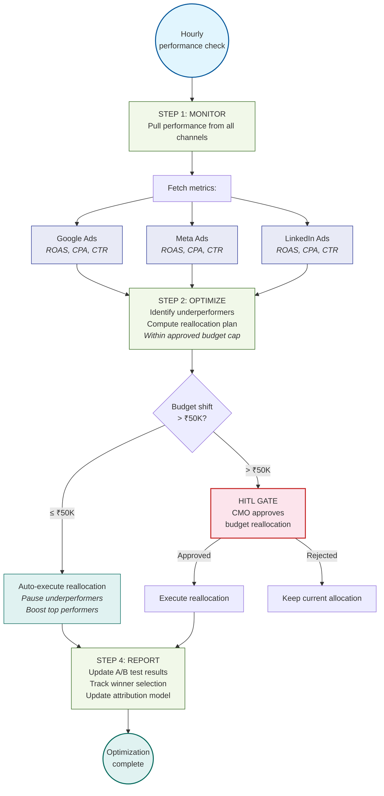

### Brand Monitor — Crisis Detection

Scans 50+ channels for brand mentions. When a crisis signal is detected, the PR team is alerted immediately.

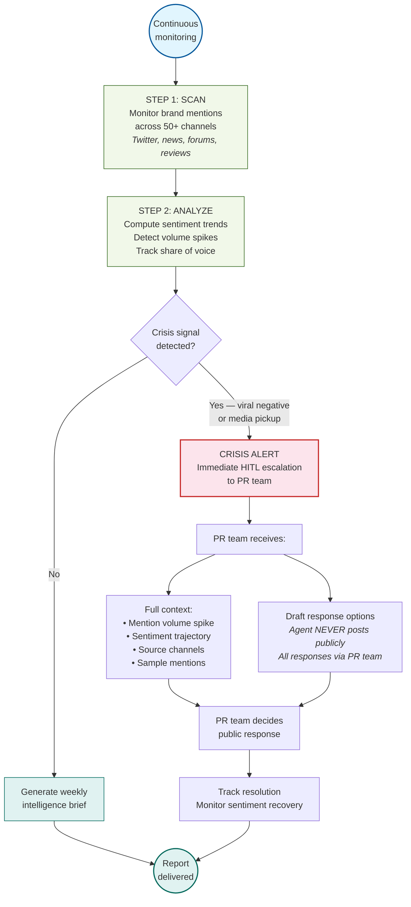

---

## Operations

### Support Triage — Ticket Resolution

Customer submits a ticket. L1 resolved automatically; L2+ enriched with full context and routed to the right team.

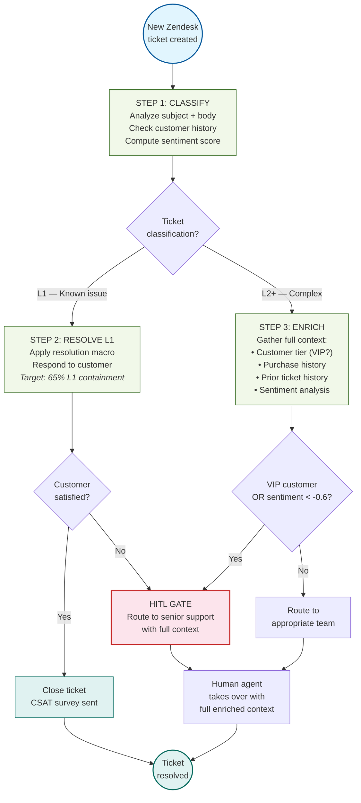

### Vendor Manager — Onboarding & KYC

New vendor? The agent runs sanctions screening, GSTIN validation, and risk scoring before creating the ERP record.

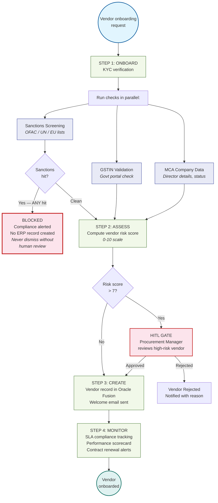

---

## Back Office

### Risk Sentinel — Fraud Detection & SAR

Continuously monitors financial transactions for suspicious patterns. Any hit triggers immediate human review.

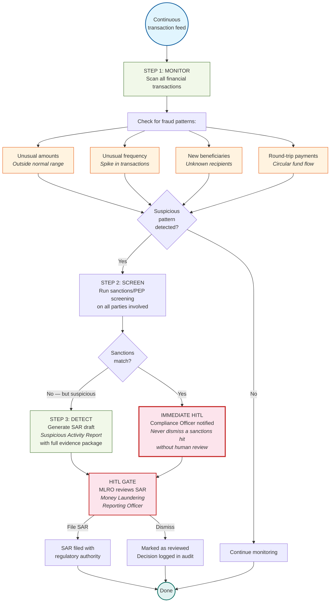

### Compliance Guard — Regulatory Filing

Tracks every regulatory deadline. Prepares filing packages automatically. Never auto-files — always requires human sign-off.

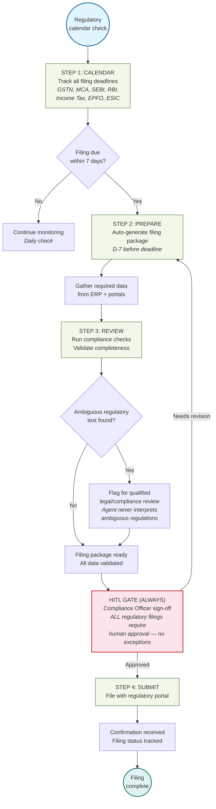

---

## Visual Legend

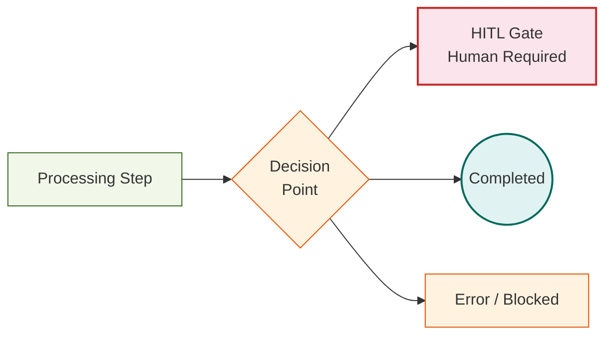

| Color | Meaning |
|-------|---------|
| Green | Processing step (automated) |
| Yellow/Orange | Decision point or error state |
| Red | HITL gate — requires human approval |
| Blue | Trigger / input / parallel tasks |
| Teal | Successfully completed |
