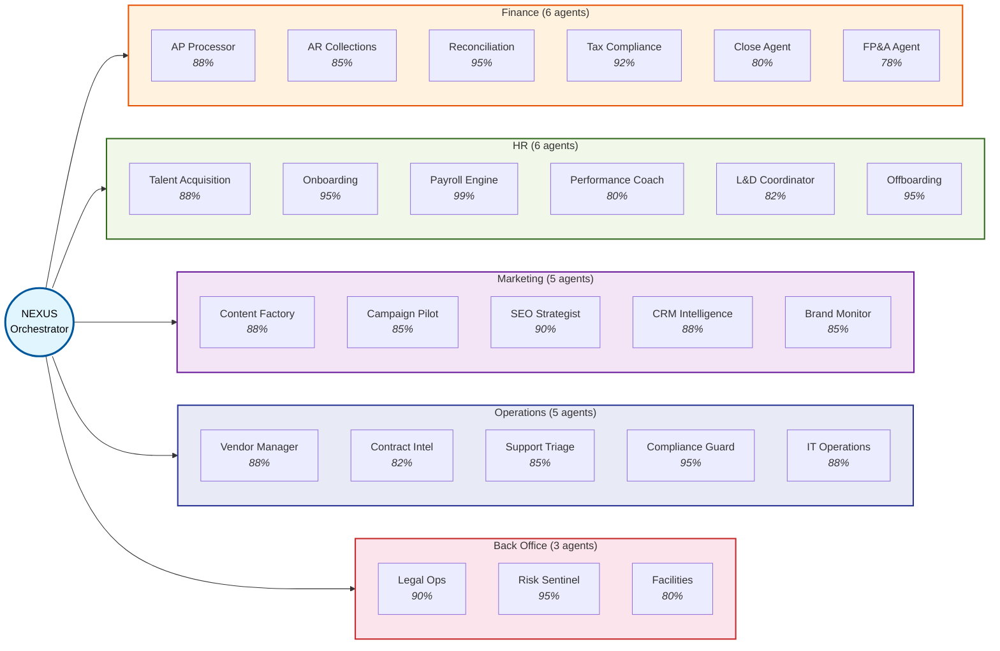
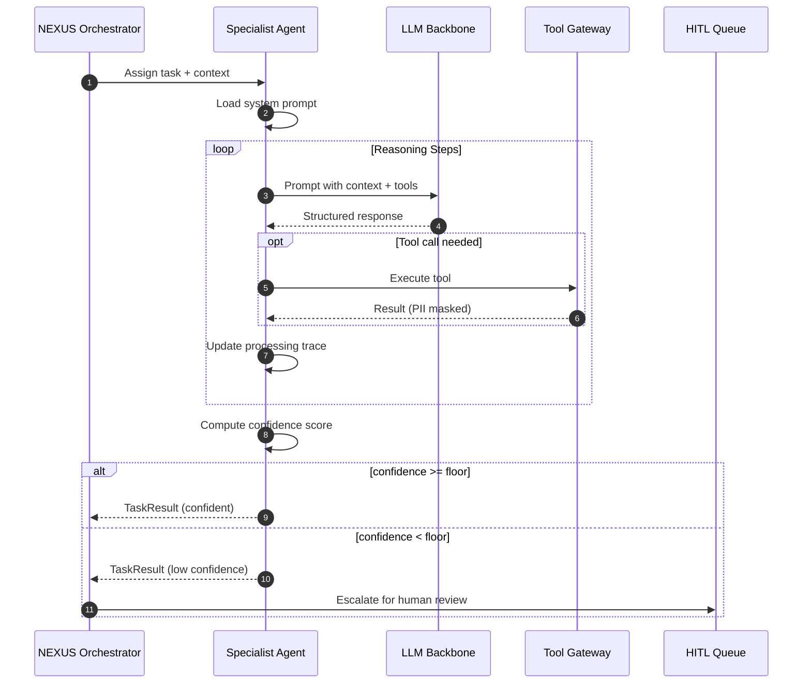
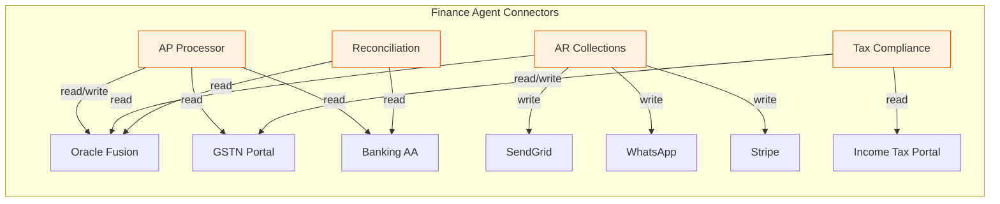
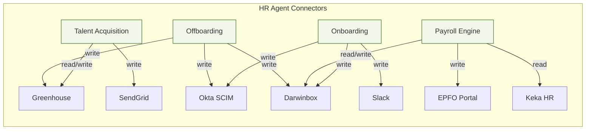
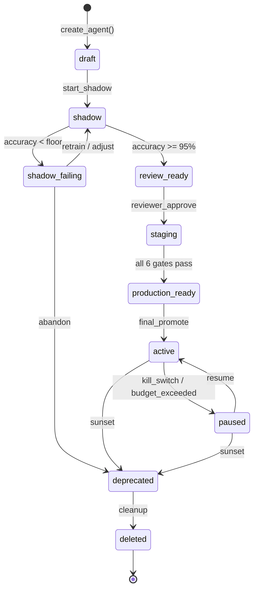
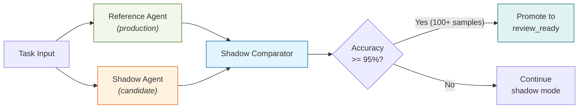
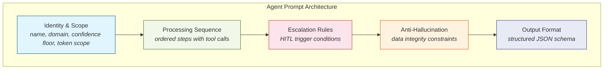
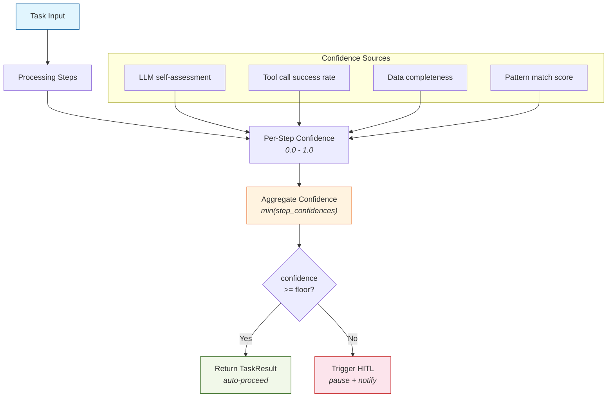
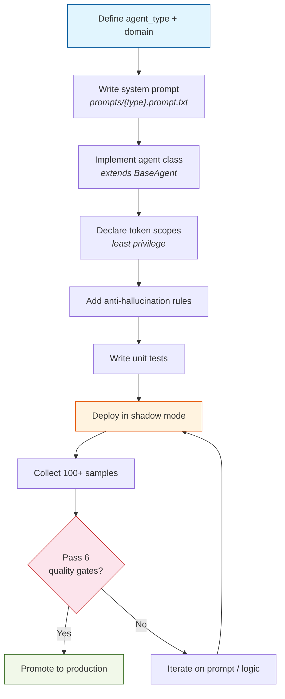

# Agent Guide

## Overview

AgentFlow OS ships with 24 specialist agents across 5 enterprise domains, coordinated by the NEXUS orchestrator. Each agent has:

- **Production system prompt** with domain-specific instructions
- **Token scope** limiting which connectors and actions it can use
- **Processing sequence** defining step-by-step execution order
- **Confidence floor** triggering HITL escalation when reasoning quality drops
- **Anti-hallucination rules** preventing fabricated data

## Agent Domain Hierarchy



> Percentages shown are the confidence floor for each agent. Below this floor, the agent triggers HITL escalation.

---

## Agent Execution Flow



---

## Agent Inventory

### Finance (6 agents)

| Agent | Type | Confidence | Key Capabilities |
|-------|------|-----------|-----------------|
| **AP Processor** | `ap_processor` | 88% | Invoice OCR, GSTIN validation, 3-way match, payment scheduling, GL posting |
| **AR Collections** | `ar_collections` | 85% | Aging analysis, tiered communications (email/WhatsApp/call), payment links |
| **Reconciliation** | `recon_agent` | 95% | Bank-to-GL matching at T+0, break detection, ranked GL suggestions |
| **Tax Compliance** | `tax_compliance` | 92% | GST/TDS computation, GSTR-1/3B/9 prep, portal reconciliation |
| **Close Agent** | `close_agent` | 80% | Month-end close checklist, P&L/BS/CF drafting, CFO sign-off gate |
| **FP&A Agent** | `fpa_agent` | 78% | Cash forecasting, budget variance, scenario modelling, board packs |



### HR (6 agents)

| Agent | Type | Confidence | Key Capabilities |
|-------|------|-----------|-----------------|
| **Talent Acquisition** | `talent_acquisition` | 88% | JD generation, multi-board posting, bias-free screening, interview scheduling |
| **Onboarding** | `onboarding_agent` | 95% | Day-0 system provisioning, 30/60/90 plans, compliance training |
| **Payroll Engine** | `payroll_engine` | 99% | Gross-to-net, PF/ESI/PT/TDS/LWF deductions, EPFO ECR filing |
| **Performance Coach** | `performance_coach` | 80% | OKR tracking, 360 feedback, attrition risk scoring |
| **L&D Coordinator** | `ld_coordinator` | 82% | Skill gap analysis, learning paths, training scheduling |
| **Offboarding** | `offboarding_agent` | 95% | Access revocation, F&F settlement, experience letters, data archival |



### Marketing (5 agents)

| Agent | Type | Confidence | Key Capabilities |
|-------|------|-----------|-----------------|
| **Content Factory** | `content_factory` | 88% | SEO content creation, brand guidelines, NEVER auto-publishes |
| **Campaign Pilot** | `campaign_pilot` | 85% | A/B testing, spend optimization, ROAS tracking |
| **SEO Strategist** | `seo_strategist` | 90% | Keyword analysis, content gaps, technical SEO recommendations |
| **CRM Intelligence** | `crm_intelligence` | 88% | Lead scoring, nurture sequences, churn risk monitoring |
| **Brand Monitor** | `brand_monitor` | 85% | Sentiment analysis, crisis detection, share of voice |

### Operations (5 agents)

| Agent | Type | Confidence | Key Capabilities |
|-------|------|-----------|-----------------|
| **Vendor Manager** | `vendor_manager` | 88% | KYC verification, sanctions screening, PO management, SLA monitoring |
| **Contract Intelligence** | `contract_intelligence` | 82% | Metadata extraction, clause analysis, renewal monitoring |
| **Support Triage** | `support_triage` | 85% | L1 resolution, L2 enrichment, sentiment-based routing |
| **Compliance Guard** | `compliance_guard` | 95% | Regulatory calendar, filing prep, compliance reporting |
| **IT Operations** | `it_operations` | 88% | Ticket triage, access provisioning, incident runbooks |

### Back Office (3 agents)

| Agent | Type | Confidence | Key Capabilities |
|-------|------|-----------|-----------------|
| **Legal Ops** | `legal_ops` | 90% | NDA routing, contract review, board resolution drafting |
| **Risk Sentinel** | `risk_sentinel` | 95% | Fraud pattern detection, sanctions screening, SAR drafting |
| **Facilities** | `facilities_agent` | 80% | Procurement, asset tracking, maintenance scheduling |

---

## Agent Lifecycle



### Shadow Mode

During shadow mode, the agent:
1. Receives the same inputs as the reference agent
2. Produces outputs in read-only mode (no side effects)
3. Outputs are compared against the reference agent's results
4. Must achieve >= 95% accuracy over >= 100 samples
5. Results stored in `shadow_comparisons` table



---

## Prompt Structure

Every agent prompt follows this structure:

```
# core/agents/prompts/{agent_type}.prompt.txt  v2.0
You are the {Agent Name} for {{org_name}}.
Domain: {domain} | Confidence floor: {N}% | Max retries: 3
Token scope: {connector}({permissions}) ...

<processing_sequence>
STEP 1 — {ACTION}
  {detailed instructions with tool calls}
STEP 2 — {ACTION}
  ...
</processing_sequence>

<escalation_rules>
Trigger HITL (never auto-proceed) if ANY condition is true:
  {agent-specific conditions}
  confidence < {floor} for any step
Include in HITL context: full trace, all computed values, trigger condition, recommendation.
</escalation_rules>

<anti_hallucination>
{agent-specific rules}
NEVER invent data not from tool responses.
NEVER proceed with stale data after a tool error — retry per policy, then escalate.
</anti_hallucination>

<output_format>
{ "status":"str", "confidence":0.0-1.0, "processing_trace":[...], "tool_calls":[...] }
</output_format>
```



---

## Agent Confidence Model



---

## Creating a Custom Agent

See [CONTRIBUTING.md](../CONTRIBUTING.md#creating-a-new-agent) for the step-by-step guide.

Key rules:
1. Must start in shadow mode (no exceptions)
2. Must have anti-hallucination rules
3. Must declare token scopes (principle of least privilege)
4. Cannot bypass HITL gates
5. Clone agents cannot elevate parent scopes


