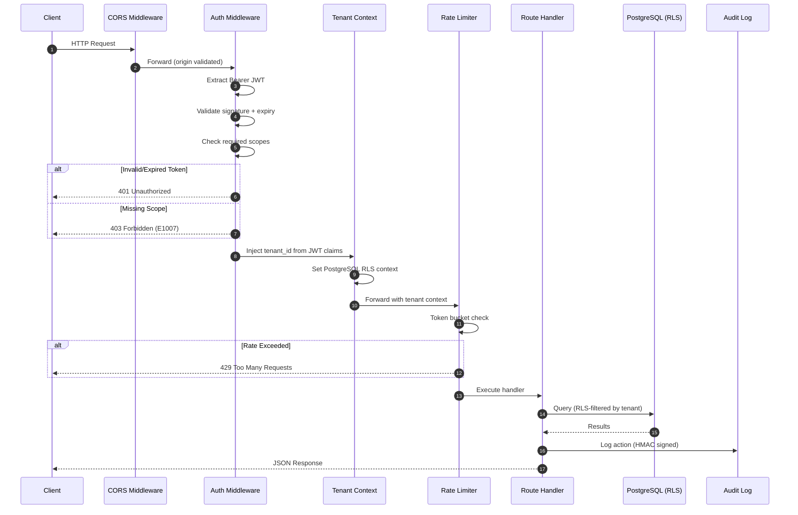
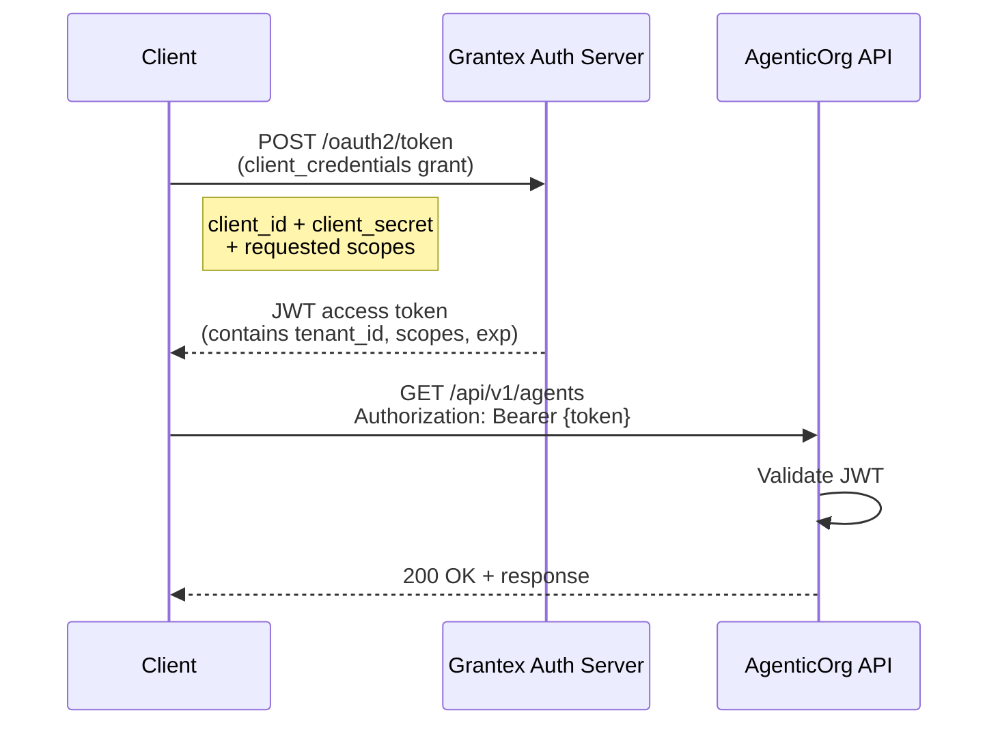
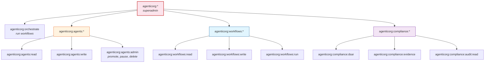
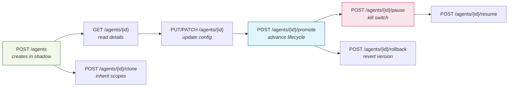
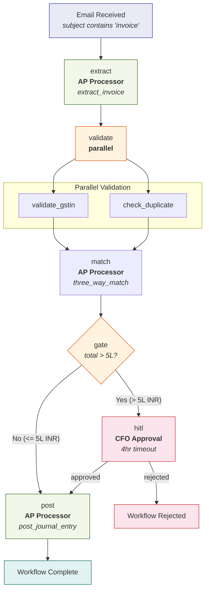
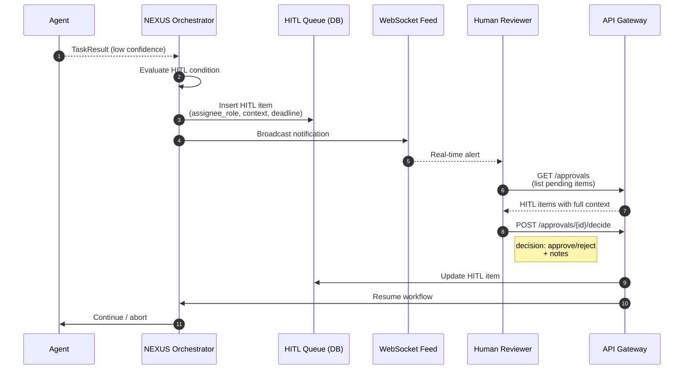
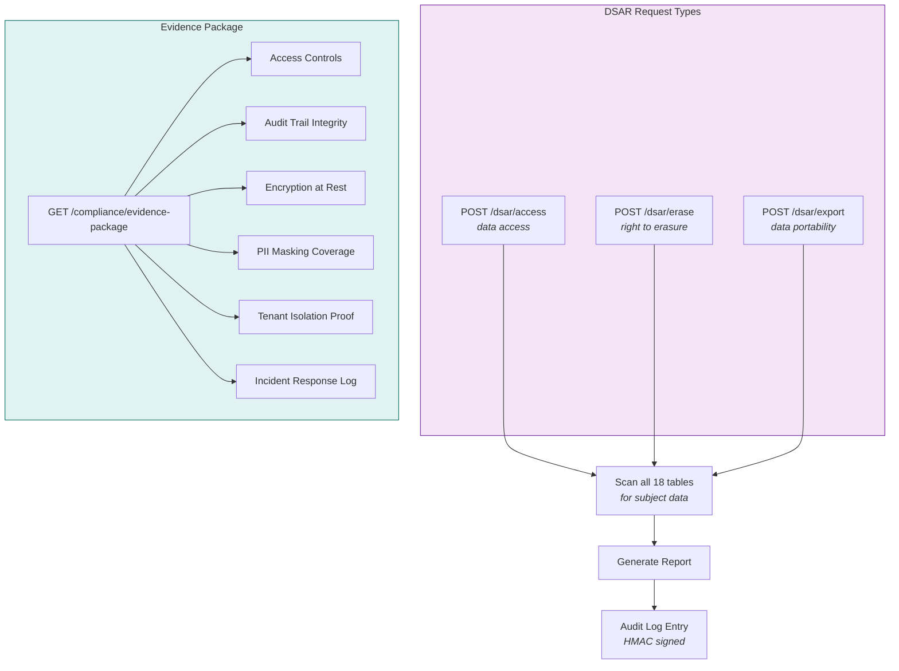
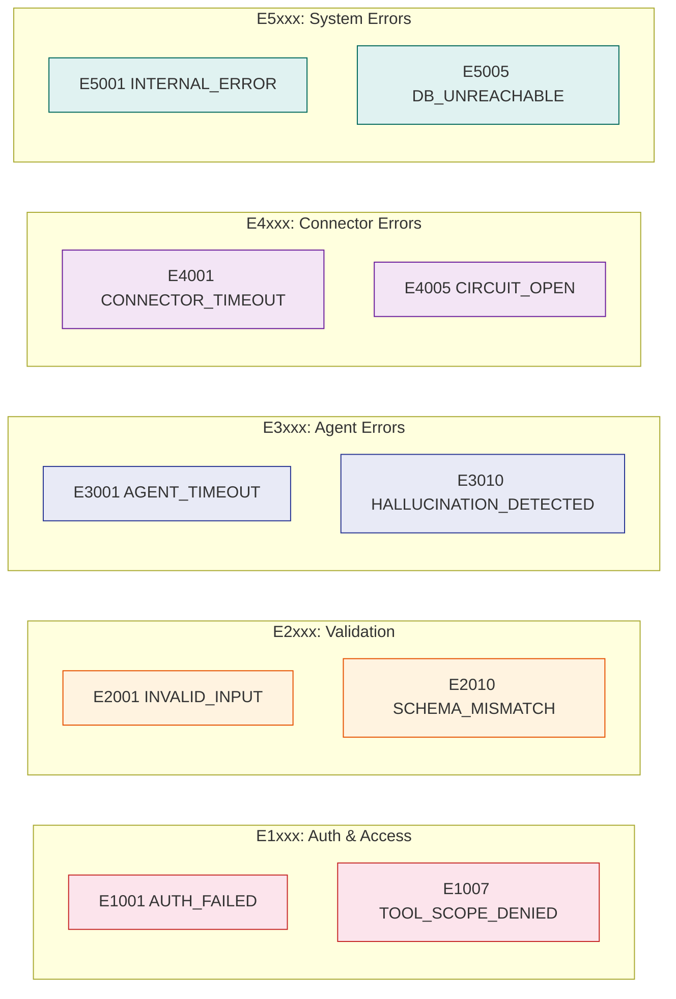
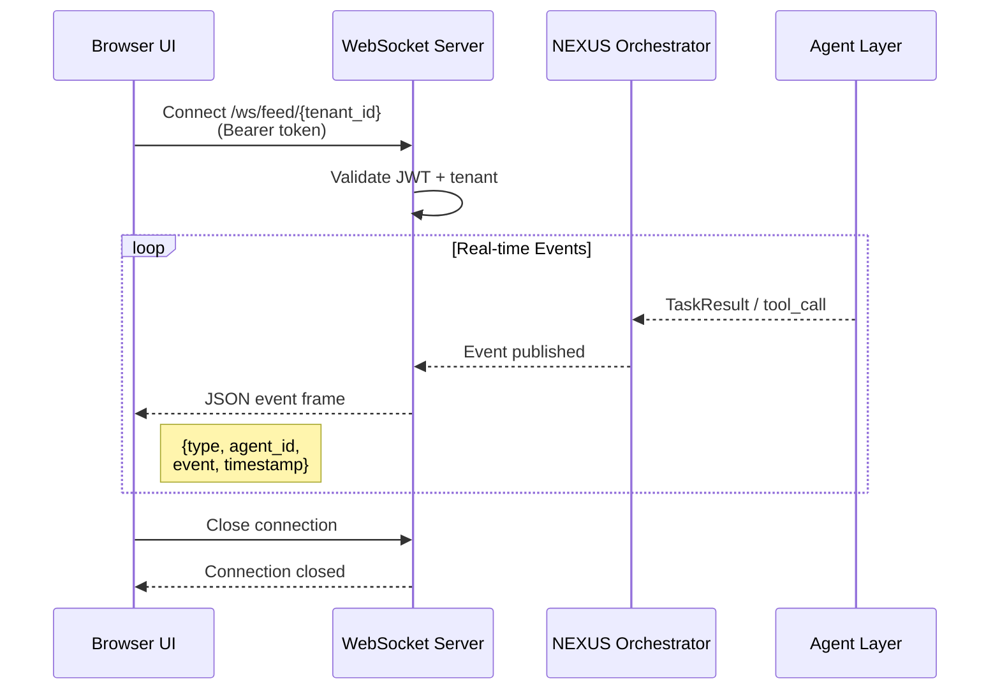

# API Reference

Base URL: `http://localhost:8000`
OpenAPI docs: `http://localhost:8000/docs`

All endpoints require authentication via Bearer JWT token or API key (except `/api/v1/health`). API keys use the `ao_sk_` prefix, are bcrypt-hashed, scoped, and revocable. Generate them from Settings > API Keys in the dashboard (admin-only).

## Request Flow

Every API request passes through a standard middleware pipeline before reaching the handler:



---

## Authentication



```bash
# Obtain platform token
curl -X POST https://auth.yourorg.com/oauth2/token \
  -d "grant_type=client_credentials" \
  -d "client_id=$GRANTEX_CLIENT_ID" \
  -d "client_secret=$GRANTEX_CLIENT_SECRET" \
  -d "scope=agenticorg:orchestrate agenticorg:agents:read"

# Use token in requests
curl -H "Authorization: Bearer $TOKEN" http://localhost:8000/api/v1/agents
```

### Scope Hierarchy



### Password Reset

**Forgot Password**
```
POST /api/v1/auth/forgot-password
```
Public endpoint (no auth required). Sends a password reset email if the email is registered. Always returns 200 to prevent email enumeration. Rate-limited to 3 requests per email per hour.

**Request Body:**
```json
{
  "email": "user@company.com"
}
```

**Response:** `200 OK`
```json
{
  "status": "ok",
  "message": "If that email is registered, a reset link has been sent."
}
```

**Reset Password**
```
POST /api/v1/auth/reset-password
```
Public endpoint (no auth required). Validates the reset JWT token and sets a new password. Token is single-use (blacklisted after use) and expires in 1 hour.

**Request Body:**
```json
{
  "token": "eyJhbGciOi...",
  "password": "NewSecurePass1"
}
```

**Response:** `200 OK`
```json
{
  "status": "ok",
  "message": "Password has been reset. You can now sign in."
}
```

**Error Responses:**
| Status | Detail |
|--------|--------|
| 400 | Invalid or expired reset token |
| 400 | Password must be at least 8 characters with uppercase, lowercase, and a number |

---

## Agents

### Create Agent
```
POST /api/v1/agents
```
Creates a new agent in `shadow` status. Requires `agenticorg:agents:write` scope.

**Request Body:**
```json
{
  "name": "Invoice Validator — GST Specialist",
  "agent_type": "invoice_validator_gst",
  "domain": "finance",
  "llm_model": "claude-3-5-sonnet-20241022",
  "confidence_floor": 0.90,
  "hitl_condition": "total > 500000 OR einvoice_failed==true",
  "authorized_tools": ["oracle_fusion:read:purchase_order", "gstn_api:read:validate_gstin"],
  "initial_status": "shadow",
  "shadow_comparison_agent": "ap-processor-001",
  "shadow_min_samples": 100,
  "shadow_accuracy_floor": 0.95,
  "cost_controls": {
    "daily_token_budget": 500000,
    "monthly_cost_cap_usd": 200,
    "on_budget_exceeded": "pause_and_alert"
  }
}
```

**Response:** `201 Created`
```json
{
  "agent_id": "uuid",
  "status": "shadow",
  "token_issued": true
}
```

### Agent CRUD Flow



### Clone Agent
```
POST /api/v1/agents/{parent_id}/clone
```
Clone an existing agent with overrides. Child cannot elevate parent's scopes.

### Kill Switch
```
POST /api/v1/agents/{id}/pause
```
Immediately pauses agent, revokes token, stops accepting new tasks. Effective in <30 seconds.

---

## Connectors

### Get Connector
```
GET /api/v1/connectors/{conn_id}
```
Returns full connector details including auth type and tool functions.

### Update Connector
```
PUT /api/v1/connectors/{conn_id}
```
Update connector authentication, base URL, rate limit, or status.

**Request Body:**
```json
{
  "auth_type": "bolt_bot_token",
  "auth_config": {"bot_token": "xoxb-..."},
  "secret_ref": "gcp-secret-manager://slack-bot-token",
  "rate_limit_rpm": 200
}
```

**Response:** `200 OK` — Returns updated connector object.

**Error Responses:**
| Status | Detail |
|--------|--------|
| 404 | Connector not found |
| 409 | Connector name already exists (on create) |

### Connector Registry
```
GET /api/v1/connectors/registry
```
Returns the full connector registry with all 54 connectors, their categories, tool counts, and auth types. No write scope required.

**Response:** `200 OK`
```json
{
  "total_connectors": 54,
  "total_tools": 340,
  "categories": ["finance", "hr", "marketing", "ops", "comms"],
  "connectors": [
    {
      "name": "gstn",
      "category": "finance",
      "auth_type": "gsp_dsc",
      "tool_count": 8,
      "tools": ["validate_gstin", "file_gstr1", "file_gstr3b", "..."]
    }
  ]
}
```

### Retest Connector
```
POST /api/v1/connectors/{conn_id}/retest
```
Triggers a health check and connectivity test for the specified connector. Returns updated status (healthy/degraded/down).

**Request Body:** (optional)
```json
{
  "timeout_seconds": 10
}
```

**Response:** `200 OK`
```json
{
  "connector_id": "uuid",
  "status": "healthy",
  "latency_ms": 142,
  "last_tested": "2026-03-31T10:00:00Z"
}
```

---

## API Keys

### List API Keys
```
GET /api/v1/api-keys
```
Returns all active API keys for the current organization. Admin-only.

**Response:** `200 OK`
```json
{
  "keys": [
    {
      "id": "uuid",
      "name": "Production SDK Key",
      "prefix": "ao_sk_a1b2",
      "scopes": ["agents:read", "agents:run", "connectors:read"],
      "created_at": "2026-03-15T08:00:00Z",
      "last_used_at": "2026-03-31T09:30:00Z",
      "expires_at": null
    }
  ],
  "count": 1,
  "max_keys": 10
}
```

### Create API Key
```
POST /api/v1/api-keys
```
Generates a new API key. The full key (`ao_sk_{40 hex chars}`) is returned only once — it is bcrypt-hashed before storage. Admin-only. Maximum 10 active keys per organization.

**Request Body:**
```json
{
  "name": "My SDK Key",
  "scopes": ["agents:read", "agents:run", "connectors:read", "mcp:read", "mcp:call", "a2a:read"],
  "expires_in_days": null
}
```

**Response:** `201 Created`
```json
{
  "id": "uuid",
  "key": "ao_sk_a1b2c3d4e5f6g7h8i9j0k1l2m3n4o5p6q7r8s9t0",
  "name": "My SDK Key",
  "scopes": ["agents:read", "agents:run", "connectors:read", "mcp:read", "mcp:call", "a2a:read"],
  "created_at": "2026-03-31T10:00:00Z"
}
```

### Revoke API Key
```
DELETE /api/v1/api-keys/{key_id}
```
Permanently revokes an API key. Admin-only.

**Response:** `200 OK`
```json
{
  "status": "revoked",
  "key_id": "uuid"
}
```

### Available Scopes

| Scope | Description |
|-------|-------------|
| `agents:read` | List and view agent details |
| `agents:run` | Execute agent tasks |
| `connectors:read` | List connectors and tools |
| `mcp:read` | List MCP tools |
| `mcp:call` | Execute MCP tool calls |
| `a2a:read` | Access A2A agent cards |

---

## Dashboards

### CFO KPIs
```
GET /api/v1/kpis/cfo
```
Returns all CFO dashboard KPI data. Requires JWT with CFO or CEO role.

**Query Parameters:**

| Parameter | Type | Required | Description |
|-----------|------|----------|-------------|
| `company_id` | uuid | No | Filter by company (for multi-company setups). Defaults to user's active company. |
| `period` | string | No | Time period: `today`, `this_week`, `this_month`, `this_quarter`, `this_year`. Default: `this_month`. |
| `compare` | boolean | No | Include comparison to previous period. Default: `true`. |

**Response:** `200 OK`
```json
{
  "period": "2026-03",
  "company_id": "uuid",
  "kpis": {
    "cash_runway_months": 14.2,
    "burn_rate_monthly": 2850000,
    "burn_rate_trend": [2700000, 2900000, 2850000],
    "dso_days": 42,
    "dso_previous": 45,
    "dpo_days": 38,
    "dpo_previous": 35,
    "ar_aging": {
      "current": 12500000,
      "30_days": 4200000,
      "60_days": 1800000,
      "90_days": 650000,
      "120_plus": 320000
    },
    "ap_aging": {
      "current": 8900000,
      "30_days": 3100000,
      "60_days": 980000,
      "90_days": 210000,
      "120_plus": 45000
    },
    "pnl": {
      "revenue": 68500000,
      "cogs": 41100000,
      "gross_margin": 27400000,
      "operating_expenses": 18200000,
      "ebitda": 9200000
    },
    "bank_balances": [
      {"bank": "HDFC", "account": "****1234", "balance": 18500000, "currency": "INR"},
      {"bank": "ICICI", "account": "****5678", "balance": 6200000, "currency": "INR"}
    ],
    "tax_calendar": [
      {"filing": "GSTR-3B", "due_date": "2026-04-20", "status": "pending", "gstin": "29XXXXX1234X1Z5"},
      {"filing": "TDS 26Q", "due_date": "2026-04-30", "status": "not_started"}
    ]
  },
  "updated_at": "2026-04-02T06:15:00Z"
}
```

### CMO KPIs
```
GET /api/v1/kpis/cmo
```
Returns all CMO dashboard KPI data. Requires JWT with CMO or CEO role.

**Query Parameters:**

| Parameter | Type | Required | Description |
|-----------|------|----------|-------------|
| `company_id` | uuid | No | Filter by company. Defaults to user's active company. |
| `period` | string | No | Time period: `today`, `this_week`, `this_month`, `this_quarter`. Default: `this_month`. |
| `compare` | boolean | No | Include comparison to previous period. Default: `true`. |

**Response:** `200 OK`
```json
{
  "period": "2026-03",
  "company_id": "uuid",
  "kpis": {
    "cac": {
      "blended": 4200,
      "by_channel": {
        "google_ads": 3800,
        "meta_ads": 5100,
        "linkedin_ads": 7200,
        "organic": 1200
      },
      "previous_blended": 4500
    },
    "mqls": {
      "count": 342,
      "previous": 298,
      "conversion_to_sql_pct": 28.4
    },
    "sqls": {
      "count": 97,
      "previous": 84,
      "conversion_to_opp_pct": 45.2
    },
    "pipeline_value": {
      "total": 28500000,
      "by_stage": {
        "discovery": 8200000,
        "proposal": 10300000,
        "negotiation": 6800000,
        "closed_won": 3200000
      }
    },
    "roas_by_channel": {
      "google_ads": {"spend": 450000, "revenue": 1800000, "roas": 4.0},
      "meta_ads": {"spend": 280000, "revenue": 840000, "roas": 3.0},
      "linkedin_ads": {"spend": 180000, "revenue": 360000, "roas": 2.0}
    },
    "email_performance": {
      "open_rate_pct": 24.3,
      "ctr_pct": 3.8,
      "unsubscribe_pct": 0.12,
      "deliverability_pct": 98.7
    },
    "brand_sentiment": {
      "positive": 68,
      "neutral": 24,
      "negative": 8,
      "trend": "improving"
    },
    "content_top_pages": [
      {"path": "/blog/ai-invoice-processing-india", "views": 12400, "avg_time_sec": 245, "conversions": 18}
    ]
  },
  "updated_at": "2026-04-02T06:30:00Z"
}
```

---

## NL Query (Chat)

### Submit Query
```
POST /api/v1/chat/query
```
Submit a natural language question. The system routes it to the appropriate agent(s), executes the query, and returns the answer with agent attribution.

**Request Body:**
```json
{
  "query": "What's my cash position?",
  "company_id": "uuid",
  "context": {
    "page": "/dashboard/cfo",
    "filters": {}
  }
}
```

| Field | Type | Required | Description |
|-------|------|----------|-------------|
| `query` | string | Yes | Natural language question |
| `company_id` | uuid | No | Company context for multi-company setups |
| `context` | object | No | Page context and active filters for better routing |

**Response:** `200 OK`
```json
{
  "query_id": "uuid",
  "query": "What's my cash position?",
  "answer": "Your current cash position across all connected accounts is Rs 2,47,00,000. HDFC: Rs 1,85,00,000, ICICI: Rs 62,00,000. Cash runway at current burn rate: 14.2 months.",
  "agents_used": [
    {"agent_id": "treasury-001", "agent_name": "Treasury Agent", "confidence": 0.96}
  ],
  "data": {
    "total_cash": 24700000,
    "accounts": [
      {"bank": "HDFC", "balance": 18500000},
      {"bank": "ICICI", "balance": 6200000}
    ]
  },
  "timestamp": "2026-04-02T10:30:00Z"
}
```

**Error Responses:**
| Status | Detail |
|--------|--------|
| 400 | Query is empty or exceeds 1000 characters |
| 403 | User does not have access to the requested data domain |
| 429 | Rate limit exceeded (default: 30 queries/minute) |

### Chat History
```
GET /api/v1/chat/history
```
Returns the chat history for the current user. Paginated.

**Query Parameters:**

| Parameter | Type | Required | Description |
|-----------|------|----------|-------------|
| `limit` | integer | No | Number of entries to return. Default: 50. Max: 200. |
| `offset` | integer | No | Pagination offset. Default: 0. |
| `company_id` | uuid | No | Filter by company. |

**Response:** `200 OK`
```json
{
  "total": 142,
  "limit": 50,
  "offset": 0,
  "history": [
    {
      "query_id": "uuid",
      "query": "What's my cash position?",
      "answer": "Your current cash position across all connected accounts is Rs 2,47,00,000...",
      "agents_used": [{"agent_id": "treasury-001", "agent_name": "Treasury Agent"}],
      "timestamp": "2026-04-02T10:30:00Z"
    }
  ]
}
```

---

## Companies (Multi-Company)

### List Companies
```
GET /api/v1/companies
```
Returns all companies the current user has access to. Used for the company switcher UI.

**Response:** `200 OK`
```json
{
  "companies": [
    {
      "id": "uuid",
      "name": "Acme Corp Pvt Ltd",
      "gstin": "29XXXXX1234X1Z5",
      "pan": "XXXXX1234X",
      "is_active": true,
      "role": "cfo",
      "agent_count": 10,
      "connector_count": 8,
      "created_at": "2026-01-15T08:00:00Z"
    },
    {
      "id": "uuid",
      "name": "Beta Industries Ltd",
      "gstin": "27XXXXX5678X1Z3",
      "pan": "XXXXX5678X",
      "is_active": true,
      "role": "auditor",
      "agent_count": 6,
      "connector_count": 5,
      "created_at": "2026-02-20T10:00:00Z"
    }
  ],
  "count": 2,
  "active_company_id": "uuid"
}
```

### Create Company
```
POST /api/v1/companies
```
Creates a new company entity. Admin-only.

**Request Body:**
```json
{
  "name": "NewCo Pvt Ltd",
  "gstin": "29XXXXX9012X1Z7",
  "pan": "XXXXX9012X",
  "address": "123 MG Road, Bengaluru, KA 560001",
  "primary_contact_email": "finance@newco.com",
  "financial_year_start": "04-01"
}
```

| Field | Type | Required | Description |
|-------|------|----------|-------------|
| `name` | string | Yes | Company legal name |
| `gstin` | string | No | GSTIN (15-character format) |
| `pan` | string | No | PAN (10-character format) |
| `address` | string | No | Registered address |
| `primary_contact_email` | string | No | Primary contact email |
| `financial_year_start` | string | No | Financial year start date (MM-DD). Default: `04-01` (Indian FY). |

**Response:** `201 Created`
```json
{
  "id": "uuid",
  "name": "NewCo Pvt Ltd",
  "gstin": "29XXXXX9012X1Z7",
  "is_active": true,
  "created_at": "2026-04-02T10:00:00Z"
}
```

**Error Responses:**
| Status | Detail |
|--------|--------|
| 400 | Invalid GSTIN or PAN format |
| 409 | Company with this GSTIN already exists |

### Update Company
```
PATCH /api/v1/companies/{id}
```
Update company details. Admin-only.

**Request Body:** (partial update — include only fields to change)
```json
{
  "name": "NewCo Technologies Pvt Ltd",
  "address": "456 Brigade Road, Bengaluru, KA 560025"
}
```

**Response:** `200 OK` — Returns the updated company object.

**Error Responses:**
| Status | Detail |
|--------|--------|
| 404 | Company not found |
| 409 | GSTIN conflict with existing company |

---

## Report Schedules

### List Scheduled Reports
```
GET /api/v1/report-schedules
```
Returns all scheduled reports for the current company.

**Query Parameters:**

| Parameter | Type | Required | Description |
|-----------|------|----------|-------------|
| `company_id` | uuid | No | Filter by company. Defaults to active company. |
| `status` | string | No | Filter by status: `active`, `paused`, `all`. Default: `all`. |

**Response:** `200 OK`
```json
{
  "schedules": [
    {
      "id": "uuid",
      "name": "Daily Cash Report",
      "report_type": "cash_position",
      "schedule_cron": "0 6 * * 1-5",
      "schedule_human": "Weekdays at 6:00 AM",
      "output_format": "pdf",
      "delivery_channels": [
        {"type": "email", "target": "cfo@company.com"},
        {"type": "slack", "target": "#finance"}
      ],
      "status": "active",
      "last_run_at": "2026-04-01T06:00:00Z",
      "last_run_status": "delivered",
      "next_run_at": "2026-04-02T06:00:00Z",
      "created_at": "2026-03-15T10:00:00Z"
    }
  ],
  "count": 3
}
```

### Create Scheduled Report
```
POST /api/v1/report-schedules
```
Creates a new scheduled report.

**Request Body:**
```json
{
  "name": "Weekly P&L Report",
  "report_type": "pnl_summary",
  "schedule_cron": "0 8 * * 1",
  "output_format": "excel",
  "delivery_channels": [
    {"type": "email", "target": "cfo@company.com"},
    {"type": "email", "target": "ceo@company.com"},
    {"type": "slack", "target": "#finance"}
  ],
  "parameters": {
    "include_budget_variance": true,
    "include_department_breakdown": true,
    "comparison_period": "previous_month"
  },
  "company_id": "uuid"
}
```

| Field | Type | Required | Description |
|-------|------|----------|-------------|
| `name` | string | Yes | Human-readable schedule name |
| `report_type` | string | Yes | Report type: `cash_position`, `pnl_summary`, `close_package`, `ar_aging`, `ap_aging`, `tax_calendar`, `marketing_weekly`, `ad_performance`, `marketing_roi` |
| `schedule_cron` | string | Yes | 5-field cron expression (minute hour day month weekday) |
| `output_format` | string | Yes | `pdf` or `excel` |
| `delivery_channels` | array | Yes | Array of delivery targets (email, slack, whatsapp) |
| `parameters` | object | No | Report-specific parameters |
| `company_id` | uuid | No | Company context. Defaults to active company. |

**Response:** `201 Created`
```json
{
  "id": "uuid",
  "name": "Weekly P&L Report",
  "schedule_cron": "0 8 * * 1",
  "schedule_human": "Mondays at 8:00 AM",
  "status": "active",
  "next_run_at": "2026-04-07T08:00:00Z",
  "created_at": "2026-04-02T10:00:00Z"
}
```

**Error Responses:**
| Status | Detail |
|--------|--------|
| 400 | Invalid cron expression |
| 400 | Invalid report_type |
| 400 | At least one delivery channel is required |

### Update Scheduled Report
```
PATCH /api/v1/report-schedules/{id}
```
Update a scheduled report. Supports partial updates. Use this to toggle status (active/paused), change schedule, or modify delivery channels.

**Request Body:** (partial update — include only fields to change)
```json
{
  "status": "paused"
}
```

Or to update the schedule and delivery:
```json
{
  "schedule_cron": "0 9 * * 1",
  "delivery_channels": [
    {"type": "email", "target": "cfo@company.com"},
    {"type": "whatsapp", "target": "+919876543210"}
  ]
}
```

**Response:** `200 OK` — Returns the updated schedule object.

**Error Responses:**
| Status | Detail |
|--------|--------|
| 404 | Schedule not found |
| 400 | Invalid cron expression |

### Run Report Now
```
POST /api/v1/report-schedules/{id}/run-now
```
Triggers an immediate run of a scheduled report, regardless of its cron schedule. Useful for testing or ad-hoc report generation.

**Request Body:** (optional)
```json
{
  "delivery_override": [
    {"type": "email", "target": "me@company.com"}
  ]
}
```

**Response:** `202 Accepted`
```json
{
  "run_id": "uuid",
  "schedule_id": "uuid",
  "status": "generating",
  "estimated_completion_seconds": 30,
  "message": "Report generation started. You will receive it at the configured delivery channels."
}
```

**Error Responses:**
| Status | Detail |
|--------|--------|
| 404 | Schedule not found |
| 409 | A run is already in progress for this schedule |
| 429 | Rate limit: maximum 5 ad-hoc runs per hour per schedule |

### Delete Scheduled Report
```
DELETE /api/v1/report-schedules/{id}
```
Permanently deletes a scheduled report. This cancels all future runs. Historical run data is retained in the audit log.

**Response:** `200 OK`
```json
{
  "status": "deleted",
  "schedule_id": "uuid",
  "message": "Schedule deleted. Historical run data is retained in the audit log."
}
```

**Error Responses:**
| Status | Detail |
|--------|--------|
| 404 | Schedule not found |

---

## Workflows

### Create Workflow
```
POST /api/v1/workflows
```

**Request Body (YAML-based definition):**
```json
{
  "name": "invoice-processing-v2",
  "version": "2.0",
  "trigger_type": "email_received",
  "trigger_config": {"filter": {"subject_contains": ["invoice", "bill"]}},
  "timeout_hours": 48,
  "definition": {
    "steps": [
      {"id": "extract", "type": "agent", "agent": "ap-processor", "action": "extract_invoice"},
      {"id": "validate", "type": "parallel", "wait_for": "all", "steps": ["validate_gstin", "check_duplicate"]},
      {"id": "match", "type": "agent", "agent": "ap-processor", "action": "three_way_match", "depends_on": ["validate"]},
      {"id": "gate", "type": "condition", "condition": "match.output.total > 500000", "true_path": "hitl", "false_path": "post"},
      {"id": "hitl", "type": "human_in_loop", "assignee_role": "cfo", "timeout_hours": 4},
      {"id": "post", "type": "agent", "agent": "ap-processor", "action": "post_journal_entry", "depends_on": ["gate"]}
    ]
  }
}
```

### Workflow Execution Example

The above invoice processing workflow executes as:



### Trigger Workflow Run
```
POST /api/v1/workflows/{id}/run
```

### Get Run Details
```
GET /api/v1/workflows/runs/{run_id}
```

---

## HITL Approvals

### Approval Flow



### List Pending Approvals
```
GET /api/v1/approvals
```

### Submit Decision
```
POST /api/v1/approvals/{id}/decide
```
```json
{
  "decision": "approve",
  "notes": "Scope change email confirmed, approving amended PO."
}
```

---

## Compliance

### DSAR Access Request
```
POST /api/v1/dsar/access
```
```json
{"subject_email": "user@example.com", "request_type": "access"}
```

### DSAR Erasure Request
```
POST /api/v1/dsar/erase
```
30-day deadline enforced per GDPR/DPDP Act.

### Evidence Package
```
GET /api/v1/compliance/evidence-package
```
Returns SOC2 Type II evidence package with 6 sections.

### Compliance Flow



---

## Error Responses

All errors use the standard envelope:
```json
{
  "error": {
    "code": "E1007",
    "name": "TOOL_SCOPE_DENIED",
    "message": "Agent ap-processor-001 lacks scope tool:okta:write:provision_user",
    "severity": "critical",
    "retryable": false,
    "escalate": true,
    "context": {"agent_id": "ap-processor-001", "workflow_run_id": "wfr_abc123"}
  }
}
```

### Error Code Ranges



---

## WebSocket

### Live Activity Feed
```
WS /api/v1/ws/feed/{tenant_id}
```
Real-time stream of agent activity, workflow events, and HITL notifications.



---

## Email Webhooks (Tier 1)

### SendGrid Webhook
```
POST /api/v1/webhooks/email/sendgrid
```
Receives SendGrid event webhooks (open, click, bounce, unsubscribe). Events are stored and linked to drip sequences for behavior-triggered progression.

**Request Body:** (SendGrid event batch format)
```json
[
  {
    "email": "lead@company.com",
    "event": "open",
    "timestamp": 1712000000,
    "sg_message_id": "abc123"
  }
]
```

**Response:** `200 OK`

### Mailchimp Webhook
```
POST /api/v1/webhooks/email/mailchimp
```
Receives Mailchimp webhook events (subscribe, unsubscribe, campaign open, click).

### MoEngage Webhook
```
POST /api/v1/webhooks/email/moengage
```
Receives MoEngage engagement events (email open, click, push delivered).

---

## Push Notifications (Tier 1)

### Subscribe to Push
```
POST /api/v1/push/subscribe
```
Registers a browser push subscription for the current user. Uses VAPID protocol.

**Request Body:**
```json
{
  "subscription": {
    "endpoint": "https://fcm.googleapis.com/fcm/send/...",
    "keys": {
      "p256dh": "...",
      "auth": "..."
    }
  }
}
```

**Response:** `201 Created`

### Unsubscribe from Push
```
POST /api/v1/push/unsubscribe
```
Removes the push subscription for the current user.

**Response:** `200 OK`

### Get VAPID Key
```
GET /api/v1/push/vapid-key
```
Returns the server's VAPID public key for push subscription.

**Response:** `200 OK`
```json
{
  "vapid_public_key": "BN..."
}
```

### Test Push
```
POST /api/v1/push/test
```
Sends a test push notification to the current user's registered subscription. Requires an active subscription.

**Response:** `200 OK`

---

## ABM — Account-Based Marketing (Tier 1)

### List Target Accounts
```
GET /api/v1/abm/accounts
```
Returns all target accounts with intent scores.

**Query Parameters:**

| Parameter | Type | Required | Description |
|-----------|------|----------|-------------|
| `tier` | string | No | Filter by tier: `tier_1`, `tier_2`, `tier_3` |
| `min_intent` | number | No | Minimum blended intent score (0-100) |
| `limit` | integer | No | Default: 50 |
| `offset` | integer | No | Default: 0 |

**Response:** `200 OK`
```json
{
  "accounts": [
    {
      "id": "uuid",
      "company": "Acme Corp",
      "domain": "acme.com",
      "tier": "tier_1",
      "intent_score": 78,
      "intent_sources": {
        "bombora": 82,
        "g2": 75,
        "trustradius": 72
      },
      "last_updated": "2026-04-02T10:00:00Z"
    }
  ],
  "count": 42
}
```

### Add Target Account
```
POST /api/v1/abm/accounts
```
Adds a single target account.

**Request Body:**
```json
{
  "company": "Beta Industries",
  "domain": "beta.com",
  "tier": "tier_2"
}
```

**Response:** `201 Created`

### Bulk Upload Accounts
```
POST /api/v1/abm/accounts/upload
```
Upload a CSV of target accounts. Columns: `company`, `domain`, `tier`.

**Request:** `multipart/form-data` with `file` field containing the CSV.

**Response:** `200 OK`
```json
{
  "imported": 150,
  "duplicates_skipped": 3,
  "errors": 0
}
```

### Get Account Intent
```
GET /api/v1/abm/accounts/{id}/intent
```
Returns detailed intent data for a specific account with per-source breakdown.

**Response:** `200 OK`
```json
{
  "account_id": "uuid",
  "company": "Acme Corp",
  "blended_score": 78,
  "weights": {"bombora": 0.4, "g2": 0.3, "trustradius": 0.3},
  "sources": {
    "bombora": {"score": 82, "topics": ["AI automation", "enterprise software"], "surge": true},
    "g2": {"score": 75, "categories": ["AI agents", "workflow automation"], "comparison_active": true},
    "trustradius": {"score": 72, "reviews_viewed": 5, "last_activity": "2026-04-01"}
  },
  "trend": "rising",
  "last_updated": "2026-04-02T10:00:00Z"
}
```

### Launch Campaign for Account
```
POST /api/v1/abm/accounts/{id}/campaign
```
Launches a personalized outreach campaign for the specified account.

**Request Body:**
```json
{
  "template": "abm_campaign",
  "channels": ["email", "linkedin"],
  "message_variant": "high_intent"
}
```

**Response:** `202 Accepted`
```json
{
  "campaign_id": "uuid",
  "account_id": "uuid",
  "status": "launching",
  "channels": ["email", "linkedin"]
}
```

### ABM Dashboard Summary
```
GET /api/v1/abm/dashboard
```
Returns summary data for the ABM dashboard — total accounts, tier breakdown, average intent, top accounts.

**Response:** `200 OK`
```json
{
  "total_accounts": 150,
  "by_tier": {"tier_1": 25, "tier_2": 60, "tier_3": 65},
  "avg_intent_score": 52,
  "top_accounts": [
    {"company": "Acme Corp", "intent_score": 92, "tier": "tier_1"},
    {"company": "Beta Industries", "intent_score": 87, "tier": "tier_1"}
  ],
  "intent_distribution": {"high": 30, "medium": 55, "low": 65},
  "updated_at": "2026-04-02T10:00:00Z"
}
```

---

## CA Firms API

Endpoints for the CA Firms paid add-on. All endpoints require JWT authentication and are scoped to the current tenant.

### Filing Approvals

#### List Filing Approvals
```
GET /api/v1/companies/{id}/approvals
```
Returns all filing approvals for a company. Filterable by status.

**Query Parameters:**

| Parameter | Type | Required | Description |
|-----------|------|----------|-------------|
| `status` | string | No | Filter: `pending`, `approved`, `rejected`, `all`. Default: `all` |
| `filing_type` | string | No | Filter: `gstr1`, `gstr3b`, `tds_26q`, `tds_24q` |
| `limit` | integer | No | Default: 50 |
| `offset` | integer | No | Default: 0 |

**Response:** `200 OK`
```json
{
  "approvals": [
    {
      "id": "uuid",
      "company_id": "uuid",
      "filing_type": "gstr3b",
      "period": "2026-03",
      "status": "pending",
      "auto_approved": false,
      "created_by_agent": "gst-filing-agent",
      "created_at": "2026-04-05T10:00:00Z",
      "decided_at": null,
      "decided_by": null,
      "reject_reason": null
    }
  ],
  "count": 12
}
```

#### Create Filing Approval
```
POST /api/v1/companies/{id}/approvals
```
Creates a filing approval request. If the company has `gst_auto_file=True`, the approval is auto-approved immediately.

**Request Body:**
```json
{
  "filing_type": "gstr3b",
  "period": "2026-03",
  "payload": {
    "total_liability": 142000,
    "itc_claimed": 98000,
    "net_payable": 44000
  }
}
```

| Field | Type | Required | Description |
|-------|------|----------|-------------|
| `filing_type` | string | Yes | One of: `gstr1`, `gstr3b`, `tds_26q`, `tds_24q` |
| `period` | string | Yes | Filing period (YYYY-MM or YYYY-QN) |
| `payload` | object | No | Filing summary data for review |

**Response:** `201 Created`
```json
{
  "id": "uuid",
  "status": "pending",
  "auto_approved": false
}
```

#### Partner Self-Approve
```
POST /api/v1/companies/{id}/approvals/{aid}/approve
```
Partner approves a pending filing. Only the tenant owner (CA partner) can approve.

**Request Body:** (optional)
```json
{
  "notes": "Verified ITC reconciliation. Approved."
}
```

**Response:** `200 OK`
```json
{
  "id": "uuid",
  "status": "approved",
  "decided_by": "partner@cafirm.com",
  "decided_at": "2026-04-06T14:30:00Z"
}
```

**Error Responses:**
| Status | Detail |
|--------|--------|
| 404 | Approval not found |
| 409 | Approval already decided |

#### Reject Filing
```
POST /api/v1/companies/{id}/approvals/{aid}/reject
```
Rejects a pending filing with a reason.

**Request Body:**
```json
{
  "reason": "ITC mismatch with GSTR-2A. Needs reconciliation."
}
```

| Field | Type | Required | Description |
|-------|------|----------|-------------|
| `reason` | string | Yes | Reason for rejection |

**Response:** `200 OK`
```json
{
  "id": "uuid",
  "status": "rejected",
  "reject_reason": "ITC mismatch with GSTR-2A. Needs reconciliation.",
  "decided_by": "partner@cafirm.com",
  "decided_at": "2026-04-06T14:30:00Z"
}
```

#### Bulk Approve Filings
```
POST /api/v1/companies/bulk-approve
```
Approve multiple filings across companies in one call.

**Request Body:**
```json
{
  "approval_ids": ["uuid-1", "uuid-2", "uuid-3"],
  "notes": "Batch approved after quarterly review."
}
```

| Field | Type | Required | Description |
|-------|------|----------|-------------|
| `approval_ids` | array | Yes | List of approval UUIDs to approve |
| `notes` | string | No | Notes applied to all approvals |

**Response:** `200 OK`
```json
{
  "approved": 3,
  "failed": 0,
  "results": [
    {"id": "uuid-1", "status": "approved"},
    {"id": "uuid-2", "status": "approved"},
    {"id": "uuid-3", "status": "approved"}
  ]
}
```

---

### GSTN Credentials

#### List Credentials
```
GET /api/v1/companies/{id}/credentials
```
Returns stored GSTN credentials for a company. Passwords are never returned in responses.

**Response:** `200 OK`
```json
{
  "credentials": [
    {
      "id": "uuid",
      "gstin": "29XXXXX1234X1Z5",
      "username": "taxpayer_user",
      "portal": "gstn",
      "is_active": true,
      "encryption_key_ref": "v1",
      "last_verified_at": "2026-04-01T06:00:00Z",
      "created_at": "2026-03-15T10:00:00Z"
    }
  ],
  "count": 1
}
```

#### Store Encrypted Credential
```
POST /api/v1/companies/{id}/credentials
```
Stores a GSTN credential. The password is encrypted with AES-256 (Fernet) before storage.

**Request Body:**
```json
{
  "gstin": "29XXXXX1234X1Z5",
  "username": "taxpayer_user",
  "password": "secret123",
  "portal": "gstn"
}
```

| Field | Type | Required | Description |
|-------|------|----------|-------------|
| `gstin` | string | Yes | GSTIN (15-character format) |
| `username` | string | Yes | Portal login username |
| `password` | string | Yes | Portal login password (encrypted at rest) |
| `portal` | string | No | Portal identifier. Default: `gstn` |

**Response:** `201 Created`
```json
{
  "id": "uuid",
  "gstin": "29XXXXX1234X1Z5",
  "username": "taxpayer_user",
  "is_active": true,
  "encryption_key_ref": "v1"
}
```

#### Deactivate Credential
```
DELETE /api/v1/companies/{id}/credentials/{cid}
```
Deactivates a stored credential. Does not delete the record (retained for audit).

**Response:** `200 OK`
```json
{
  "id": "uuid",
  "is_active": false,
  "deactivated_at": "2026-04-06T14:30:00Z"
}
```

#### Verify Credential (Test Decrypt)
```
POST /api/v1/companies/{id}/credentials/{cid}/verify
```
Tests that the stored credential can be decrypted and optionally validates against the GSTN portal.

**Response:** `200 OK`
```json
{
  "id": "uuid",
  "decrypt_ok": true,
  "portal_login_ok": true,
  "verified_at": "2026-04-06T14:35:00Z"
}
```

**Error Responses:**
| Status | Detail |
|--------|--------|
| 404 | Credential not found |
| 400 | Decryption failed (key rotation needed) |

---

### GSTN Uploads

#### List Generated Files
```
GET /api/v1/companies/{id}/gstn-uploads
```
Returns generated GSTN JSON files for manual portal upload.

**Query Parameters:**

| Parameter | Type | Required | Description |
|-----------|------|----------|-------------|
| `filing_type` | string | No | Filter: `gstr1`, `gstr3b` |
| `status` | string | No | Filter: `generated`, `uploaded`, `accepted`, `rejected` |
| `limit` | integer | No | Default: 50 |
| `offset` | integer | No | Default: 0 |

**Response:** `200 OK`
```json
{
  "uploads": [
    {
      "id": "uuid",
      "company_id": "uuid",
      "filing_type": "gstr1",
      "period": "2026-03",
      "status": "generated",
      "file_url": "/api/v1/companies/{id}/gstn-uploads/{uid}/download",
      "arn": null,
      "generated_at": "2026-04-05T10:00:00Z",
      "uploaded_at": null
    }
  ],
  "count": 5
}
```

#### Generate GSTN JSON
```
POST /api/v1/companies/{id}/gstn-uploads
```
Generates a GSTN-compliant JSON file for manual upload to the GSTN portal.

**Request Body:**
```json
{
  "filing_type": "gstr1",
  "period": "2026-03"
}
```

| Field | Type | Required | Description |
|-------|------|----------|-------------|
| `filing_type` | string | Yes | `gstr1` or `gstr3b` |
| `period` | string | Yes | Filing period (YYYY-MM) |

**Response:** `201 Created`
```json
{
  "id": "uuid",
  "filing_type": "gstr1",
  "period": "2026-03",
  "status": "generated",
  "file_url": "/api/v1/companies/{id}/gstn-uploads/{uid}/download",
  "invoice_count": 142,
  "total_taxable_value": 8500000,
  "generated_at": "2026-04-05T10:00:00Z"
}
```

#### Update Upload Status
```
PATCH /api/v1/companies/{id}/gstn-uploads/{uid}
```
Updates the upload status and ARN after manual portal upload.

**Request Body:**
```json
{
  "status": "uploaded",
  "arn": "AA290326000001X"
}
```

| Field | Type | Required | Description |
|-------|------|----------|-------------|
| `status` | string | Yes | `uploaded`, `accepted`, or `rejected` |
| `arn` | string | No | Acknowledgement Reference Number from GSTN portal |

**Response:** `200 OK`
```json
{
  "id": "uuid",
  "status": "uploaded",
  "arn": "AA290326000001X",
  "uploaded_at": "2026-04-06T14:30:00Z"
}
```

---

### Compliance Deadlines

#### List Upcoming Deadlines
```
GET /api/v1/companies/{id}/deadlines
```
Returns upcoming compliance deadlines for a company.

**Query Parameters:**

| Parameter | Type | Required | Description |
|-----------|------|----------|-------------|
| `status` | string | No | Filter: `upcoming`, `overdue`, `filed`, `all`. Default: `upcoming` |
| `months_ahead` | integer | No | Number of months to look ahead. Default: 3 |

**Response:** `200 OK`
```json
{
  "deadlines": [
    {
      "id": "uuid",
      "company_id": "uuid",
      "filing_type": "gstr3b",
      "period": "2026-03",
      "due_date": "2026-04-20",
      "status": "upcoming",
      "alert_7day_sent": true,
      "alert_1day_sent": false,
      "filed_at": null
    }
  ],
  "count": 8
}
```

#### Generate Deadlines
```
POST /api/v1/companies/{id}/deadlines/generate
```
Generates compliance deadlines for upcoming months based on the company's filing obligations.

**Request Body:**
```json
{
  "months_ahead": 6
}
```

| Field | Type | Required | Description |
|-------|------|----------|-------------|
| `months_ahead` | integer | No | Number of months to generate. Default: 3 |

**Response:** `201 Created`
```json
{
  "generated": 18,
  "company_id": "uuid",
  "filings": ["gstr1", "gstr3b", "tds_26q"]
}
```

#### Mark Deadline as Filed
```
PATCH /api/v1/companies/{id}/deadlines/{did}/filed
```
Marks a compliance deadline as filed.

**Request Body:** (optional)
```json
{
  "arn": "AA290326000001X",
  "filed_via": "portal"
}
```

**Response:** `200 OK`
```json
{
  "id": "uuid",
  "status": "filed",
  "filed_at": "2026-04-06T14:30:00Z",
  "arn": "AA290326000001X"
}
```

---

### CA Subscription

#### Get Tenant Subscription
```
GET /api/v1/ca-subscription
```
Returns the current CA pack subscription for the tenant.

**Response:** `200 OK`
```json
{
  "tenant_id": "uuid",
  "plan": "ca_pack",
  "status": "active",
  "price_inr": 4999,
  "billing_cycle": "monthly",
  "trial_ends_at": null,
  "current_period_start": "2026-04-01T00:00:00Z",
  "current_period_end": "2026-04-30T23:59:59Z",
  "client_count": 7,
  "client_limit": null
}
```

#### Activate Subscription
```
POST /api/v1/ca-subscription/activate
```
Starts a 14-day free trial or activates a paid subscription.

**Request Body:**
```json
{
  "plan": "ca_pack",
  "trial": true
}
```

| Field | Type | Required | Description |
|-------|------|----------|-------------|
| `plan` | string | Yes | Subscription plan: `ca_pack` |
| `trial` | boolean | No | Start with 14-day trial. Default: `true` |

**Response:** `201 Created`
```json
{
  "tenant_id": "uuid",
  "plan": "ca_pack",
  "status": "trial",
  "trial_ends_at": "2026-04-20T00:00:00Z",
  "activated_at": "2026-04-06T10:00:00Z"
}
```

**Error Responses:**
| Status | Detail |
|--------|--------|
| 409 | Subscription already active |
| 400 | Invalid plan |

---

### Partner Dashboard

#### Aggregate KPIs
```
GET /api/v1/partner-dashboard
```
Returns aggregate KPIs across all client companies for the CA partner.

**Response:** `200 OK`
```json
{
  "tenant_id": "uuid",
  "total_clients": 7,
  "filings_pending": 12,
  "filings_overdue": 2,
  "filings_completed_this_month": 18,
  "deadlines_next_7_days": 5,
  "client_health": [
    {
      "company_id": "uuid",
      "company_name": "Acme Corp Pvt Ltd",
      "health_score": 92,
      "pending_filings": 1,
      "overdue_filings": 0,
      "last_activity": "2026-04-06T09:00:00Z"
    }
  ],
  "revenue_this_month": 34993,
  "updated_at": "2026-04-06T10:00:00Z"
}
```

---

### Tally Auto-Detect

#### Detect Company from Tally Bridge
```
POST /api/v1/companies/tally-detect
```
Reads the Tally bridge and auto-creates or matches a company entity using GSTIN, PAN, and financial year.

**Request Body:**
```json
{
  "bridge_url": "http://localhost:9000",
  "company_name": "Acme Corp"
}
```

| Field | Type | Required | Description |
|-------|------|----------|-------------|
| `bridge_url` | string | Yes | Tally bridge endpoint URL |
| `company_name` | string | No | Tally company name to select (if multiple open) |

**Response:** `200 OK`
```json
{
  "company_id": "uuid",
  "company_name": "Acme Corp Pvt Ltd",
  "gstin": "29XXXXX1234X1Z5",
  "pan": "XXXXX1234X",
  "financial_year": "2025-04-01 to 2026-03-31",
  "created": false,
  "matched_existing": true
}
```

**Error Responses:**
| Status | Detail |
|--------|--------|
| 400 | Tally bridge unreachable |
| 400 | No company open in Tally |
| 409 | GSTIN conflict with existing company in different tenant |

---

### Compliance Alert Cron

#### Trigger Daily Compliance Alerts
```
POST /api/v1/cron/compliance-alerts
```
Triggers the daily compliance alert job. Normally run by Celery Beat at 6 AM IST. Sends email alerts for deadlines due in 7 days and 1 day. Idempotent -- safe to call multiple times per day.

**Request Body:** None

**Response:** `200 OK`
```json
{
  "alerts_sent": 5,
  "seven_day_alerts": 3,
  "one_day_alerts": 2,
  "companies_notified": 4,
  "run_at": "2026-04-06T00:30:00Z"
}
```

---

## Enterprise Readiness endpoints (PR-A → PR-F)

These endpoints landed during the Enterprise Readiness program
(2026-04-18 → 2026-04-19). Each is linked to the PR that introduced it.

### Product facts — single source of truth for counts

```
GET /api/v1/product-facts
```

Returns every public numeric claim in one document. The UI, README,
Landing, Pricing, and llms.txt all derive their numbers from this
endpoint — no hardcoded counts anywhere.

**Auth:** None (exempt — consumed by the landing page).

**Response:** `200 OK`

```json
{
  "version": "4.8.0",
  "connector_count": 53,
  "agent_count": 26,
  "tool_count": 315
}
```

Source: PR #196 (PR-A / Phase 1.1).

### Governance config — per-tenant compliance controls

```
GET  /api/v1/governance/config
PUT  /api/v1/governance/config
```

Persists `pii_masking`, `data_region` (IN | EU | US), and
`audit_retention_years` (1-10). Every `PUT` writes an audit row.
DB-level `CHECK` constraints reject invalid regions / retention.

**Auth:** `agenticorg:admin` scope (admin-gated).

**Response shape:**

```json
{
  "pii_masking": true,
  "data_region": "IN",
  "audit_retention_years": 7,
  "updated_by": "<user-uuid>",
  "updated_at": "2026-04-18T16:00:00Z"
}
```

Source: PR #200 (PR-B1 / Phase 4).

### Integrations status — deploy-time config flags

```
GET /api/v1/integrations/status
```

Boolean report of which third-party integrations are configured at the
deployment level. Never returns secret values — only env presence.
Drives the Grantex status badge on the Settings page.

**Response:**

```json
{
  "grantex_configured": true,
  "composio_configured": false,
  "ragflow_configured": false
}
```

Source: PR #210 (PR-D4).

### Agent explanation — real run-trace bullets

```
GET /api/v1/agents/{id}/explanation/latest
```

Returns explanation bullets derived from the most recent
`AgentTaskResult` trace — tool names that fired, confidence, and HITL
gate outcomes. Empty state (`Run the agent to see the explanation`)
when no run has happened yet; no mock copy.

Source: PR #203 (PR-C1 / Phase 7.1).

### Workflow templates — backend catalog

```
GET /api/v1/workflows/templates
```

The Workflow Create page consumes this endpoint instead of embedding a
hardcoded list. Add a template by editing `core/workflows/template_catalog.py`
— no UI change required.

Source: PR #207 (PR-C3 / Phase 7.2).

### Knowledge search — native pgvector fallback

```
POST /api/v1/knowledge/search
```

**Request:**

```json
{ "query": "GSTR-3B due date", "top_k": 3 }
```

**Retrieval order:**

1. RAGFlow (when `RAGFLOW_API_URL` is configured)
2. Native pgvector ANN using BGE embeddings
3. Keyword ILIKE fallback

Never returns an empty list against seeded content. Default embedding
model is `BAAI/bge-small-en-v1.5` (384-dim, English+). Operators can
swap to bge-m3 (multilingual, 1024-dim) via `AGENTICORG_EMBEDDING_MODEL`
— see `docs/embeddings-upgrade.md` for the column-dim rotation
procedure.

**Response:**

```json
{
  "results": [
    {
      "chunk_text": "GSTR-3B -- Summary Return: due 20th of the following month...",
      "score": 0.87,
      "document_name": "GST Return Filing -- GSTR-1, GSTR-3B, GSTR-9 Guidelines"
    }
  ]
}
```

Source: PR #209 (PR-B4).
