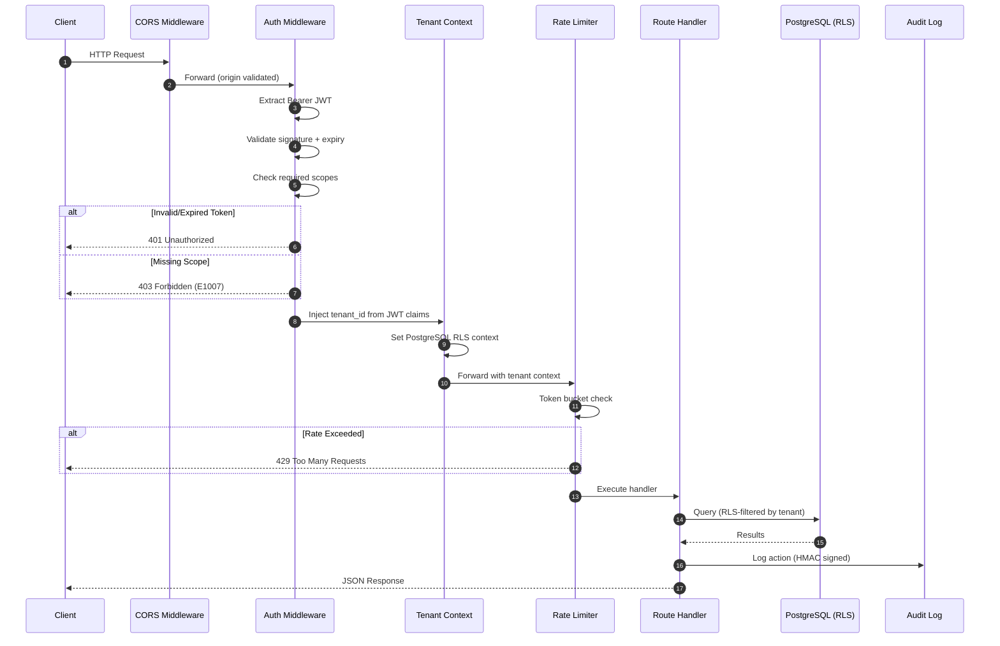
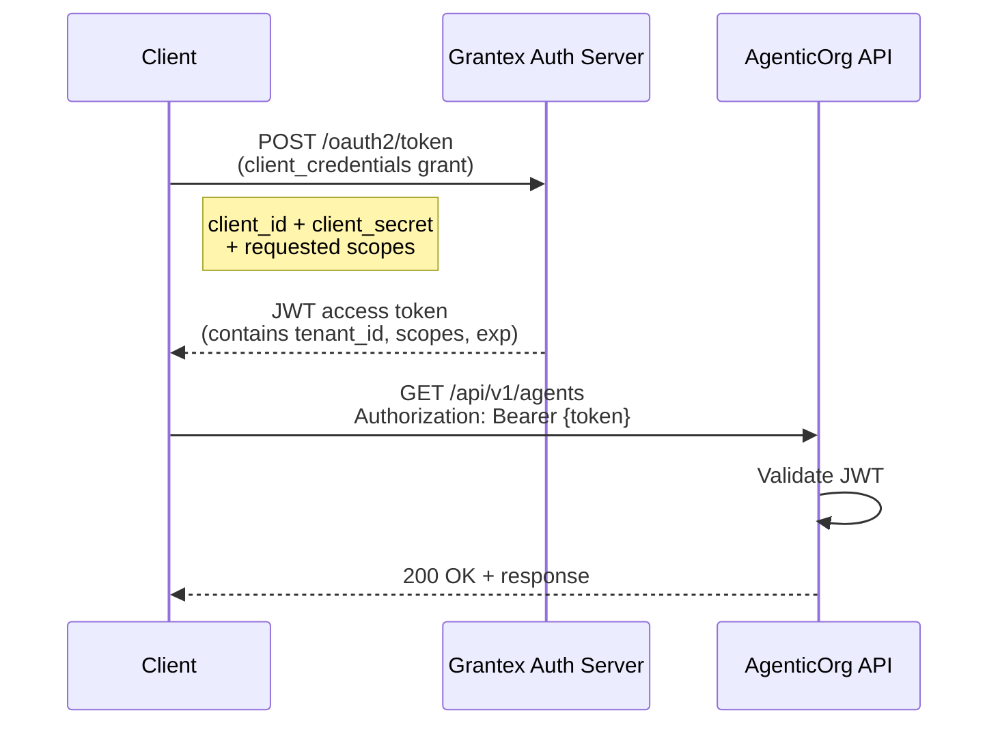
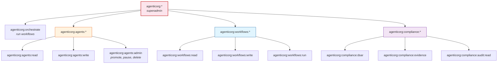
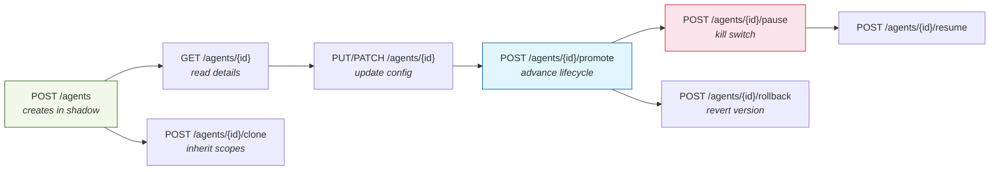
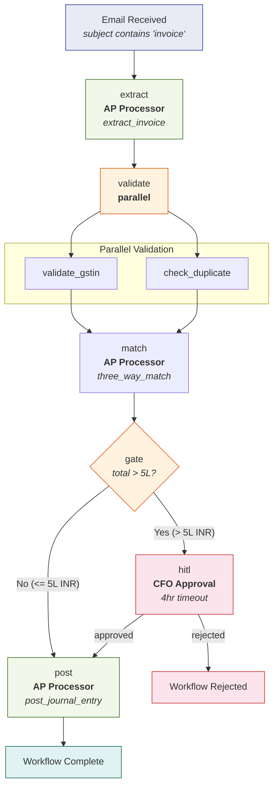
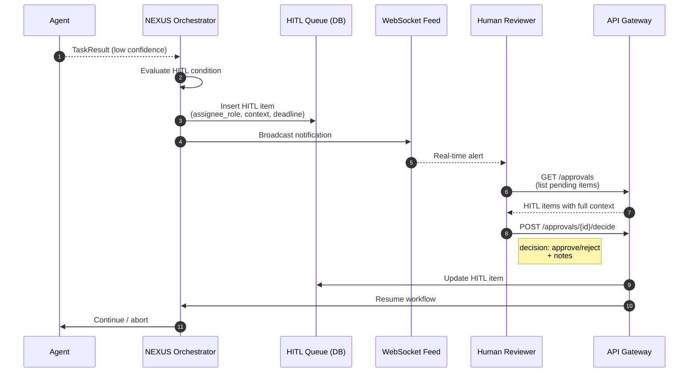
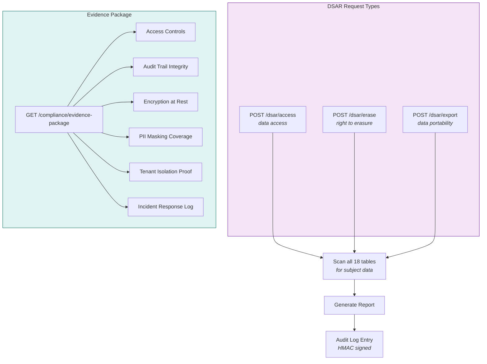
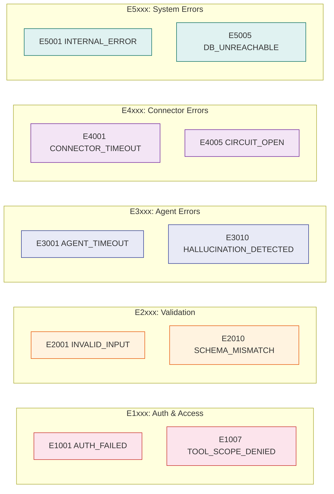
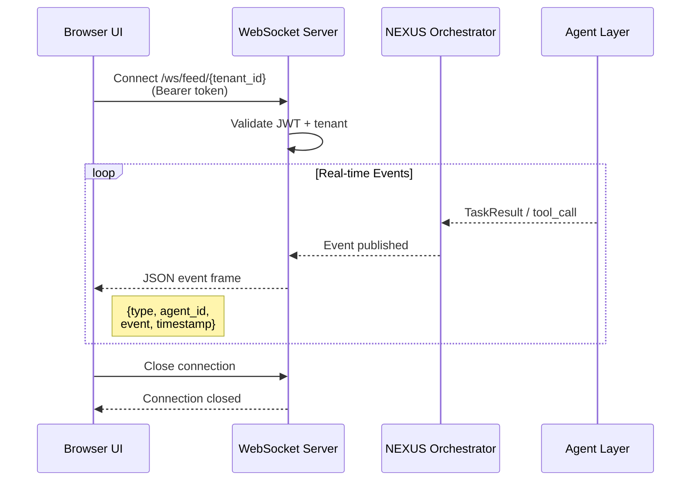

# API Reference

Base URL: `http://localhost:8000`
OpenAPI docs: `http://localhost:8000/docs`

All endpoints require a Bearer JWT token (except `/api/v1/health`).

## Request Flow

Every API request passes through a standard middleware pipeline before reaching the handler:



---

## Authentication



```bash
# Obtain platform token
curl -X POST https://auth.yourorg.com/oauth2/token \
  -d "grant_type=client_credentials" \
  -d "client_id=$GRANTEX_CLIENT_ID" \
  -d "client_secret=$GRANTEX_CLIENT_SECRET" \
  -d "scope=agenticorg:orchestrate agenticorg:agents:read"

# Use token in requests
curl -H "Authorization: Bearer $TOKEN" http://localhost:8000/api/v1/agents
```

### Scope Hierarchy



---

## Agents

### Create Agent
```
POST /api/v1/agents
```
Creates a new agent in `shadow` status. Requires `agenticorg:agents:write` scope.

**Request Body:**
```json
{
  "name": "Invoice Validator — GST Specialist",
  "agent_type": "invoice_validator_gst",
  "domain": "finance",
  "llm_model": "claude-3-5-sonnet-20241022",
  "confidence_floor": 0.90,
  "hitl_condition": "total > 500000 OR einvoice_failed==true",
  "authorized_tools": ["oracle_fusion:read:purchase_order", "gstn_api:read:validate_gstin"],
  "initial_status": "shadow",
  "shadow_comparison_agent": "ap-processor-001",
  "shadow_min_samples": 100,
  "shadow_accuracy_floor": 0.95,
  "cost_controls": {
    "daily_token_budget": 500000,
    "monthly_cost_cap_usd": 200,
    "on_budget_exceeded": "pause_and_alert"
  }
}
```

**Response:** `201 Created`
```json
{
  "agent_id": "uuid",
  "status": "shadow",
  "token_issued": true
}
```

### Agent CRUD Flow



### Clone Agent
```
POST /api/v1/agents/{parent_id}/clone
```
Clone an existing agent with overrides. Child cannot elevate parent's scopes.

### Kill Switch
```
POST /api/v1/agents/{id}/pause
```
Immediately pauses agent, revokes token, stops accepting new tasks. Effective in <30 seconds.

---

## Workflows

### Create Workflow
```
POST /api/v1/workflows
```

**Request Body (YAML-based definition):**
```json
{
  "name": "invoice-processing-v2",
  "version": "2.0",
  "trigger_type": "email_received",
  "trigger_config": {"filter": {"subject_contains": ["invoice", "bill"]}},
  "timeout_hours": 48,
  "definition": {
    "steps": [
      {"id": "extract", "type": "agent", "agent": "ap-processor", "action": "extract_invoice"},
      {"id": "validate", "type": "parallel", "wait_for": "all", "steps": ["validate_gstin", "check_duplicate"]},
      {"id": "match", "type": "agent", "agent": "ap-processor", "action": "three_way_match", "depends_on": ["validate"]},
      {"id": "gate", "type": "condition", "condition": "match.output.total > 500000", "true_path": "hitl", "false_path": "post"},
      {"id": "hitl", "type": "human_in_loop", "assignee_role": "cfo", "timeout_hours": 4},
      {"id": "post", "type": "agent", "agent": "ap-processor", "action": "post_journal_entry", "depends_on": ["gate"]}
    ]
  }
}
```

### Workflow Execution Example

The above invoice processing workflow executes as:



### Trigger Workflow Run
```
POST /api/v1/workflows/{id}/run
```

### Get Run Details
```
GET /api/v1/workflows/runs/{run_id}
```

---

## HITL Approvals

### Approval Flow



### List Pending Approvals
```
GET /api/v1/approvals
```

### Submit Decision
```
POST /api/v1/approvals/{id}/decide
```
```json
{
  "decision": "approve",
  "notes": "Scope change email confirmed, approving amended PO."
}
```

---

## Compliance

### DSAR Access Request
```
POST /api/v1/dsar/access
```
```json
{"subject_email": "user@example.com", "request_type": "access"}
```

### DSAR Erasure Request
```
POST /api/v1/dsar/erase
```
30-day deadline enforced per GDPR/DPDP Act.

### Evidence Package
```
GET /api/v1/compliance/evidence-package
```
Returns SOC2 Type II evidence package with 6 sections.

### Compliance Flow



---

## Error Responses

All errors use the standard envelope:
```json
{
  "error": {
    "code": "E1007",
    "name": "TOOL_SCOPE_DENIED",
    "message": "Agent ap-processor-001 lacks scope tool:okta:write:provision_user",
    "severity": "critical",
    "retryable": false,
    "escalate": true,
    "context": {"agent_id": "ap-processor-001", "workflow_run_id": "wfr_abc123"}
  }
}
```

### Error Code Ranges



---

## WebSocket

### Live Activity Feed
```
WS /api/v1/ws/feed/{tenant_id}
```
Real-time stream of agent activity, workflow events, and HITL notifications.


