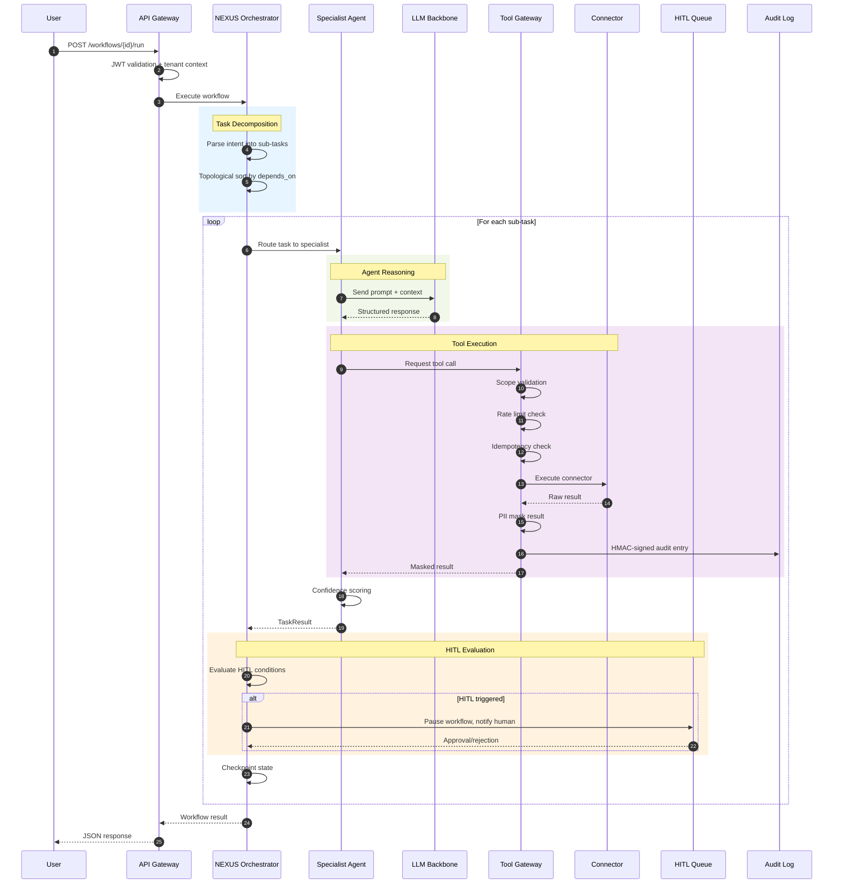
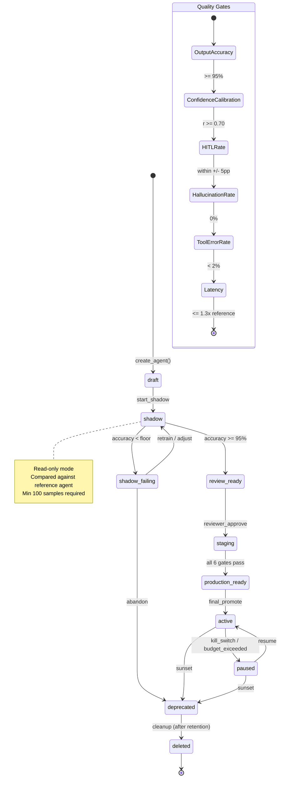
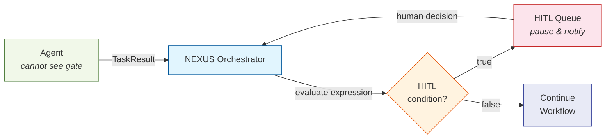
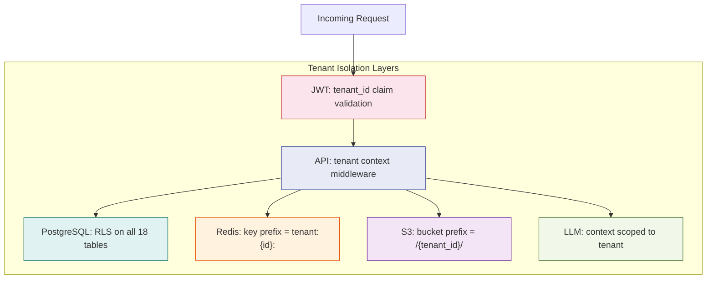
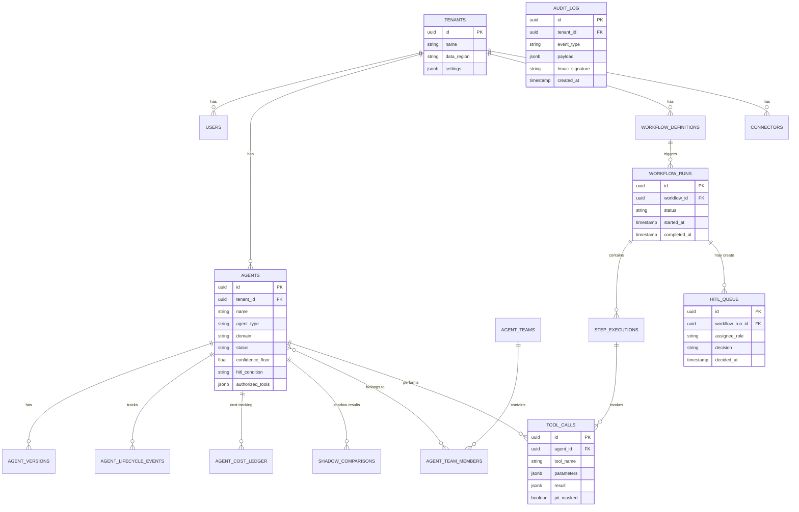
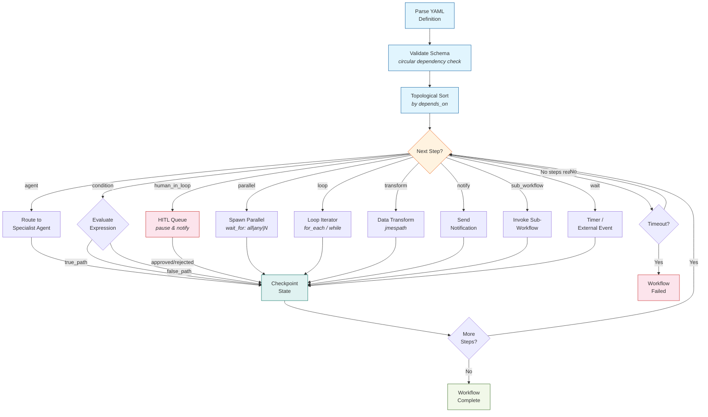
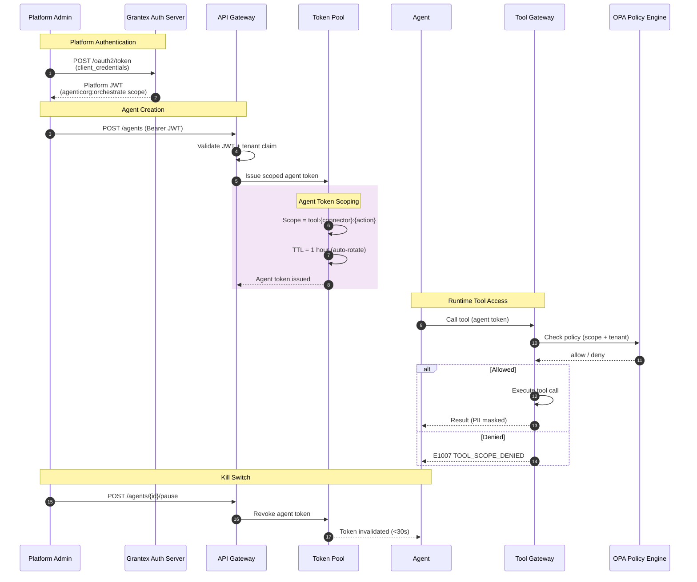
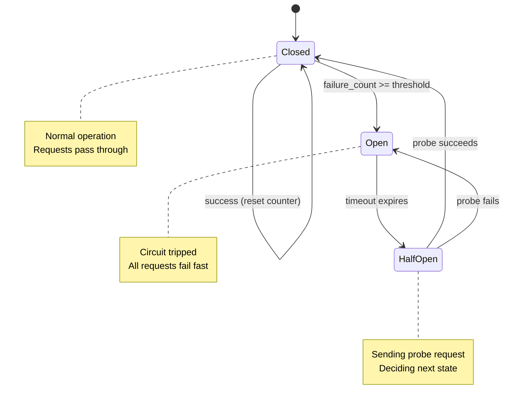
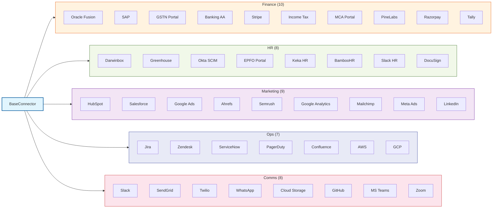

# Architecture Guide

## System Overview

AgenticOrg is an 8-layer enterprise platform that orchestrates AI agents to automate business workflows.

```mermaid
graph TB
    subgraph L8["<b>L8: Auth & Compliance</b>"]
        direction LR
        Grantex["Grantex/OAuth2"]
        JWT["JWT"]
        OPA["OPA Policy Engine"]
        WORM["WORM Audit"]
        DSAR["DSAR Handler"]
    end

    subgraph L7["<b>L7: Observability</b>"]
        direction LR
        OTel["OpenTelemetry<br/><i>7 spans</i>"]
        Prom["Prometheus<br/><i>13 metrics</i>"]
        LS["LangSmith"]
        Alert["Alerting<br/><i>11 thresholds</i>"]
    end

    subgraph L6["<b>L6: Data Layer</b>"]
        direction LR
        PG["PostgreSQL 16<br/>+ pgvector"]
        Redis["Redis 7"]
        S3["S3-compat<br/>Storage"]
        DB_Detail["18 tables &middot; RLS &middot; Partitioning &middot; HMAC"]
    end

    subgraph L5["<b>L5: Connector Layer</b><br/><i>42 adapters</i>"]
        direction LR
        Fin["Finance (10)"]
        HR["HR (8)"]
        Mkt["Marketing (9)"]
        Ops["Ops (7)"]
        Comms["Comms (8)"]
    end

    subgraph L4["<b>L4: Tool Gateway</b>"]
        direction LR
        Scope["Scope Enforcement"]
        RateLimit["Token Bucket<br/>Rate Limiting"]
        Idemp["Idempotency"]
        PII["PII Masking"]
        AuditLog["Audit Logging"]
    end

    subgraph L3["<b>L3: NEXUS Orchestrator</b>"]
        direction LR
        TaskDecomp["Task Decomposition"]
        Routing["Routing"]
        Conflict["Conflict Resolution"]
        Checkpoint["Checkpointing"]
        StateMachine["State Machine"]
        HITL_Eval["HITL Evaluation"]
    end

    subgraph L2["<b>L2: Agent Layer</b><br/><i>24 specialists</i>"]
        direction LR
        Confidence["Confidence Scoring"]
        HITL_Trigger["HITL Trigger<br/>Evaluation"]
        StructOut["Structured Output"]
        AntiHalluc["Anti-Hallucination<br/>Rules"]
    end

    subgraph L1["<b>L1: LLM Backbone</b>"]
        direction LR
        Claude["Claude Sonnet<br/><i>primary</i>"]
        GPT["GPT-4o<br/><i>fallback</i>"]
        Failover["Auto-Failover"]
        TokenTrack["Token Tracking"]
        CostLedger["Cost Ledger"]
    end

    L8 --- L7
    L7 --- L6
    L6 --- L5
    L5 --- L4
    L4 --- L3
    L3 --- L2
    L2 --- L1

    style L8 fill:#fce4ec,stroke:#c62828,stroke-width:2px
    style L7 fill:#e8eaf6,stroke:#283593,stroke-width:2px
    style L6 fill:#e0f2f1,stroke:#00695c,stroke-width:2px
    style L5 fill:#fff3e0,stroke:#e65100,stroke-width:2px
    style L4 fill:#f3e5f5,stroke:#6a1b9a,stroke-width:2px
    style L3 fill:#e1f5fe,stroke:#01579b,stroke-width:2px
    style L2 fill:#f1f8e9,stroke:#33691e,stroke-width:2px
    style L1 fill:#fafafa,stroke:#424242,stroke-width:2px
```

---

## Message Flow

---

## Agent Lifecycle FSM

Every agent follows a governed promotion path through these states:

### Quality Gates Detail

| Gate | Metric | Threshold |
|------|--------|-----------|
| Output Accuracy | Shadow vs reference match | >= 95% |
| Confidence Calibration | Pearson correlation | r >= 0.70 |
| HITL Rate | Deviation from reference | within +/- 5pp |
| Hallucination Rate | Fabricated data detected | 0% |
| Tool Error Rate | Failed tool calls | < 2% |
| Latency | Compared to reference | <= 1.3x |

---

## Key Design Decisions

### 1. HITL at Orchestrator Level
Agents cannot observe, reason about, or bypass their own HITL gates. The threshold expression is evaluated by the Orchestrator after receiving the TaskResult -- never by the agent itself. This prevents prompt injection from disabling safety controls.

### 2. Shadow Mode Mandatory
No agent gets write access without first proving accuracy in shadow mode. Minimum 100 samples at 95% accuracy. This is enforced by architecture, not configuration -- there is no flag to skip it in production.

### 3. Append-Only Audit
The `audit_log` table has RLS blocking all UPDATE and DELETE. Every row carries an HMAC-SHA256 signature. This is a hard system property verified by the SEC-INFRA-002 test.

### 4. Tenant Isolation at Every Layer
PostgreSQL RLS, Redis key namespacing, S3 prefix isolation, JWT tenant claim validation, LLM context isolation. A tenant breach is classified as a critical security incident.

### 5. Error Taxonomy (not ad-hoc strings)
All 50 error codes have defined severity, retry policy, and escalation rules. The API always returns the ErrorEnvelope schema. This enables automated error handling and monitoring.

---

## Database Schema

18 tables organized across 6 migration files:

### Table Reference

| Table | Purpose | Partitioned? |
|-------|---------|-------------|
| `tenants` | Multi-tenant root | No |
| `users` | Human users with roles | No |
| `agents` | Agent definitions (33 columns) | No |
| `workflow_definitions` | YAML workflow specs | No |
| `workflow_runs` | Execution instances | Yes (monthly) |
| `step_executions` | Per-step results | Yes (monthly) |
| `tool_calls` | Every tool invocation | Yes (monthly) |
| `hitl_queue` | Human approval items | No |
| `audit_log` | Append-only audit trail | Yes (monthly) |
| `connectors` | Registered connectors | No |
| `schema_registry` | JSON Schema templates | No |
| `documents` | Document store (pgvector) | No |
| `agent_versions` | Version history | No |
| `agent_lifecycle_events` | State transitions | No |
| `agent_teams` | Agent groupings | No |
| `agent_team_members` | Team membership | No |
| `agent_cost_ledger` | Daily cost tracking | No |
| `shadow_comparisons` | Shadow vs reference results | Yes (monthly) |

---

## Workflow Engine

The workflow engine supports 9 step types and executes via dependency graph resolution:

### Step Types

1. **agent** -- Route task to a specialist agent for LLM-powered execution
2. **condition** -- Branch to `true_path` / `false_path` based on expression evaluation
3. **human_in_loop** -- Pause workflow and create HITL approval item
4. **parallel** -- Execute multiple steps concurrently with `wait_for: all|any|N`
5. **loop** -- Iterate over collections or repeat while condition holds
6. **transform** -- Apply data transformations (JMESPath expressions)
7. **notify** -- Send notifications via configured channels
8. **sub_workflow** -- Invoke another workflow definition as a nested call
9. **wait** -- Wait for timer expiry or external event

---

## Auth Flow

---

## Connector Framework

All 42 connectors extend `BaseConnector` with:
- `_register_tools()` -- declares available tool functions
- `_authenticate()` -- obtains credentials via `_get_secret()`
- Circuit breaker (Redis-backed, 3-state: closed/open/half-open)
- Rate limiting per connector per tenant
- Health check endpoint

### Connector Categories

