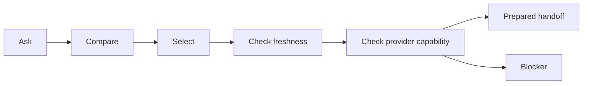

# The Buyer Journey From Question To Prepared Purchase Handoff

## Summary

OACP lets a buyer journey move from discovery to prepared purchase handoff without faking checkout, payment, order, or mandate success.

## Target Audience

Buyer-experience teams, operators, and merchant success.

## Architecture Diagram

## End-To-End Flow

The buyer asks about products. AgenticOrg answers from OACP cache. The buyer asks to buy. AgenticOrg checks required artifacts, product and variant selection, price and inventory freshness, policy, and Plural/Pine capability evidence. The output is a prepared handoff or a blocker.

## What Is Implemented Now

Buyer Q&A, product listing, protocol adapters, provider capability verification, and purchase preparation are implemented.

## What Requires External Approval Or Config

Provider rail execution, merchant order integration, channel approvals, and rollback evidence.

## Failure Modes

- Product no longer fresh.
- Price/inventory record missing.
- Provider capability stale.
- Buyer asks for final payment/order success.

## Safe User Wording Examples

- "I can prepare this for review."
- "No payment was attempted."
- "The merchant/provider system remains the source of final order status."
