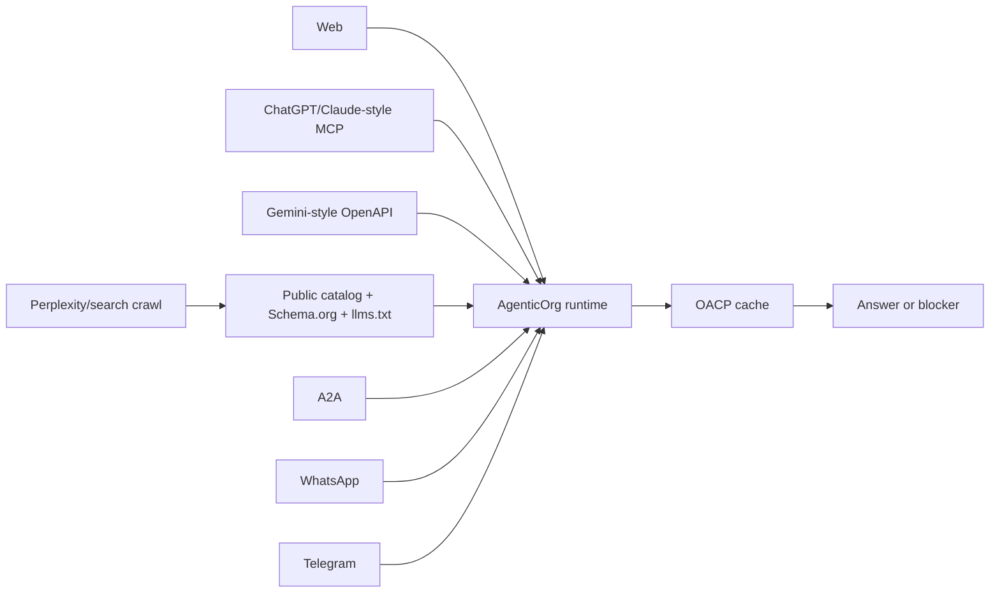

# How ChatGPT, Claude, Gemini, Perplexity, WhatsApp, And Telegram Can Shop Through Seller Agents

## Summary

Buyer surfaces use different protocols, but they must share one OACP-backed truth path in AgenticOrg. Web, MCP, OpenAPI, A2A, search/crawler, WhatsApp, and Telegram routes must preserve source/freshness labels and commitment boundaries.

## Target Audience

Developers, channel owners, and go-to-market teams.

## Architecture Diagram

## End-To-End Flow

1. A buyer asks through a surface.
2. The bridge normalizes the request.
3. The shared buyer question path checks OACP cache.
4. The response returns source/freshness labels.
5. Search-style agents discover merchant-enabled public pages, Schema.org JSON-LD, sitemap, and `llms.txt`.
6. Commitment requests go to purchase preparation.

## What Is Implemented Now

AgenticOrg exposes web ask, MCP seller/catalog/product/freshness tools, OpenAPI ask/schema, A2A agent card, surface matrix, merchant-enabled public catalog pages, Schema.org JSON-LD, sitemap, `llms.txt`, WhatsApp webhook, Telegram webhook, protocol adapter routes, and buyer Q&A from cache.

## What Requires External Approval Or Config

WhatsApp and Telegram webhook secrets, MCP/OpenAPI client review, public channel policy, search indexing, provider or bank credentials for mandate/payment capability, and merchant launch approval.

## Failure Modes

- Channel secret missing.
- Channel payload cannot be normalized or verified.
- Cache is stale.
- Buyer asks for execution from a discovery channel.
- Public publishing is disabled for the merchant.

## Safe User Wording Examples

- "This channel can answer from cached OACP artifacts."
- "A purchase request can be prepared for review only."
- "No checkout, payment, or order was created."
