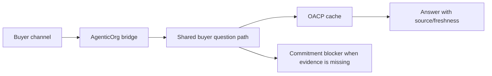

# How ChatGPT, Claude, Gemini, WhatsApp, And Telegram Buyers Interact

Every channel uses the same seller-agent facts. MCP tools serve ChatGPT and
Claude-style clients. OpenAPI and A2A metadata serve Gemini and hosted/action
clients. WhatsApp and Telegram use verified webhooks. The answer path is shared,
so channel differences do not create different commerce truth.

The channels can ask questions, inspect product snapshots, and request a
prepared handoff. They cannot create orders or payments by themselves.

