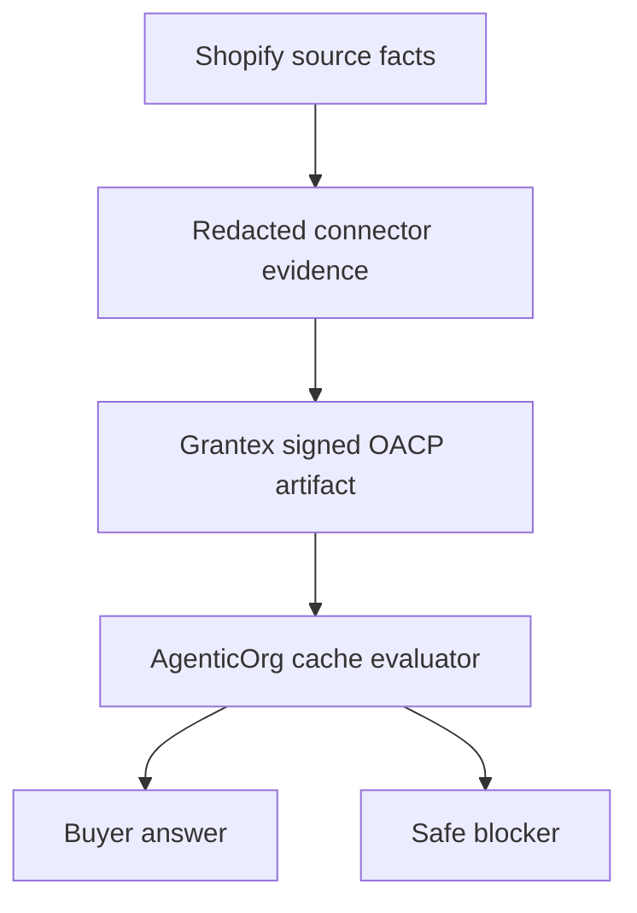

# How OACP Artifacts Keep Buyer Agents Honest

Buyer agents are useful only when they stop guessing. OACP artifacts carry
scope, source refs, TTL, freshness, revocation posture, verifier state, and
non-execution flags. AgenticOrg checks those fields before answering.

If evidence is stale, missing, revoked, or outside scope, the agent refuses or
asks for a refresh. That is the point: a blocked answer is better than a made-up
price, stock promise, or checkout claim.

