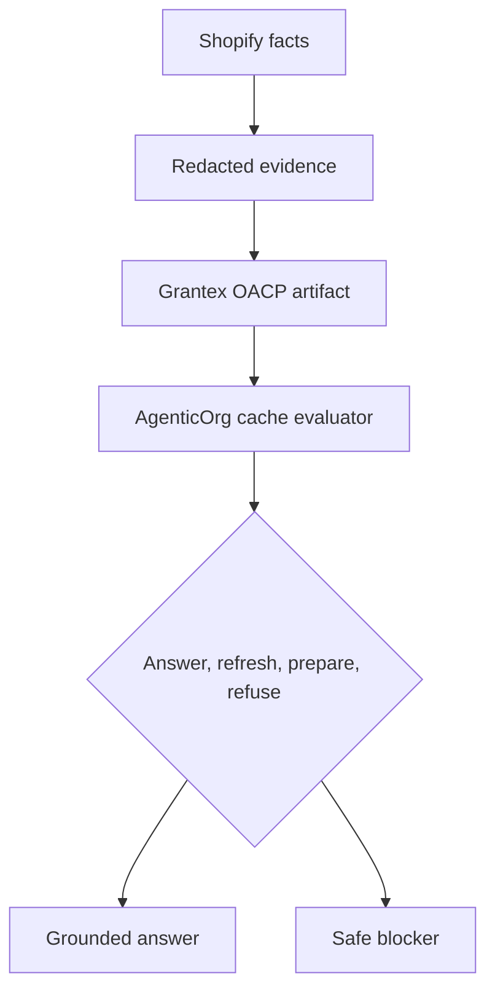

# Why OACP Keeps Buyer Agents Honest

## Summary

OACP keeps buyer agents honest by making source, freshness, scope, revocation posture, risk tier, and non-execution flags mandatory runtime inputs.

## Target Audience

Buyer-agent builders, safety teams, and support operators.

## Architecture Diagram

## End-To-End Flow

The buyer asks a question. AgenticOrg loads scoped cache records, checks artifact TTL and source freshness, filters private or executable fields, and returns either a grounded answer, a refresh instruction, a prepared handoff, or a blocker.

## What Is Implemented Now

The runtime builds cache records from Grantex artifacts, answers from cache, generates source labels, blocks stale/missing artifacts, and refuses purchase preparation when required artifacts or Plural/Pine capability evidence are missing.

## What Requires External Approval Or Config

Channel rollout, merchant source approval, provider capability configuration, and any future execution path.

## Failure Modes

- Cache record expired.
- Buyer asks for payment or order success.
- Source refs are missing.
- Provider capability evidence is stale.

## Safe User Wording Examples

- "I can answer from the current merchant snapshot."
- "I cannot confirm payment from cached artifacts."
- "This request needs refreshed source evidence."
