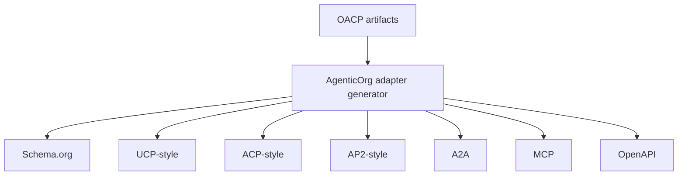

# How OACP Maps To Schema.org, UCP, ACP, AP2, A2A, MCP

## Summary

AgenticOrg consumes Grantex OACP artifacts and generates compatibility adapter payloads for web, MCP, OpenAPI, A2A, and partner-style clients.

## Target Audience

Developers and protocol partners.

## Architecture Diagram

## End-To-End Flow

Grantex issues protocol adapter artifacts. AgenticOrg caches them and generates channel payloads from canonical source, freshness, policy, and blocked-capability fields.

## What Is Implemented Now

`/api/v1/commerce/runtime/protocol-adapters` and `/protocol-adapters/{surface}` return generated payloads. OpenAPI and A2A bridge metadata routes also exist.

## What Requires External Approval Or Config

External program review, public client acceptance, channel policy approval, and any partner claims outside internal compatibility mapping.

## Failure Modes

- Adapter generated without source labels.
- Unsupported execution fields included.
- Client treats metadata as payment/order authority.

## Safe User Wording Examples

- "This is a compatibility mapping derived from OACP artifacts."
- "The adapter does not create checkout or payment."
- "Unsupported execution fields are blocked."
