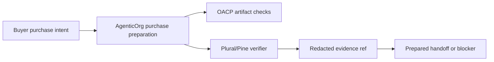

# How Pine Labs Plural/P3P Mandate Capability Fits Into Agentic Commerce

## Summary

AgenticOrg verifies provider-owned Plural/Pine capability metadata and uses redacted evidence refs in purchase preparation. Pine Labs Plural/P3P owns mandate and payment rail execution.

## Target Audience

Fintech partners, operators, and commerce risk teams.

## Architecture Diagram

## End-To-End Flow

AgenticOrg checks fresh OACP artifacts, product/price/inventory/policy records, and Plural/Pine capability evidence. If all required evidence exists, it prepares a provider-owned handoff. If not, it returns a blocker.

## What Is Implemented Now

The runtime has `/providers/plural-pine/mandate-capability/verify` and `/purchase/prepare`. It returns redacted capability evidence or exact blockers without storing raw payment secrets.

## What Requires External Approval Or Config

Plural/Pine credentials, environment approval, merchant approval, provider webhook/reconciliation path, rollback owner, and support policy.

## Failure Modes

- Provider env vars missing.
- Non-approved provider environment.
- Capability evidence stale.
- Buyer asks the agent to create a mandate directly.

## Safe User Wording Examples

- "Provider capability evidence is present for preparation only."
- "No mandate, payment, or order was created."
- "Plural/Pine capability is missing or stale, so this is blocked."
