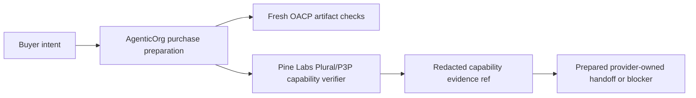

# How Plural/Pine Mandate Capability Fits Without Grantex Owning Payments

Grantex governs the OACP artifact and policy layer. AgenticOrg runs buyer and
seller agents and verifies provider-owned capability metadata. Pine Labs
Plural/P3P owns mandate and payment rail execution.

If provider capability evidence is missing, stale, or unavailable, AgenticOrg
returns an exact blocker. It does not fake a successful mandate, payment, or
order.

