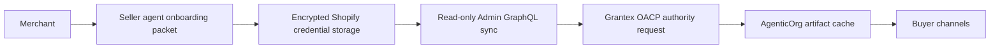

# How A Shopify Merchant Becomes An Agentic Commerce Seller

A Shopify merchant starts in AgenticOrg, not in a protocol console. The merchant
creates a Seller Commerce Agent, connects Shopify read-only, and lets AgenticOrg
sync public-safe catalog snapshots. Grantex signs the authority artifacts.
Buyer channels then answer from cached artifacts with source and freshness
labels.

Checkout and payment execution remain outside this path until provider and
merchant approvals are complete.

