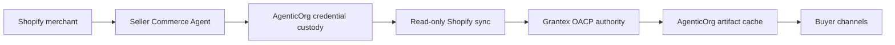

# How A Shopify Merchant Becomes An Agentic Commerce Seller

## Summary

A Shopify merchant becomes an Agentic Commerce seller by saving tenant/merchant/store commerce config in AgenticOrg, creating a Seller Commerce Agent, connecting Shopify read-only, requesting Grantex OACP authority artifacts, and enabling buyer surfaces from cached source-labeled artifacts.

## Target Audience

Merchants, implementation teams, and AgenticOrg operators.

## Architecture Diagram

## End-To-End Flow

1. Merchant opens `/dashboard/commerce-runtime`.
2. Merchant saves tenant/merchant/store-scoped source connector, buyer channel, provider-owned payment, public publishing, and Offline POS settings.
3. Merchant creates or updates a Seller Commerce Agent.
4. AgenticOrg stores merchant-scoped Shopify access without rendering secrets.
5. AgenticOrg syncs product, variant, price, image, status, and inventory evidence.
6. AgenticOrg sends public-safe evidence to Grantex.
7. Grantex issues or refuses OACP artifact families.
8. AgenticOrg caches artifacts and answers buyer questions with source/freshness labels.
9. Purchase intent becomes a provider/POS/merchant-owned prepared handoff or an exact blocker.

## What Is Implemented Now

Runtime endpoints exist for onboarding packets, Shopify credentials, Shopify sync, Grantex authority requests, artifact cache intake, buyer questions, bridges, protocol adapters, Plural/Pine capability verification, and purchase preparation.

WooCommerce, ERP, PIM, OMS, WMS, custom API, bank-owned rails, fintech rails, and custom provider configs can be saved by merchants today as pending-adapter setup. They are not marked runtime-live until approved adapters, tests, credentials, and external approvals exist.

## What Requires External Approval Or Config

Merchant Shopify access, Grantex tenant allowlist, channel webhook secrets, Plural/Pine credentials, merchant approval, provider approval, and rollback owner.

## Failure Modes

- Shopify credential missing or invalid.
- Grantex authority returns a blocker.
- Artifact cache lacks fresh product/price/inventory records.
- Provider capability evidence is missing for a purchase request.

## Safe User Wording Examples

- "Source: Shopify via Grantex artifact."
- "I can prepare a handoff, but no payment or order was created."
- "The source evidence is stale. Please refresh Shopify and Grantex artifacts."
