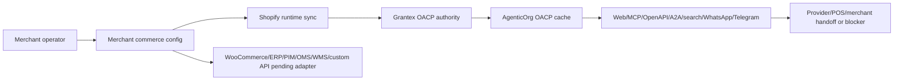

# Merchant Self-Service Config For OACP Commerce

## Summary

AgenticOrg now treats OACP commerce setup as tenant, merchant, and seller-agent scoped configuration. A tenant admin or merchant operator can configure source systems, buyer channels, provider-owned payment rails, public publishing, and Offline POS metadata during Seller Commerce Agent onboarding or later from `/dashboard/commerce-runtime`.

## What The Merchant Controls

The merchant can update:

- merchant profile and commerce categories;
- seller agent and buyer agent ids;
- source connector type and refs;
- Shopify domain and read-only credential custody refs;
- buyer channel enablement and external approval refs;
- payment provider type and provider-owned credential refs;
- public catalog publishing preference;
- Offline POS store and webhook-secret refs.

The config row stores refs and redacted metadata only. It must not store Shopify Admin API tokens, OAuth secrets, raw provider payloads, card data, bank data, UPI data, payment URLs, checkout URLs, raw Grantex artifacts, or executable order/payment/refund targets.

## Runtime Support Today

Shopify is the supported runtime source connector. AgenticOrg can run read-only Shopify Admin GraphQL sync, reconcile webhook-triggered refresh state, request Grantex OACP authority artifacts, cache buyer-safe artifacts, and answer buyer questions with source/freshness labels.

WooCommerce, ERP, PIM, OMS, WMS, and custom API configs are accepted as merchant intent and marked `configured_pending_adapter`. That gives operators a real setup path without pretending those adapters are live.

## Provider And Bank Rails

Pine Labs Plural/P3P is the current provider-owned mandate capability verifier. Merchants can also configure bank-owned rails, fintech rails, custom providers, or no provider. Bank and custom provider configs remain non-executing until an approved adapter, sandbox test path, callback verification, and rollout approval exist.

## Public Publishing

Public seller profile, catalog JSON, product pages, Schema.org JSON-LD, sitemap, and `llms.txt` require the merchant config `public_publishing.enabled=true`. The platform can still disable all public commerce publishing with `OACP_PUBLIC_CATALOG_PLATFORM_DISABLED=true`.

## Safe Buyer Outcome

The configured journey is:

Non-binding buyer questions can continue from valid OACP cache. Commitment, mandate, payment, POS, order, refund, return, fulfillment, and inventory-hold requests require approved merchant/provider/POS evidence or fail closed.
