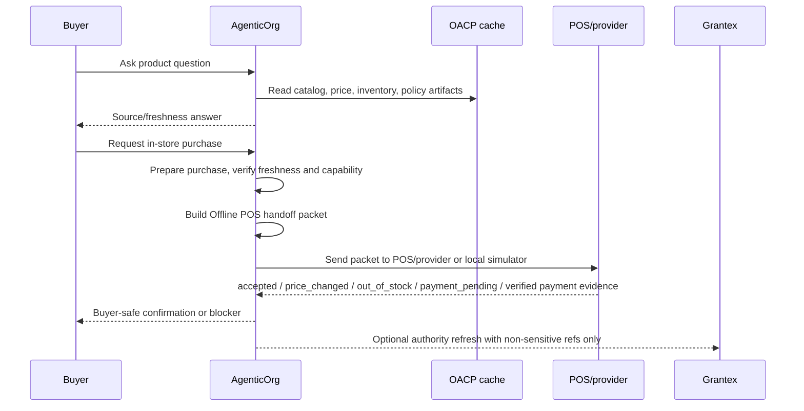

# Offline POS Bridge: Connecting In-Store Checkout To AI Buyer Agents

## Audience

Merchants, POS/payment partners, commerce developers, and operators evaluating AgenticOrg's OACP-backed commerce runtime.

## Summary

AgenticOrg can now prepare an in-store purchase handoff from OACP-backed product, price, inventory, policy, and capability artifacts. The Offline POS Bridge creates a non-sensitive packet, accepts POS/provider confirmation statuses, and reconciles buyer-safe outcomes. It does not run POS transactions, capture payments, create orders, reserve inventory, or turn simulator results into live paid states.

## Visual Workflow

## End-To-End Flow

1. The buyer asks about a product through web, MCP, OpenAPI, A2A, WhatsApp, or Telegram.
2. AgenticOrg answers from cached OACP artifacts and shows source/freshness labels.
3. The buyer asks to buy in store or pick up locally.
4. AgenticOrg runs purchase preparation against artifact freshness, policy, buyer/session scope, and Plural/Pine capability evidence.
5. AgenticOrg builds an Offline POS handoff packet with tenant, merchant, seller agent, store/POS location, product/variant, quantity, displayed price, artifact refs, freshness timestamps, expiry window, risk tier, allowed actions, blocked actions, and non-sensitive evidence refs.
6. A POS provider or the deterministic local simulator returns a confirmation status.
7. AgenticOrg reconciles the status into buyer-safe and operator-safe wording.
8. Payment happens at the POS or provider, not inside OACP artifacts.
9. AgenticOrg stores only redacted POS/provider evidence refs and marks inventory or artifact refresh when required.

## Implemented State

| Capability | Status |
| --- | --- |
| Packet builder | Implemented in `core/commerce/offline_pos_bridge.py`. |
| POS readiness route | Implemented at `GET /api/v1/commerce/runtime/pos/offline/readiness`. |
| Handoff route | Implemented at `POST /api/v1/commerce/runtime/pos/offline/handoffs`. |
| Confirmation intake | Implemented at `POST /api/v1/commerce/runtime/pos/offline/confirmations`. |
| Deterministic simulator | Implemented at `POST /api/v1/commerce/runtime/pos/offline/simulator/confirm`. |
| Reconciliation | Implemented with buyer-safe status, operator status, refresh flags, and redacted evidence refs. |
| Persistence | Added tenant-scoped handoff and confirmation tables with non-execution constraints. |
| UI | Commerce Runtime demo shows Offline POS readiness, handoff, and simulator confirmation. |

## Limitations

- The local simulator is for tests and demos only.
- Live POS provider callbacks need provider-specific approval and verification.
- `payment_confirmed` and `receipt_available` are accepted only with verified callback evidence and a provider/POS evidence ref.
- The bridge does not create orders, capture payments, reserve inventory, or store raw POS/payment payloads.
- Grantex verifies OACP artifact and policy/evidence references only when authority refresh is needed.

## External Requirements

| Requirement | Owner |
| --- | --- |
| POS provider approval | Merchant + POS/payment provider |
| Verified callback secret or signature path | AgenticOrg + POS/payment provider |
| Store/POS location metadata | Merchant + AgenticOrg |
| Monitoring and rollback | AgenticOrg operator |
| Authority refresh allowlist | Grantex + AgenticOrg |

## Failure Modes

| Failure | Safe behavior |
| --- | --- |
| Stale price or inventory | Refuse commitment and request refresh. |
| Missing POS location | Block POS handoff and ask operator to configure location metadata. |
| POS reports price changed | Require buyer confirmation and refresh artifacts. |
| POS reports out of stock | Tell buyer the agent cannot complete the purchase. |
| Simulator says accepted | Tell buyer staff must confirm final price and payment at store. |
| Unverified payment confirmation | Downgrade to staff review; do not claim success. |
| Grantex unavailable with valid cache | Allow non-binding Q&A only; commitment depends on cached policy and risk. |

## Safe Wording Examples

- "Source: Shopify catalog. Updated 4 min ago. Final price is confirmed at POS."
- "POS accepted the handoff. Staff must confirm final price and payment at the store."
- "The POS reported a price change. Please confirm the new price before payment."
- "I cannot claim payment or order success without verified POS/provider evidence."
- "Inventory needs refresh before I can prepare this handoff."
