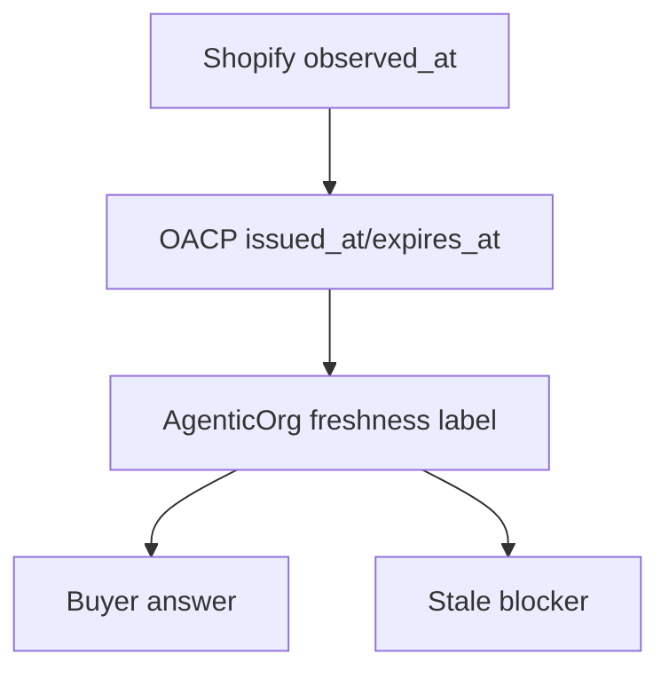

# Source, Freshness, And Trust In AI Commerce

## Summary

Source and freshness labels make AI commerce inspectable. OACP requires buyer answers to carry where facts came from and whether they are still usable.

## Target Audience

Product managers, UX writers, and support operators.

## Architecture Diagram

## End-To-End Flow

Shopify source timestamps flow into connector evidence. Grantex artifacts carry issue and expiry windows. AgenticOrg converts those into source/freshness labels and blockers.

## What Is Implemented Now

Cache records include source refs, evidence refs, TTL, freshness, revocation posture, and non-enablement flags. Buyer answers display source labels in the runtime demo.

## What Requires External Approval Or Config

Merchant-specific source precedence, channel wording review, and public support runbooks.

## Failure Modes

- Stale source evidence.
- Missing source label in a channel.
- Cache record used for a higher-risk request than allowed.

## Safe User Wording Examples

- "Source: Shopify via Grantex artifact."
- "Freshness: current within the artifact window."
- "This snapshot is stale; refresh is required."
