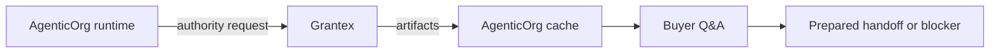

# Why Grantex Is Not A Transaction Toll Booth

## Summary

Grantex is the OACP authority, not a relay for every buyer message. AgenticOrg can answer non-binding questions from valid cached artifacts, while merchant/provider/POS systems remain responsible for execution.

## Target Audience

Architects, merchant success teams, and operators.

## Architecture Diagram

## End-To-End Flow

AgenticOrg asks Grantex for authority artifacts after source sync. Buyer Q&A then uses valid cache. A request that commits the buyer requires fresh artifacts, provider or bank capability evidence, POS or merchant confirmation where applicable, and merchant/provider approval.

## What Is Implemented Now

AgenticOrg has authority request, cache, Q&A, bridge, adapter, and purchase preparation paths. Grantex has the C6Z authority endpoint.

## What Requires External Approval Or Config

Tenant allowlists, channel approvals, provider or bank configuration, POS callback verification, and any execution path.

## Failure Modes

- Cache used past freshness window.
- Commitment treated as discovery.
- Grantex outage misunderstood as permission to proceed.

## Safe User Wording Examples

- "This answer came from a valid cached OACP artifact."
- "A cached artifact is not payment authority."
- "I need fresh authority evidence before preparing that request."
