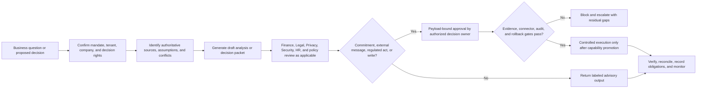

# CBO Guide - Business Governance Evaluation Surface

**Status:** preview/evaluation only; CBO scope and mandatory readiness gates remain open
**Product version:** 4.8.0
**Repository baseline:** `384543788bcd1f66aed8cff8ab03699ae384926e`
**Accountable owner:** unassigned until roadmap item `W0-05` closes
**Last reviewed:** 2026-07-15
**Next review:** CBO scope sign-off or 2026-07-27, whichever occurs first
**Prerequisites:** ratified CBO responsibility matrix, isolated non-production tenant, synthetic business data, reviewed role grants, and disabled external writes
**Limitations:** this guide uses the working Chief Business Officer scope in program memory; it does not establish legal authority, board delegation, or production readiness
**Related test:** `tests/regression/test_readiness_documentation.py`
**Related runbook:** [build and release roadmap](readiness/BUILD_ROADMAP.md), especially `CBO-01` through `CBO-08`

## Scope and readiness boundary

Here, CBO means **Chief Business Officer**, covering commercial strategy and governance plus selected partnerships, legal/risk, board, communications, information-governance, and investigation responsibilities. The supported/out-of-scope matrix still requires `W0-04` sign-off; it must not be interpreted as Chief Brand Officer or as a transfer of authority from Legal, Finance, Privacy, Security, the Board, or regulated officers.

The [capability register](readiness/CAPABILITY_READINESS_REGISTER.md) marks the CBO command center **Scaffolded / Blocked / Preview**. Pricing/deal desk, corporate secretarial/board, information governance, and fraud-investigation capabilities are unavailable. Commercial forecasting, legal operations, risk, and business-metric governance are blocked; strategy, partnerships, and communications scaffolds are not assessed.

`/dashboard/cbo` is admin-only in the current route configuration and may expose generic agent activity. That is platform telemetry, not a trusted strategy, pipeline, portfolio, risk, contract, board, or reputation command center.

## Evaluation scope

| Area | Safe evaluation use | Current boundary |
|---|---|---|
| Strategy and portfolio | Draft objectives, assumptions, dependencies, and review packs | No approved strategy, capital allocation, portfolio decision, or outcome forecast |
| Partnerships and business development | Draft qualification, diligence, and approval checklists | No outreach, commitment, signature, data sharing, or partner activation |
| Commercial pipeline | Model stages, definitions, forecast reviews, and exceptions | No authoritative forecast, revenue commitment, or CRM write |
| Pricing and deal desk | Requirements and decision-rights design only | Unavailable; offer and billing truth must come from governed commercial contracts |
| Contract and legal operations | Draft intake, clause review, obligation extraction, and routing | No legal advice, signature, acceptance, notice, or obligation discharge |
| Enterprise risk | Draft risk statements, control links, and review queues | No certified control effectiveness, regulatory conclusion, or risk acceptance |
| Board and corporate secretarial | Requirements and evidence mapping only | Unavailable; no board record, filing, resolution, or statutory action |
| Communications | Draft internal communication with human review | No public, investor, crisis, legal, or employee communication dispatch |
| Information governance and investigations | Requirements and human-led case design | Unavailable; no autonomous legal hold, deletion, surveillance, fraud conclusion, or disciplinary action |

## Normative workflow

The current safe endpoint is a labeled draft or decision packet, not an external commitment.

## Command-center contract

A production CBO dashboard must eventually disclose governed views of:

- objectives, assumptions, accountable owners, dependencies, benefits, costs, risks, and decision status;
- partnership and commercial pipeline stage, quality, forecast, concentration, and approval state;
- governed offer, pricing, discount, entitlement, contract, billing, renewal, and obligation truth;
- enterprise risks, controls, incidents, legal matters, communication approvals, and board actions within authorized scope;
- metric definitions, source systems, entity and period, currency/unit, owner, freshness, lineage, reconciliation, and confidence;
- conflicts, dissent, overrides, expired evidence, missing data, and decisions awaiting cross-functional sign-off.

These are target contracts. They are not present-day KPI or outcome claims.

## Source and connector posture

CRM, contract, finance, risk, communication, board, and data-governance connector names are inventory until their exact scopes, credential/company binding, source authority, field mappings, legal basis, retention, health, retries, rate limits, idempotency, external-write confirmation, audit, and real sandbox evidence are approved. The governed commercial catalog defines offer and entitlement truth; website copy or a draft proposal cannot override it.

## Approval and authority rules

- Every decision packet must name the decision owner, consulted functions, approval threshold, source set, assumptions, alternatives, conflicts, expiry, and required evidence.
- Deals, prices, discounts, contracts, public statements, board matters, filings, risk acceptance, legal holds, investigations, and data actions require the specifically authorized human or body.
- Approval must be single use and bind to tenant, company, counterparty, action, exact payload, material terms, and expiry.
- Agent output is analysis support, not legal, accounting, tax, investment, employment, regulatory, or board advice.
- Cross-domain actions remain blocked until all participating Finance, CA, HR, Marketing, COO, Security, Privacy, and Legal gates pass.

## Safe local evaluation

1. Ratify the working CBO scope and decision-rights matrix before assessing feature completeness.
2. Use synthetic companies, counterparties, opportunities, contracts, risks, and board artifacts in an isolated test tenant.
3. Confirm admin authorization and company context before opening `/dashboard/cbo`.
4. Exercise advisory flows and inspect source lineage, assumptions, conflicts, approvals, and expiry behavior.
5. Confirm that signatures, offers, external messages, filings, CRM writes, and data-governance actions cannot dispatch.
6. Retain only redacted evidence; record outcomes against the relevant `CBO-Cxx` capability and work package.

## Evidence required for promotion

Promotion requires ratified scope and decision rights; source-authority and metric contracts; tenant/company isolation; real vendor sandbox evidence; legal/privacy/security review; policy and threshold coverage; durable payload-bound approvals and audit; conflict and obligation tracking; failure/reconciliation tests; SLOs and alerts; incident, rollback, correction, retention, and deletion runbooks; controlled pilot evidence; and accountable CBO plus Finance, Legal, Privacy, Security, HR/COO/Marketing where relevant, and operations sign-off.

## Troubleshooting and escalation

| Symptom | Required response |
|---|---|
| CBO responsibility is disputed or ambiguous | Stop and resolve `W0-04`; do not infer authority from a UI role |
| Dashboard presents generic activity as a business metric | Treat it as telemetry and track the command-center gap under `CBO-08` |
| Offer, price, or entitlement conflicts with the commercial catalog | Block publication or commitment and reconcile the authoritative contract |
| Legal, board, filing, investigation, or data action appears executable | Do not proceed; the relevant capabilities are unavailable or blocked |
| Source lineage, assumption, or decision owner is absent | Do not use the output for a commitment; return it for correction |

See the [gap analysis](readiness/GAP_ANALYSIS.md), [readiness standard](readiness/DOMAIN_READINESS_STANDARD.md), and [program memory](readiness/PROGRAM_MEMORY.md) for the current evidence boundary.
