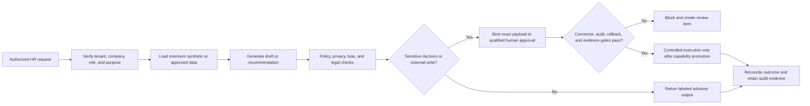

# CHRO Guide - Human Resources Evaluation Surface

**Status:** preview/evaluation only; mandatory HR readiness gates remain open
**Product version:** 4.8.0
**Repository baseline:** `384543788bcd1f66aed8cff8ab03699ae384926e`
**Accountable owner:** unassigned until roadmap item `W0-05` closes
**Last reviewed:** 2026-07-15
**Next review:** owner assignment or 2026-07-27, whichever occurs first
**Prerequisites:** isolated non-production tenant, synthetic workforce data, reviewed role grants, and no live connector credentials
**Limitations:** local routes, agents, and tests are inventory or implementation evidence; they are not HR, legal, security, sandbox, pilot, or production sign-off
**Related test:** `tests/regression/test_readiness_documentation.py`
**Related runbook:** [build and release roadmap](readiness/BUILD_ROADMAP.md), especially `HR-01` through `HR-08`

## Readiness boundary

The CHRO surface is a governed evaluation workspace, not an autonomous HR system. The current [capability register](readiness/CAPABILITY_READINESS_REGISTER.md) classifies the CHRO command center as **Scaffolded / Blocked / Preview**. Employee-master integration is unavailable, and hiring, onboarding, payroll, performance, grievance, compliance, and offboarding paths remain blocked pending policy, approval, privacy, connector, audit, and pilot evidence.

`/dashboard/chro` may expose role-filtered agent activity. Generic task counts, completion rates, HITL counts, or model cost are platform telemetry; they must not be presented as trusted workforce KPIs.

## Evaluation scope

| Area | Safe evaluation use | Current boundary |
|---|---|---|
| Workforce planning | Draft scenarios and review assumptions using synthetic data | No approved headcount plan, skills graph, succession decision, or workforce forecast |
| Recruiting | Draft requisition, screening, and interview workflows | No automated candidate decision, outreach, offer, or protected-trait inference |
| Onboarding | Model checklists and approval handoffs | No production provisioning, payroll enrollment, benefit enrollment, or statutory completion |
| Time and leave | Inspect schemas and sample policy flows | No authoritative balance, attendance, or leave decision |
| Payroll and benefits | Draft validations and exception queues | No payroll calculation, bank instruction, tax filing, benefit change, or payment dispatch |
| Performance and compensation | Draft cycles, rubrics, and reviewer queues | No automated rating, promotion, pay, bonus, or termination decision |
| Learning and skills | Draft learning plans and skill-gap views | No certified competency or mandated-training completion claim |
| Employee service | Model case intake and human escalation | No autonomous grievance, accommodation, investigation, or disciplinary outcome |
| Offboarding | Draft cross-functional checklist | No final pay, access revocation, asset disposition, or statutory action |

## Normative workflow

Until promotion evidence exists, the safe path terminates at a labeled draft, recommendation, or review item.

## Command-center contract

A production CHRO dashboard must eventually source, reconcile, and disclose at least:

- workforce count and movement by approved dimensions;
- vacancy, time-to-stage, and offer funnel with denominator definitions;
- onboarding and offboarding control completion;
- regretted and non-regretted attrition with agreed formulas;
- attendance and leave exceptions where legally permitted;
- payroll and benefit exception state, never raw secrets or unnecessary personal data;
- performance-cycle, learning, grievance, accommodation, and compliance queues;
- data freshness, lineage, consent or purpose, reconciliation status, and access scope for every KPI.

Those are target contracts, not claims that the current dashboard calculates them.

## Connector posture

Names shown in code, documentation, or UI are connector inventory only. A connector is usable for a specific HR workflow only after credential ownership, company binding, scopes, data mapping, consent/purpose, retention, deletion, retries, rate limits, idempotency, health, degraded behavior, audit, and vendor-sandbox evidence are recorded. Never paste production HRIS, payroll, identity, benefits, background-check, or communications secrets into an evaluation tenant.

## Approval and safety rules

- A human accountable for the employment decision must review the source data, rationale, policy result, and exact proposed payload.
- Approval must expire, be single use, and bind to the tenant, company, workflow, action, and payload hash.
- Candidate or employee decisions must not rely on inferred protected traits, undisclosed surveillance, or unreviewed proxy variables.
- Payroll, benefits, identity, access, communications, and statutory actions remain blocked unless their separate domain gates also pass.
- The system must preserve an appeal/correction path and a complete decision audit without exposing unnecessary personal data.

## Safe local evaluation

1. Use an isolated local or approved test environment and synthetic identities.
2. Confirm the role and company boundary before opening `/dashboard/chro`.
3. Exercise one advisory flow at a time; inspect source references, policy state, missing-data behavior, and approval requirements.
4. Verify that any sensitive or write-capable step stops before external dispatch.
5. Export no personal data; retain only redacted test evidence approved for the repository.
6. Record failures against the capability ID and roadmap work package rather than changing readiness labels.

## Evidence required for promotion

Promotion requires approved policies and data processing terms; tenant/company isolation; real connector sandbox contracts; representative failure tests; bias, privacy, accessibility, and security review; durable approvals and audit; reconciliation; SLOs and alerts; incident, rollback, correction, retention, and deletion runbooks; controlled pilot evidence; and CHRO, HR, legal/privacy, security, and operations sign-off.

## Troubleshooting and escalation

| Symptom | Required response |
|---|---|
| Dashboard shows generic activity only | Treat it as platform telemetry and use `HR-08` to track the missing KPI contract |
| Data source, period, or freshness is absent | Do not use the value for a workforce decision; open a lineage/reconciliation defect |
| Company or role scope is unclear | Stop evaluation and escalate as a tenant-isolation/security issue |
| Sensitive action appears executable without bound approval | Do not proceed; capture redacted evidence and escalate as a release blocker |
| Connector is configured but unproven | Keep it read-only or disabled; registration is not readiness |

See the [gap analysis](readiness/GAP_ANALYSIS.md), [readiness standard](readiness/DOMAIN_READINESS_STANDARD.md), and [program memory](readiness/PROGRAM_MEMORY.md) for the current evidence boundary.
