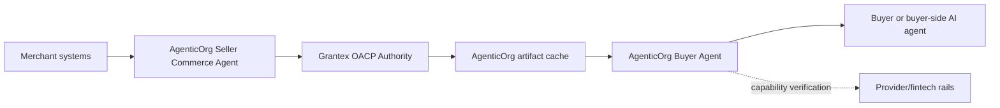
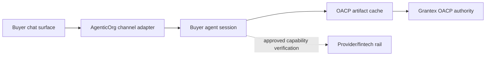

# AgenticOrg Agentic Commerce Implementation PRD

This document explains what AgenticOrg must provide so merchants can safely join
agentic commerce through Grantex.

The consolidated cross-repo PRD lives in the Grantex repo at
`docs/guides/commerce-v1-agentic-commerce-prd.md`. This AgenticOrg PRD is the
buyer-agent implementation companion and must stay aligned with that canonical
source.

AgenticOrg is not the merchant system of record and not the provider/payment
rail. It is the buyer and seller AI-agent runtime. It helps merchants create
seller commerce agents, initiate connector sync jobs, maintain local OACP
artifact cache, run buyer conversations, request refresh/confirmation, and
verify provider-owned mandate capability where approved.

This document is planning and documentation only. It does not deploy, change
production configuration, enable public commerce discovery, approve a merchant,
enable checkout/payment creation, enable live payments, or enable live Plural.

## 1. Product Boundary

Grantex owns:

- authority-side merchant approval state and tenant boundary;
- public-safe catalog, inventory, pricing, tax, warranty, and return-policy
  artifact validation;
- policy and approval gates;
- Commerce Passport and revocation posture;
- OACP artifact families, adapter previews, refusal semantics, source/freshness
  TTLs, and non-sensitive evidence reference rules;
- native API, MCP-style, UCP-style, ACP-style, schema.org, A2A-style, and
  AP2-style preview authority.

AgenticOrg owns:

- the Commerce Sales Agent pack;
- seller-agent self-serve onboarding;
- merchant-approved connector sync initiation;
- OACP artifact cache scoped by buyer agent, seller agent, tenant, and merchant;
- Grantex/OACP connector aliases;
- buyer-facing workflow orchestration;
- safe refusal behavior;
- synthetic/demo walkthroughs;
- evals proving agents do not invent seller, price, inventory, checkout,
  refund, delivery, or payment facts;
- public discovery gating until Grantex approves a real surface;
- ChatGPT-style, Claude/MCP-style, Gemini-style, Perplexity/search-style, web,
  and messaging channel bridges.

AgenticOrg must not hold raw provider credentials by default, execute payments,
or become the canonical catalog/order/refund system. It may verify
provider-owned mandate capability directly where approved and may initiate
merchant-approved connector sync jobs; those paths must remain separate from
payment execution and must not leak raw credentials or private payloads.

### End-To-End Flow Summary

The complete product flow is documented in
`docs/commerce-agent-end-to-end-agentic-commerce-flow.md`. That guide is the
plain-language operating model for buyers, sellers, and implementation owners.

Buyer one-time setup:

1. Buyer chooses an approved channel such as ChatGPT, Claude, Gemini, WhatsApp,
   Telegram, web/mobile, or a future agent surface.
2. AgenticOrg creates or resumes a buyer-agent session and binds it to the
   channel identity without exposing tokens.
3. Buyer sets safe preferences such as locale, currency, delivery region,
   notification route, and accessibility needs.
4. Buyer sees what the channel can do: browse, compare, draft cart, request
   checkout, read status, or hand off to support.
5. Payment-affecting actions still require Grantex consent and Commerce
   Passport evidence every time.

Seller one-time setup:

1. Seller starts in AgenticOrg Seller Commerce Agent.
2. Seller creates an onboarding packet for Grantex authority review.
3. Seller connects existing systems through AgenticOrg seller-agent connector
   workflows, merchant-owned connector platforms, approved external integration
   providers, or CSV/API.
4. Grantex validates public-safe facts, source/freshness evidence, policy,
   consent posture, and protocol adapter state into OACP artifacts.
5. Seller selects allowed agent actions and channels.
6. Grantex runs scans, readiness checks, human review gates, smoke tests, and
   rollback checks before any production capability is approved.

Regular transaction:

1. Buyer asks in their chosen chat channel.
2. AgenticOrg starts the session and reads valid cached OACP artifacts when TTL,
   revocation, and risk rules allow.
3. AgenticOrg refreshes or verifies with Grantex when artifacts are missing,
   stale, revoked, high risk, or ambiguous.
4. AgenticOrg presents grounded facts, source/freshness labels, and blocker
   codes without inventing facts.
5. Commitment-bound actions use prepared envelopes, response reconciliation,
   eligibility packets, and dry-run verification before any future handoff.
6. Merchant confirmation goes through approved connector handoff or
   merchant-owned systems.
7. Provider-owned mandate/payment capability verification stays with providers
   and may be verified directly by AgenticOrg where approved.
8. AgenticOrg shows buyer-safe status and refuses unsupported claims.

## 2. Current Implementation Snapshot

| Area | Current evidence | Current state |
| --- | --- | --- |
| Grantex/OACP connector | `connectors/commerce/grantex_commerce.py` exposes `merchant_get_profile`, `catalog_search`, `catalog_get_item`, `inventory_check`, `cart_create`, `consent_request`, `consent_exchange`, `buyer_discovery_preview`, `payment_create_intent`, `checkout_create`, and `payment_get_status`. | Existing aliases remain useful, but approved provider/connector verifiers and UX integration still need separate approved slices. |
| Payment guardrails | `core/commerce/sales_guardrails.py` blocks missing consent/passport, amount-cap breach, disabled merchant/agent, policy denial, and non-mock provider choices. | Good local fail-closed behavior; must expand as Grantex adds order/refund/fulfillment. |
| Demo and evals | `demos/commerce_sales_agent_demo.py`, golden commerce evals, no-provider-call regression tests, real-staging and hosted smoke tests. | Strong demo/smoke foundation. |
| Public discovery gate | Commerce metadata is fail-closed behind `AGENTICORG_COMMERCE_PUBLIC_DISCOVERY_ENABLED`. | Safe posture. |
| Docs-only CI guard | `.github/workflows/deploy.yml` classifies docs-only changes and skips cloud auth/build/push/deploy-adjacent jobs. | Correct for future planning docs merges. |
| Merchant education docs | C5O-C5X docs cover self-onboarding, architecture, API/data model proposals, UI wireframes, validator, review workflow, rollout automation, demo merchant, and launch rehearsal. | Good planning foundation; runtime implementation still pending. |
| OACP consumer foundation | C6W3-C6W9 helper/tests/docs consume artifact schemas, adapter previews, commitment boundaries, prepared envelopes, response reconciliations, eligibility packets, and dry-run verifier results. | Internal only; no execution, public protocol publication, certification, or production readiness. |
| OACP cache foundation | C6X1-C6X5 add cache verifier/runtime planning, fail-closed cache evaluation, repository boundary, durable SQL-backed cache records, and local maintenance planning. | Internal only; planner/cache do not call Grantex live, providers, merchant private APIs, checkout, payments, schedulers, or queues. |

### 2.1 Current OACP Status Through C6X5

AgenticOrg currently has local consumer behavior for:

- public-safe OACP artifact family validation;
- adapter preview consumption for schema.org, UCP-style, ACP-style,
  AP2-style, A2A-style, and MCP-style surfaces;
- commitment-boundary classification over cached artifacts;
- prepared envelope consumption;
- response evidence reconciliation;
- eligibility packet handling;
- execution-controller dry-run verifier consumption;
- fail-closed OACP cache evaluation;
- repository port plus in-memory adapter;
- durable cache records scoped by buyer agent, seller agent, tenant, and
  merchant;
- local maintenance planning over durable records.

Still missing:

- seller-agent onboarding UI/runtime for OACP;
- real Shopify/WooCommerce/ERP connector sync initiation;
- cache refresh/eviction scheduler, durable maintenance log, and refresh intent
  queue;
- provider-owned mandate capability verifier runtime;
- channel bridges for ChatGPT-style, Claude/MCP-style, Gemini-style,
  Perplexity/search-style, web, and messaging surfaces;
- public seller cards and third-party agent cards with risk controls;
- execution-controller ownership and implementation;
- production audit persistence and live merchant pilot workflows.

## 3. Buyer-Agent Journey

The target AgenticOrg buyer journey should be:

1. User asks an agent to find or compare products.
2. Agent reads valid cached OACP artifacts when TTL, revocation, and risk rules
   allow; otherwise it refreshes/verifies with Grantex.
3. Agent explains uncertainty when stock, price, delivery, or return data is
   stale or unavailable.
4. Agent asks for seller/source confirmation through approved connector handoff
   when commitment-bound facts need refresh.
5. Agent verifies provider-owned mandate capability directly only where approved.
6. Agent prepares non-executing handoff artifacts when C6W5-C6W9 rules pass.
7. Agent refuses unsupported refunds, returns, discounts, delivery promises,
   live-provider claims, and certification claims unless Grantex provides them.

## 4. Buyer Agent Launch From Existing Chat Interfaces

This is a critical product requirement: buyers should not need to learn a new
shopping interface just to use agentic commerce. A buyer should be able to start
from the chat surface they already use, such as ChatGPT, Claude, Gemini,
WhatsApp, Telegram, a merchant website chat widget, voice assistant, or a future
agent marketplace.

The current implementation does not yet provide full channel launch coverage.
The PRD therefore requires an AgenticOrg channel adapter layer that makes each
interface feel simple while preserving OACP artifact rules and keeping execution
with the correct owner.

Channel adapter principles:

- One buyer prompt should create or resume a buyer-agent session.
- The user should not need to understand MCP, UCP, ACP, AP2, passports, or
  provider details.
- Each channel must normalize user identity, locale, currency, consent state,
  conversation ID, channel message limits, attachment handling, and handoff URLs.
- Non-binding browse/compare/explain actions may continue from valid cached
  artifacts.
- Commitment-bound actions require refresh, refusal, or prepared handoff
  depending on risk tier and artifact freshness.
- Channel adapters must never store provider credentials or private merchant
  integration credentials.
- Payment and mandate setup must remain provider-owned. AgenticOrg may verify
  provider capability only through approved provider flows and must not execute
  payments.

| Buyer interface | Launch path AgenticOrg should support | Current platform reality to design around | Required AgenticOrg work |
| --- | --- | --- | --- |
| ChatGPT | Publish an AgenticOrg/Grantex Commerce app using remote MCP-backed tools and Apps SDK packaging. | ChatGPT apps can be connected and invoked in chat, and custom apps use MCP-backed tools. Workspace admins can control actions. OpenAI docs also state that ChatGPT Agent Mode does not use custom apps today, and Deep Research custom-app usage is read/fetch only. | Build remote MCP app manifest, OAuth/account linking, read vs write action labels, confirmation copy, app review checklist, frozen-tool-version update workflow, and fallback to read-only discovery when write actions are unavailable. |
| Claude | Expose a remote MCP connector for Claude-compatible clients. | MCP is the primary official integration path for Claude and other clients; remote MCP gives Claude access to external tools and data. | Build remote MCP endpoint, auth, tool descriptions, least-privilege scopes, connector test harness, and refusal behavior for missing Grantex approval. |
| Gemini | Support a Gemini API or Vertex/ADK wrapper using function declarations that call AgenticOrg channel tools. | Gemini API function calling lets a model call declared functions and return structured parameters; consumer Gemini app distribution for arbitrary third-party commerce actions is not the same as a public MCP app directory. | Build Gemini function-declaration schema, tool execution loop, response normalization, user consent handoff, and clear "supported via AgenticOrg-hosted Gemini channel" vs "native Gemini app support pending" labels. |
| WhatsApp | Provide a WhatsApp Business Platform channel adapter backed by webhooks. | WhatsApp Cloud API uses WABA/business phone numbers, permissions, approved templates, inbound message webhooks, and delivery-status webhooks. | Build WABA setup guide, webhook receiver, message template policy, session window handling, identity binding, consent link handoff, rate-limit handling, opt-out, and human support escalation. |
| Telegram | Provide a Telegram bot channel adapter. | Telegram Bot API is HTTPS-based, uses bot tokens, and receives updates through polling or webhooks; webhooks can include a secret token header. | Build BotFather setup guide, webhook receiver, secret validation, chat/user identity mapping, inline buttons, consent link handoff, rate limits, and bot token secret handling. |
| Merchant website or mobile app | Embed AgenticOrg buyer chat or deep-link into an AgenticOrg hosted session. | This is the most controllable first-party channel. | Build web/mobile SDK or embeddable widget, session resume, Grantex merchant selector, consent redirect, and analytics attribution. |
| Other agent/chat surfaces | Use remote MCP, A2A handoff, REST, or webhook adapter depending on platform support. | Capability support differs by platform and changes over time. | Maintain a channel readiness matrix with supported actions, auth, consent, message constraints, and known limitations. |

Do not describe this as "flawless across every chat app" until each channel has:

- one-click or low-friction user launch;
- account/channel identity binding;
- approved Grantex merchant and capability discovery;
- OACP artifact consumption and authority-checked refresh behavior;
- consent and Commerce Passport handoff;
- payment/checkout confirmation wording;
- refusal and recovery UX;
- telemetry, audit, and redacted evidence;
- regression tests and channel-specific smoke tests;
- a documented fallback when the platform does not allow write actions.

### Buyer Agent Launch Acceptance Criteria

A channel is launch-ready only when all of these pass:

1. A real user can start with a natural prompt such as "help me buy a sofa from
   this merchant" and reach the AgenticOrg buyer agent without manual developer
   setup.
2. The channel creates or resumes a stable AgenticOrg buyer-agent session.
3. The session is bound to channel user identity without exposing private tokens.
4. Merchant discovery comes from Grantex, not from model guesses.
5. Product, price, inventory, delivery, return, and checkout facts are grounded
   in Grantex responses.
6. The channel shows clear consent and checkout handoff copy before any
   payment-affecting action.
7. If the channel cannot support write actions, the agent offers read-only
   discovery and a safe handoff link instead of pretending checkout is possible.
8. The agent refuses unsupported claims and logs redacted evidence.
9. A merchant can see channel attribution and failure reasons in operational
   reporting.
10. Channel launch is disabled by default until Grantex approves merchant
    read-only discovery and any checkout scope separately.

Implementation must re-check current platform documentation before build because
chat-platform capabilities and approval rules change. Current reference inputs:

- OpenAI ChatGPT custom apps and remote MCP developer-mode documentation:
  <https://help.openai.com/en/articles/12584461-developer-mode-and-mcp-apps-in-chatgpt>
- Anthropic Claude MCP connector documentation:
  <https://docs.anthropic.com/en/docs/agents-and-tools/mcp-connector>
- Google Gemini API function-calling documentation:
  <https://ai.google.dev/gemini-api/docs/function-calling>
- Meta WhatsApp Business Platform / Cloud API documentation:
  <https://developers.facebook.com/docs/whatsapp/cloud-api/>
- Telegram Bot API documentation:
  <https://core.telegram.org/bots/api>

## 5. Merchant Education Journey

AgenticOrg should help merchants understand the journey without creating false
production confidence:

1. Show a synthetic merchant demo such as Demo Home Goods Store.
2. Show what the buyer-side agent can see.
3. Show blocked paths: direct provider calls, live payments, live Plural,
   checkout without consent, refund execution, stale inventory promises.
4. Show the Grantex onboarding checklist and approval gates.
5. Show how existing merchant systems connect through AgenticOrg seller-agent
   workflows, merchant-owned connector platforms, or approved external
   integration providers, while Grantex validates public-safe OACP artifacts.
6. Show how AgenticOrg responds when Grantex says no.
7. Show a launch rehearsal that ends in "request rollout", not automatic
   production enablement.

## 6. Standards And Protocol Fit

AgenticOrg should treat OACP artifacts as the internal source for protocol
surfaces. Standards-style adapters are previews derived from Grantex authority
artifacts, not separate sources of truth and not transaction authority.

| Surface | AgenticOrg behavior |
| --- | --- |
| OACP artifacts | Primary internal trust input for non-binding agent interactions and future commitment handoffs. |
| Native Grantex tools | Authority refresh/verification path for artifacts and policy; not required for every valid cached non-binding turn. |
| MCP | Use tool aliases backed by OACP artifacts and Grantex authority. Do not add payment-execution tools. This is the primary bridge for ChatGPT custom apps, Claude-compatible connectors, and other MCP-capable clients. |
| UCP-style profile | Consume only Grantex-authorized capability profiles. Use it to explain merchant capabilities to channel adapters. |
| ACP-style checkout | Render only prepared or blocked checkout state; do not complete checkout outside an approved future execution path. |
| AP2-style evidence | Present provider-owned mandate/consent evidence refs only when deterministic signed evidence exists. |
| schema.org | Use public-safe product/offer/shipping/return metadata generated by Grantex. |

Do not claim UCP, ACP, AP2, A2A, MPP, schema.org production, or live-provider
compliance unless Grantex implementation and conformance evidence exist.

## 7. AgenticOrg Gap Register

| Gap | Why it matters | Required AgenticOrg work | Dependency |
| --- | --- | --- | --- |
| Buyer-agent creation and launch | Real buyers should start from familiar chat interfaces without developer setup. | Channel adapter layer for ChatGPT-style, Claude/MCP-style, Gemini-style, Perplexity/search-style, WhatsApp, Telegram, web/mobile, and future agent surfaces. | Platform-specific app/bot/API approval plus Grantex capability approval. |
| Seller Commerce Agent onboarding | Merchants should self-serve inside AgenticOrg. | Seller agent creates onboarding packet, connector plan, source/freshness evidence, and Grantex authority request. | Grantex authority APIs and product approval. |
| Artifact cache productization | Non-binding interactions should continue without Grantex in every turn and operators need safe cache upkeep. | C6X4/C6X5 provide durable cache records and maintenance planning. Still needed: refresh/eviction runner, audit trail, operator UX, and refresh/refusal copy. | Grantex artifact issuance/verification contract plus separate AgenticOrg runner/UX approval. |
| Buyer-facing commerce UX | Buyers need a safe, understandable flow. | Product comparison, grounded cart draft, consent handoff, checkout status, refusal copy. | Grantex catalog/consent/payment APIs. |
| Merchant-facing demo UX | Merchants need to understand how publishing works. | Demo Home Goods Store walkthrough, launch rehearsal, status labels, blocked-path examples. | Grantex demo packet and self-serve docs. |
| Order and fulfillment reads | Buyers ask "where is my order?" | Add OACP status artifact consumption, connector handoff, and buyer-safe UI copy after order/fulfillment sources exist. | Merchant OMS/logistics evidence and Grantex artifact policy. |
| Return/refund request reads | Buyers ask for returns and refunds. | Refuse or hand off until Grantex request APIs exist; later add request/status aliases. | Grantex return/refund workflow. |
| Delivery promise safety | Agents must not invent shipping dates. | Add stale/unknown delivery refusal logic and verified delivery status rendering. | Grantex logistics/fulfillment fields. |
| Discounts/offers/EMI safety | Agents must not invent promotions. | Require Grantex-sourced offer metadata and tests for unsupported offer claims. | Grantex pricing/offer/provider metadata. |
| Existing-system connectors | Merchants need to keep Shopify/WooCommerce/ERP/OMS/etc. | Seller-agent connector sync initiation, credential-custody selection, source evidence, and stale/conflict UX. | Merchant/external connector custody and Grantex artifact policy. |
| Provider mandate capability verification | Buyers may need provider-owned mandates before autonomous commitments. | Approved provider verifier flow, buyer-safe status, non-sensitive evidence refs, and no payment execution. | Provider/fintech rail approval. |
| Protocol discovery UX | Users and platforms need capability clarity. | Display capabilities only from OACP artifacts and Grantex-authorized profiles. | Grantex OACP/UCP/ACP/MCP/schema.org/AP2 adapter previews. |
| Eval coverage | Regression tests must catch unsafe agent behavior. | Add evals for order, fulfillment, refund, delivery, offer, stale data, direct-provider import attempts. | New Grantex capabilities. |
| Public discovery policy | Public surfaces must stay fail-closed until approved. | Keep `AGENTICORG_COMMERCE_PUBLIC_DISCOVERY_ENABLED` disabled by default and tested. | Grantex read-only production approval. |
| Landing page copy | Prospects need clear positioning without overclaiming. | Add future public copy only after approval: "Agentic commerce readiness through Grantex"; no live/certification claims. | Product/web approval. |
| GitHub workflows | Docs-only changes should not push images or deploy. | Keep docs-only guard current and treat workflow changes as non-docs-only. | Existing CI guard. |

## 8. Fast-Track AgenticOrg Plan

| Slice | Goal | AgenticOrg output | Guardrail |
| --- | --- | --- | --- |
| A. Seller Commerce Agent education pack | Explain the self-serve journey. | Demo script, screenshots/walkthrough, blocked-path labels, connector-custody choices. | Synthetic/demo only. |
| A1. Seller Commerce Agent runtime | Let merchant start onboarding in AgenticOrg. | Onboarding packet, connector plan, source evidence status, authority request. | No live enablement. |
| B. Buyer read-only discovery UX | Let a user ask merchant/product questions safely. | OACP artifact-backed discovery plus product comparison and inventory caution copy. | No public discovery, checkout/payment, fulfillment, refunds, live Plural, live provider paths, or invented merchant/product claims. |
| C. First-party web/mobile buyer channel | Prove low-friction session creation. | AgenticOrg hosted buyer-agent session and embeddable merchant link/widget. | OACP-backed and fail-closed; no public discovery unless approved. |
| D. ChatGPT-style and Claude/MCP-style channels | Reach major AI chat surfaces through remote MCP or equivalent hosted bridge. | Remote MCP app/connector, auth, action labels, confirmation copy, smoke tests. | Respect platform limits; no unsupported write-action claims. |
| E. WhatsApp and Telegram bot channels | Reach common messaging surfaces. | Webhook adapters, identity binding, consent links, opt-out, human escalation. | Tokens/webhook secrets never logged or committed. |
| F. Gemini channel | Support Gemini-powered buyer-agent sessions. | Gemini function declarations or hosted wrapper calling AgenticOrg tools. | Label native Gemini app support as pending unless approved. |
| G. Prepared commitment UX | Rehearse safe commitment handoff. | C6W5-C6W9 boundary, envelope, reconciliation, eligibility, and dry-run status in buyer-safe copy. | No execution. |
| H. Provider mandate verifier | Show provider-owned capability verification where approved. | First approved provider verifier and non-sensitive evidence refs. | No payment execution. |
| I. Order/fulfillment support | Answer post-purchase questions. | OACP status artifacts and connector handoff after merchant order/fulfillment sources exist. | No invented status. |
| J. Returns/refunds support | Guide support safely. | Refusal/manual handoff now; OACP request/status artifacts later. | No refund execution. |
| K. Protocol display | Show standard capability status. | UCP/ACP/schema.org/AP2 readiness labels from Grantex. | No unsupported compliance claims. |
| L. Real merchant pilot support | Assist one approved merchant rollout. | Controlled agent workflow and eval evidence. | Separate Grantex rollout approval. |

## 9. Release Acceptance Criteria

Before AgenticOrg can participate in a real merchant pilot:

- Grantex has approved the merchant, capability surface, and rollout scope.
- AgenticOrg public commerce discovery remains disabled until Grantex read-only
  discovery is approved.
- Every commerce tool alias maps to an OACP artifact, Grantex authority API, or
  explicitly approved provider/connector verifier.
- Each approved buyer channel has a documented launch path, auth model, consent
  handoff, write-action support status, fallback behavior, telemetry, and smoke
  evidence.
- No commerce code executes payments, creates live checkout/payment, or calls
  merchant private APIs outside approved connector sync workflows.
- Provider capability verification, if added, is separated from payment
  execution and logs only non-sensitive evidence refs.
- Buyer-facing copy distinguishes "known", "unknown", "stale", "blocked", and
  "requires consent" states.
- AgenticOrg evals cover stale inventory, missing consent, denied policy,
  disabled merchant, unsupported offer, no direct provider call, and no
  invented refund/delivery/order facts.
- Evidence reports contain only statuses, synthetic IDs, redacted hashes,
  blocker codes, and non-secret references.
- Docs-only PRs skip cloud build/push/deploy-adjacent jobs by policy.

## 10. Public Landing Page And Blog Plan

If product/web owners update the AgenticOrg landing page later, use safe
positioning like this. This PRD update is planning only and does not publish
runtime UI.

> AgenticOrg runs seller and buyer AI agents for commerce workflows. Seller
> agents help merchants connect existing systems and prepare Grantex authority
> requests. Buyer agents consume signed OACP artifacts, show source/freshness,
> and refuse unsupported commitments. Provider and fintech rails own mandate and
> payment execution.

AgenticOrg landing page planning blocks:

- Hero: "Seller And Buyer Agents For Safe Agentic Commerce"
- Section 1: Seller Commerce Agent - onboarding packet, connector plan,
  source/freshness evidence, Grantex authority request.
- Section 2: Buyer Agent Runtime - channel UX, comparison, source labels,
  refusal, refresh, and prepared handoff.
- Section 3: Artifact Cache - cached per buyer agent, seller agent, tenant, and
  merchant with TTL/risk rules.
- Section 4: Connector Workflows - Shopify, WooCommerce, ERP/PIM, OMS/WMS,
  logistics, support, CSV/API.
- Section 5: Provider Mandate Boundary - provider-owned setup and execution,
  approved capability verification, non-sensitive evidence refs only.
- Section 6: OACP Status - internal C6W9 foundation, no public standard or live
  execution claim.

Blog series plan:

| Blog | Audience | Visual workflow |
| --- | --- | --- |
| Seller Commerce Agents: Where Merchant Self-Serve Begins | Merchants | Seller agent -> connector setup -> Grantex authority request. |
| Buyer Agents With Source And Freshness Labels | Product and UX | Buyer question -> cache check -> refresh/refuse -> answer. |
| Artifact Cache Across Buyer, Seller, Tenant, And Merchant | Engineers | Four-scope cache key and TTL/risk tiers. |
| Shopify And WooCommerce In Agentic Commerce | Integrators | Connector custody and sync evidence flow. |
| Provider-Owned Mandates Without Payment Execution In The Agent | Fintech and risk teams | Provider mandate setup -> capability verification -> evidence ref. |
| ChatGPT, Claude, Gemini, And Search-Style Channels | GTM and engineering | Channel bridge matrix and supported action labels. |
| What Is Still Missing Before Autonomous Commerce | Leadership | C6W9 complete vs runtime gaps. |

Avoid claims that imply:

- production commerce is already enabled;
- live payments are ready;
- UCP, ACP, or AP2 certification already exists;
- agents can refund customers;
- agents can execute payments;
- agents can call merchant systems without approved connector policy.

Detailed page and blog plan lives in
`docs/reports/commerce-agent-oacp-landing-blog-plan.md`.

## 11. Documentation And Workflow Coverage

| Surface | Required AgenticOrg update |
| --- | --- |
| `docs/commerce-agent-overview.md` | Keep architecture, merchant journey, standards fit, and gap summary current. |
| `docs/commerce-agent-end-to-end-agentic-commerce-flow.md` | Keep buyer one-time setup, seller one-time setup, regular transaction, exception paths, and source-of-truth rules current. |
| `docs/commerce-agent-developer-guide.md` | Keep safe extension rules, direct-provider bans, and future alias requirements current. |
| C6X reports | Keep `docs/reports/commerce-agent-c6x1-oacp-cache-verifier-runtime-planning.md` through `docs/reports/commerce-agent-c6x5-oacp-cache-maintenance.md` current when cache storage, evaluation, maintenance, or non-goals change. |
| Channel adapter docs | Maintain per-channel setup/runbooks for ChatGPT, Claude, Gemini, WhatsApp, Telegram, web/mobile, and future agent surfaces. |
| C5 planning reports | Continue using C5-series docs for implementation slices and evidence packets. |
| Demo docs | Keep Demo Home Goods Store explicitly synthetic/demo-only. |
| Evals and regressions | Add tests whenever new commerce aliases or refusal cases are added. |
| `.github/workflows/deploy.yml` | Preserve docs-only guard so planning merges skip cloud build/push/deploy-adjacent jobs. |
| Product landing page | Public copy must mention OACP cache/cache maintenance only as fail-closed internal foundation and must not imply production commerce readiness. |

## 12. Stop Conditions

Stop AgenticOrg work if any of these occur:

- A direct Stripe, Plural, Pine, provider, or merchant private commerce API path
  is introduced for payment execution or unapproved merchant execution.
- AgenticOrg stores provider credentials, raw payment data, Commerce Passport
  values, JWTs, idempotency keys, webhook secrets, DB/Redis URLs, private keys,
  or private merchant artifacts.
- AgenticOrg claims a merchant, protocol, payment provider, checkout, refund, or
  live path is approved when Grantex has not approved it.
- AgenticOrg public discovery is enabled before Grantex read-only production
  discovery is approved.
- The agent invents seller details, prices, discounts, availability, delivery
  dates, refund eligibility, order status, or payment status.
- A channel claims to support checkout, payment, order, refund, or live commerce
  when that platform only supports read/fetch actions or when Grantex has not
  approved the merchant capability.
- A docs-only change triggers cloud build/push/deploy-adjacent work without an
  explicit policy decision.
