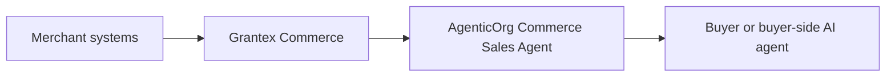

# AgenticOrg Agentic Commerce Implementation PRD

This document explains what AgenticOrg must provide so merchants can safely join
agentic commerce through Grantex.

AgenticOrg is not the merchant system of record. It is the buyer-agent and
workflow layer. It helps users discover products, compare options, draft carts,
request consent, and follow checkout/order status only through Grantex-approved
commerce tools.

This document is planning and documentation only. It does not deploy, change
production configuration, enable public commerce discovery, approve a merchant,
enable checkout/payment creation, enable live payments, or enable live Plural.

## 1. Product Boundary

Grantex owns:

- merchant profile and tenant boundary;
- catalog, inventory, pricing, tax, warranty, and return-policy truth;
- policy and approval gates;
- Commerce Passport consent;
- provider credentials and provider webhooks;
- payment intent, checkout handoff, reconciliation, settlement, audit, and
  rollback;
- native API, MCP, UCP-style, ACP-style, schema.org, and future AP2 evidence
  publishing.

AgenticOrg owns:

- the Commerce Sales Agent pack;
- Grantex-only connector aliases;
- buyer-facing workflow orchestration;
- safe refusal behavior;
- synthetic/demo walkthroughs;
- evals proving agents do not invent seller, price, inventory, checkout,
  refund, delivery, or payment facts;
- public discovery gating until Grantex approves a real surface.

AgenticOrg must not hold provider credentials, call Plural/Stripe/Pine/payment
providers directly, call private merchant commerce APIs directly, or become the
canonical catalog/order/refund system.

## 2. Current Implementation Snapshot

| Area | Current evidence | Current state |
| --- | --- | --- |
| Grantex-only connector | `connectors/commerce/grantex_commerce.py` exposes `merchant_get_profile`, `catalog_search`, `catalog_get_item`, `inventory_check`, `cart_create`, `consent_request`, `consent_exchange`, `payment_create_intent`, `checkout_create`, and `payment_get_status`. | Correct boundary exists. |
| Payment guardrails | `core/commerce/sales_guardrails.py` blocks missing consent/passport, amount-cap breach, disabled merchant/agent, policy denial, and non-mock provider choices. | Good local fail-closed behavior; must expand as Grantex adds order/refund/fulfillment. |
| Demo and evals | `demos/commerce_sales_agent_demo.py`, golden commerce evals, no-provider-call regression tests, real-staging and hosted smoke tests. | Strong demo/smoke foundation. |
| Public discovery gate | Commerce metadata is fail-closed behind `AGENTICORG_COMMERCE_PUBLIC_DISCOVERY_ENABLED`. | Safe posture. |
| Docs-only CI guard | `.github/workflows/deploy.yml` classifies docs-only changes and skips cloud auth/build/push/deploy-adjacent jobs. | Correct for future planning docs merges. |
| Merchant education docs | C5O-C5X docs cover self-onboarding, architecture, API/data model proposals, UI wireframes, validator, review workflow, rollout automation, demo merchant, and launch rehearsal. | Good planning foundation; runtime implementation still pending. |

## 3. Buyer-Agent Journey

The target AgenticOrg buyer journey should be:

1. User asks an agent to find or compare products.
2. Agent reads only Grantex merchant/catalog/inventory tools.
3. Agent explains uncertainty when stock, price, delivery, or return data is
   stale or unavailable.
4. Agent creates a cart draft only from grounded Grantex variant IDs.
5. Agent asks the user for consent through Grantex.
6. Grantex issues a scoped Commerce Passport only if consent and policy pass.
7. Agent requests payment intent and checkout handoff through Grantex.
8. Agent polls payment/order status only through Grantex.
9. Agent refuses unsupported refunds, returns, discounts, delivery promises,
   live-provider claims, and certification claims unless Grantex provides them.

## 4. Merchant Education Journey

AgenticOrg should help merchants understand the journey without creating false
production confidence:

1. Show a synthetic merchant demo such as Demo Home Goods Store.
2. Show what the buyer-side agent can see.
3. Show blocked paths: direct provider calls, live payments, live Plural,
   checkout without consent, refund execution, stale inventory promises.
4. Show the Grantex onboarding checklist and approval gates.
5. Show how existing merchant systems connect to Grantex, not AgenticOrg.
6. Show how AgenticOrg responds when Grantex says no.
7. Show a launch rehearsal that ends in "request rollout", not automatic
   production enablement.

## 5. Standards And Protocol Fit

AgenticOrg should treat standards as surfaces published by Grantex, not as
separate sources of truth.

| Surface | AgenticOrg behavior |
| --- | --- |
| Native Grantex tools | Primary runtime path for all commerce actions. |
| MCP | Use tool aliases backed by Grantex policy and audit. Do not add direct provider tools. |
| UCP-style profile | Consume only Grantex-published capability profiles after approval. |
| ACP-style checkout | Render checkout state and buyer messages from Grantex; do not complete checkout outside Grantex. |
| AP2-style evidence | Present mandate/consent status only when Grantex provides deterministic signed evidence. |
| schema.org | Use public-safe product/offer/shipping/return metadata generated by Grantex. |

Do not claim UCP, ACP, AP2, A2A, MPP, schema.org production, or live-provider
compliance unless Grantex implementation and conformance evidence exist.

## 6. AgenticOrg Gap Register

| Gap | Why it matters | Required AgenticOrg work | Dependency |
| --- | --- | --- | --- |
| Buyer-facing commerce UX | Buyers need a safe, understandable flow. | Product comparison, grounded cart draft, consent handoff, checkout status, refusal copy. | Grantex catalog/consent/payment APIs. |
| Merchant-facing demo UX | Merchants need to understand how publishing works. | Demo Home Goods Store walkthrough, launch rehearsal, status labels, blocked-path examples. | Grantex demo packet and self-serve docs. |
| Order and fulfillment reads | Buyers ask "where is my order?" | Add Grantex-only aliases and UI copy after Grantex order/fulfillment APIs exist. | Grantex order/fulfillment implementation. |
| Return/refund request reads | Buyers ask for returns and refunds. | Refuse or hand off until Grantex request APIs exist; later add request/status aliases. | Grantex return/refund workflow. |
| Delivery promise safety | Agents must not invent shipping dates. | Add stale/unknown delivery refusal logic and verified delivery status rendering. | Grantex logistics/fulfillment fields. |
| Discounts/offers/EMI safety | Agents must not invent promotions. | Require Grantex-sourced offer metadata and tests for unsupported offer claims. | Grantex pricing/offer/provider metadata. |
| Existing-system explanation | Merchants need to know they can keep Shopify/ERP/OMS/etc. | Docs and UI copy that point all integrations to Grantex. | Grantex connector framework. |
| Protocol discovery UX | Users and platforms need capability clarity. | Display capabilities only from Grantex-published profiles and approved metadata. | Grantex UCP/ACP/MCP/schema.org/AP2 adapters. |
| Eval coverage | Regression tests must catch unsafe agent behavior. | Add evals for order, fulfillment, refund, delivery, offer, stale data, direct-provider import attempts. | New Grantex capabilities. |
| Public discovery policy | Public surfaces must stay fail-closed until approved. | Keep `AGENTICORG_COMMERCE_PUBLIC_DISCOVERY_ENABLED` disabled by default and tested. | Grantex read-only production approval. |
| Landing page copy | Prospects need clear positioning without overclaiming. | Add future public copy only after approval: "Agentic commerce readiness through Grantex"; no live/certification claims. | Product/web approval. |
| GitHub workflows | Docs-only changes should not push images or deploy. | Keep docs-only guard current and treat workflow changes as non-docs-only. | Existing CI guard. |

## 7. Fast-Track AgenticOrg Plan

| Slice | Goal | AgenticOrg output | Guardrail |
| --- | --- | --- | --- |
| A. Merchant education pack | Explain the self-serve journey. | Demo script, screenshots/walkthrough, blocked-path labels. | Synthetic/demo only. |
| B. Buyer read-only discovery UX | Let a user ask product questions safely. | Grantex-only product comparison and inventory caution copy. | No checkout or payment. |
| C. Cart and consent UX | Rehearse safe checkout. | Cart draft and Grantex consent handoff. | No passport displayed or logged. |
| D. Sandbox checkout demo | Show end-to-end sandbox flow. | Checkout status and payment status rendering. | Mock/sandbox provider only. |
| E. Order/fulfillment support | Answer post-purchase questions. | Grantex-only order and fulfillment aliases after Grantex ships them. | No invented status. |
| F. Returns/refunds support | Guide support safely. | Refusal/manual handoff now; Grantex-only request/status later. | No refund execution. |
| G. Protocol display | Show standard capability status. | UCP/ACP/schema.org/AP2 readiness labels from Grantex. | No unsupported compliance claims. |
| H. Real merchant pilot support | Assist one approved merchant rollout. | Controlled agent workflow and eval evidence. | Separate Grantex rollout approval. |

## 8. Release Acceptance Criteria

Before AgenticOrg can participate in a real merchant pilot:

- Grantex has approved the merchant, capability surface, and rollout scope.
- AgenticOrg public commerce discovery remains disabled until Grantex read-only
  discovery is approved.
- Every commerce tool alias maps to a Grantex API or MCP tool.
- No commerce code imports or calls direct provider SDKs, Plural, Stripe, Pine,
  or merchant private checkout APIs.
- Buyer-facing copy distinguishes "known", "unknown", "stale", "blocked", and
  "requires consent" states.
- AgenticOrg evals cover stale inventory, missing consent, denied policy,
  disabled merchant, unsupported offer, no direct provider call, and no
  invented refund/delivery/order facts.
- Evidence reports contain only statuses, synthetic IDs, redacted hashes,
  blocker codes, and non-secret references.
- Docs-only PRs skip cloud build/push/deploy-adjacent jobs by policy.

## 9. Public Landing Page Copy Draft

If product/web owners update the AgenticOrg landing page later, use safe
positioning like this:

> AgenticOrg can demonstrate buyer-side agentic commerce workflows powered by
> Grantex. Merchants connect their existing systems to Grantex, preview the
> agent-facing surface, and launch only after explicit approval. AgenticOrg
> agents use Grantex-approved tools; they do not hold payment credentials or
> invent prices, stock, discounts, refunds, or delivery promises.

Safe bullets:

- Show merchants how AI agents will discover and explain their products.
- Demonstrate cart drafting, consent handoff, and checkout status in sandbox.
- Refuse unsafe or unsupported commerce actions.
- Keep merchant data, credentials, policy, consent, and audit in Grantex.
- Keep public discovery gated until Grantex approves it.

Avoid these claims until separately approved:

- "Production commerce enabled."
- "Live payments ready."
- "Certified UCP/ACP/AP2 compliant."
- "Agents can refund customers."
- "Agents can call merchant systems directly."

## 10. Documentation And Workflow Coverage

| Surface | Required AgenticOrg update |
| --- | --- |
| `docs/commerce-agent-overview.md` | Keep architecture, merchant journey, standards fit, and gap summary current. |
| `docs/commerce-agent-developer-guide.md` | Keep safe extension rules, direct-provider bans, and future alias requirements current. |
| C5 planning reports | Continue using C5-series docs for implementation slices and evidence packets. |
| Demo docs | Keep Demo Home Goods Store explicitly synthetic/demo-only. |
| Evals and regressions | Add tests whenever new commerce aliases or refusal cases are added. |
| `.github/workflows/deploy.yml` | Preserve docs-only guard so planning merges skip cloud build/push/deploy-adjacent jobs. |
| Product landing page | Future copy must be reviewed before runtime/UI change and must not imply production readiness. |

## 11. Stop Conditions

Stop AgenticOrg work if any of these occur:

- A direct Stripe, Plural, Pine, provider, or merchant private commerce API path
  is introduced for commerce execution.
- AgenticOrg stores provider credentials, raw payment data, Commerce Passport
  values, JWTs, idempotency keys, webhook secrets, DB/Redis URLs, private keys,
  or private merchant artifacts.
- AgenticOrg claims a merchant, protocol, payment provider, checkout, refund, or
  live path is approved when Grantex has not approved it.
- AgenticOrg public discovery is enabled before Grantex read-only production
  discovery is approved.
- The agent invents seller details, prices, discounts, availability, delivery
  dates, refund eligibility, order status, or payment status.
- A docs-only change triggers cloud build/push/deploy-adjacent work without an
  explicit policy decision.
