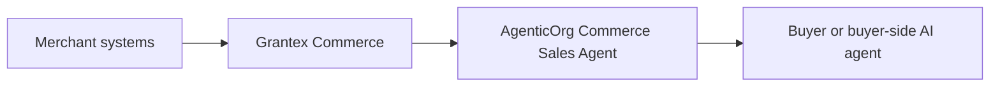
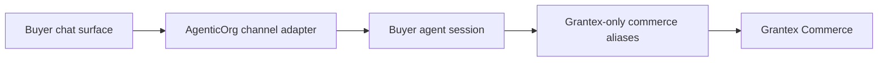

# AgenticOrg Agentic Commerce Implementation PRD

This document explains what AgenticOrg must provide so merchants can safely join
agentic commerce through Grantex.

The consolidated cross-repo PRD lives in the Grantex repo at
`docs/guides/commerce-v1-agentic-commerce-prd.md`. This AgenticOrg PRD is the
buyer-agent implementation companion and must stay aligned with that canonical
source.

AgenticOrg is not the merchant system of record. It is the buyer-agent and
workflow layer. It helps users discover products, compare options, draft carts,
request consent, and follow checkout/order status only through Grantex-approved
commerce tools.

This document is planning and documentation only. It does not deploy, change
production configuration, enable public commerce discovery, approve a merchant,
enable checkout/payment creation, enable live payments, or enable live Plural.

## 1. Product Boundary

Grantex owns:

- merchant profile and tenant boundary;
- catalog, inventory, pricing, tax, warranty, and return-policy truth;
- policy and approval gates;
- Commerce Passport consent;
- provider credentials and provider webhooks;
- payment intent, checkout handoff, reconciliation, settlement, audit, and
  rollback;
- native API, MCP, UCP-style, ACP-style, schema.org, and future AP2 evidence
  publishing.

AgenticOrg owns:

- the Commerce Sales Agent pack;
- Grantex-only connector aliases;
- buyer-facing workflow orchestration;
- safe refusal behavior;
- synthetic/demo walkthroughs;
- evals proving agents do not invent seller, price, inventory, checkout,
  refund, delivery, or payment facts;
- public discovery gating until Grantex approves a real surface.

AgenticOrg must not hold provider credentials, call Plural/Stripe/Pine/payment
providers directly, call private merchant commerce APIs directly, or become the
canonical catalog/order/refund system.

### End-To-End Flow Summary

The complete product flow is documented in
`docs/commerce-agent-end-to-end-agentic-commerce-flow.md`. That guide is the
plain-language operating model for buyers, sellers, and implementation owners.

Buyer one-time setup:

1. Buyer chooses an approved channel such as ChatGPT, Claude, Gemini, WhatsApp,
   Telegram, web/mobile, or a future agent surface.
2. AgenticOrg creates or resumes a buyer-agent session and binds it to the
   channel identity without exposing tokens.
3. Buyer sets safe preferences such as locale, currency, delivery region,
   notification route, and accessibility needs.
4. Buyer sees what the channel can do: browse, compare, draft cart, request
   checkout, read status, or hand off to support.
5. Payment-affecting actions still require Grantex consent and Commerce
   Passport evidence every time.

Seller one-time setup:

1. Seller creates the merchant workspace in Grantex.
2. Seller verifies identity and stores private approval artifacts outside repos.
3. Seller connects existing systems to Grantex: storefront, catalog, ERP/PIM,
   inventory/WMS, OMS, logistics, payment provider, CRM/support, or CSV/API.
4. Grantex normalizes catalog, inventory, price, policy, consent, payment,
   order, fulfillment, support, audit, and protocol-publishing state.
5. Seller selects allowed agent actions and channels.
6. Grantex runs scans, readiness checks, human review gates, smoke tests, and
   rollback checks before any production capability is approved.

Regular transaction:

1. Buyer asks in their chosen chat channel.
2. AgenticOrg starts the session and asks Grantex for approved merchant/channel
   capabilities.
3. AgenticOrg searches catalog, checks inventory, and drafts carts only through
   Grantex.
4. Grantex returns grounded facts, totals, policy, inventory freshness, and
   blocker codes.
5. Buyer approves or denies Grantex consent.
6. Grantex issues scoped Commerce Passport status only if consent and policy
   pass.
7. AgenticOrg requests payment intent and checkout handoff only through
   Grantex.
8. Grantex owns provider interaction, webhook reconciliation, audit, order,
   fulfillment, support, return, refund, settlement, and rollback state.
9. AgenticOrg shows buyer-safe status and refuses unsupported claims.

## 2. Current Implementation Snapshot

| Area | Current evidence | Current state |
| --- | --- | --- |
| Grantex-only connector | `connectors/commerce/grantex_commerce.py` exposes `merchant_get_profile`, `catalog_search`, `catalog_get_item`, `inventory_check`, `cart_create`, `consent_request`, `consent_exchange`, `payment_create_intent`, `checkout_create`, and `payment_get_status`. | Correct boundary exists. |
| Payment guardrails | `core/commerce/sales_guardrails.py` blocks missing consent/passport, amount-cap breach, disabled merchant/agent, policy denial, and non-mock provider choices. | Good local fail-closed behavior; must expand as Grantex adds order/refund/fulfillment. |
| Demo and evals | `demos/commerce_sales_agent_demo.py`, golden commerce evals, no-provider-call regression tests, real-staging and hosted smoke tests. | Strong demo/smoke foundation. |
| Public discovery gate | Commerce metadata is fail-closed behind `AGENTICORG_COMMERCE_PUBLIC_DISCOVERY_ENABLED`. | Safe posture. |
| Docs-only CI guard | `.github/workflows/deploy.yml` classifies docs-only changes and skips cloud auth/build/push/deploy-adjacent jobs. | Correct for future planning docs merges. |
| Merchant education docs | C5O-C5X docs cover self-onboarding, architecture, API/data model proposals, UI wireframes, validator, review workflow, rollout automation, demo merchant, and launch rehearsal. | Good planning foundation; runtime implementation still pending. |

## 3. Buyer-Agent Journey

The target AgenticOrg buyer journey should be:

1. User asks an agent to find or compare products.
2. Agent reads only Grantex merchant/catalog/inventory tools.
3. Agent explains uncertainty when stock, price, delivery, or return data is
   stale or unavailable.
4. Agent creates a cart draft only from grounded Grantex variant IDs.
5. Agent asks the user for consent through Grantex.
6. Grantex issues a scoped Commerce Passport only if consent and policy pass.
7. Agent requests payment intent and checkout handoff through Grantex.
8. Agent polls payment/order status only through Grantex.
9. Agent refuses unsupported refunds, returns, discounts, delivery promises,
   live-provider claims, and certification claims unless Grantex provides them.

## 4. Buyer Agent Launch From Existing Chat Interfaces

This is a critical product requirement: buyers should not need to learn a new
shopping interface just to use agentic commerce. A buyer should be able to start
from the chat surface they already use, such as ChatGPT, Claude, Gemini,
WhatsApp, Telegram, a merchant website chat widget, voice assistant, or a future
agent marketplace.

The current implementation does not yet provide full channel launch coverage.
The PRD therefore requires an AgenticOrg channel adapter layer that makes each
interface feel simple while keeping commerce execution inside Grantex.

Channel adapter principles:

- One buyer prompt should create or resume a buyer-agent session.
- The user should not need to understand MCP, UCP, ACP, AP2, passports, or
  provider details.
- Each channel must normalize user identity, locale, currency, consent state,
  conversation ID, channel message limits, attachment handling, and handoff URLs.
- Every commerce action must still go through Grantex-only tools.
- Channel adapters must never store provider credentials or private merchant
  integration credentials.
- Payment and checkout actions must require Grantex consent and Commerce
  Passport evidence, even if the chat interface has its own confirmation UX.

| Buyer interface | Launch path AgenticOrg should support | Current platform reality to design around | Required AgenticOrg work |
| --- | --- | --- | --- |
| ChatGPT | Publish an AgenticOrg/Grantex Commerce app using remote MCP-backed tools and Apps SDK packaging. | ChatGPT apps can be connected and invoked in chat, and custom apps use MCP-backed tools. Workspace admins can control actions. OpenAI docs also state that ChatGPT Agent Mode does not use custom apps today, and Deep Research custom-app usage is read/fetch only. | Build remote MCP app manifest, OAuth/account linking, read vs write action labels, confirmation copy, app review checklist, frozen-tool-version update workflow, and fallback to read-only discovery when write actions are unavailable. |
| Claude | Expose a remote MCP connector for Claude-compatible clients. | MCP is the primary official integration path for Claude and other clients; remote MCP gives Claude access to external tools and data. | Build remote MCP endpoint, auth, tool descriptions, least-privilege scopes, connector test harness, and refusal behavior for missing Grantex approval. |
| Gemini | Support a Gemini API or Vertex/ADK wrapper using function declarations that call AgenticOrg channel tools. | Gemini API function calling lets a model call declared functions and return structured parameters; consumer Gemini app distribution for arbitrary third-party commerce actions is not the same as a public MCP app directory. | Build Gemini function-declaration schema, tool execution loop, response normalization, user consent handoff, and clear "supported via AgenticOrg-hosted Gemini channel" vs "native Gemini app support pending" labels. |
| WhatsApp | Provide a WhatsApp Business Platform channel adapter backed by webhooks. | WhatsApp Cloud API uses WABA/business phone numbers, permissions, approved templates, inbound message webhooks, and delivery-status webhooks. | Build WABA setup guide, webhook receiver, message template policy, session window handling, identity binding, consent link handoff, rate-limit handling, opt-out, and human support escalation. |
| Telegram | Provide a Telegram bot channel adapter. | Telegram Bot API is HTTPS-based, uses bot tokens, and receives updates through polling or webhooks; webhooks can include a secret token header. | Build BotFather setup guide, webhook receiver, secret validation, chat/user identity mapping, inline buttons, consent link handoff, rate limits, and bot token secret handling. |
| Merchant website or mobile app | Embed AgenticOrg buyer chat or deep-link into an AgenticOrg hosted session. | This is the most controllable first-party channel. | Build web/mobile SDK or embeddable widget, session resume, Grantex merchant selector, consent redirect, and analytics attribution. |
| Other agent/chat surfaces | Use remote MCP, A2A handoff, REST, or webhook adapter depending on platform support. | Capability support differs by platform and changes over time. | Maintain a channel certification matrix with supported actions, auth, consent, message constraints, and known limitations. |

Do not describe this as "flawless across every chat app" until each channel has:

- one-click or low-friction user launch;
- account/channel identity binding;
- approved Grantex merchant and capability discovery;
- Grantex-only tool execution;
- consent and Commerce Passport handoff;
- payment/checkout confirmation wording;
- refusal and recovery UX;
- telemetry, audit, and redacted evidence;
- regression tests and channel-specific smoke tests;
- a documented fallback when the platform does not allow write actions.

### Buyer Agent Launch Acceptance Criteria

A channel is launch-ready only when all of these pass:

1. A real user can start with a natural prompt such as "help me buy a sofa from
   this merchant" and reach the AgenticOrg buyer agent without manual developer
   setup.
2. The channel creates or resumes a stable AgenticOrg buyer-agent session.
3. The session is bound to channel user identity without exposing private tokens.
4. Merchant discovery comes from Grantex, not from model guesses.
5. Product, price, inventory, delivery, return, and checkout facts are grounded
   in Grantex responses.
6. The channel shows clear consent and checkout handoff copy before any
   payment-affecting action.
7. If the channel cannot support write actions, the agent offers read-only
   discovery and a safe handoff link instead of pretending checkout is possible.
8. The agent refuses unsupported claims and logs redacted evidence.
9. A merchant can see channel attribution and failure reasons in operational
   reporting.
10. Channel launch is disabled by default until Grantex approves merchant
    read-only discovery and any checkout scope separately.

Implementation must re-check current platform documentation before build because
chat-platform capabilities and approval rules change. Current reference inputs:

- OpenAI ChatGPT custom apps and remote MCP developer-mode documentation:
  <https://help.openai.com/en/articles/12584461-developer-mode-and-mcp-apps-in-chatgpt>
- Anthropic Claude MCP connector documentation:
  <https://docs.anthropic.com/en/docs/agents-and-tools/mcp-connector>
- Google Gemini API function-calling documentation:
  <https://ai.google.dev/gemini-api/docs/function-calling>
- Meta WhatsApp Business Platform / Cloud API documentation:
  <https://developers.facebook.com/docs/whatsapp/cloud-api/>
- Telegram Bot API documentation:
  <https://core.telegram.org/bots/api>

## 5. Merchant Education Journey

AgenticOrg should help merchants understand the journey without creating false
production confidence:

1. Show a synthetic merchant demo such as Demo Home Goods Store.
2. Show what the buyer-side agent can see.
3. Show blocked paths: direct provider calls, live payments, live Plural,
   checkout without consent, refund execution, stale inventory promises.
4. Show the Grantex onboarding checklist and approval gates.
5. Show how existing merchant systems connect to Grantex, not AgenticOrg.
6. Show how AgenticOrg responds when Grantex says no.
7. Show a launch rehearsal that ends in "request rollout", not automatic
   production enablement.

## 6. Standards And Protocol Fit

AgenticOrg should treat standards as surfaces published by Grantex, not as
separate sources of truth.

| Surface | AgenticOrg behavior |
| --- | --- |
| Native Grantex tools | Primary runtime path for all commerce actions. |
| MCP | Use tool aliases backed by Grantex policy and audit. Do not add direct provider tools. This is the primary bridge for ChatGPT custom apps, Claude-compatible connectors, and other MCP-capable clients. |
| UCP-style profile | Consume only Grantex-published capability profiles after approval. Use it to explain merchant capabilities to channel adapters. |
| ACP-style checkout | Render checkout state and buyer messages from Grantex; do not complete checkout outside Grantex. |
| AP2-style evidence | Present mandate/consent status only when Grantex provides deterministic signed evidence. |
| schema.org | Use public-safe product/offer/shipping/return metadata generated by Grantex. |

Do not claim UCP, ACP, AP2, A2A, MPP, schema.org production, or live-provider
compliance unless Grantex implementation and conformance evidence exist.

## 7. AgenticOrg Gap Register

| Gap | Why it matters | Required AgenticOrg work | Dependency |
| --- | --- | --- | --- |
| Buyer-agent creation and launch | Real buyers should start from familiar chat interfaces without developer setup. | Channel adapter layer for ChatGPT, Claude, Gemini, WhatsApp, Telegram, web/mobile, and future agent surfaces. | Platform-specific app/bot/API approval plus Grantex capability approval. |
| Buyer-facing commerce UX | Buyers need a safe, understandable flow. | Product comparison, grounded cart draft, consent handoff, checkout status, refusal copy. | Grantex catalog/consent/payment APIs. |
| Merchant-facing demo UX | Merchants need to understand how publishing works. | Demo Home Goods Store walkthrough, launch rehearsal, status labels, blocked-path examples. | Grantex demo packet and self-serve docs. |
| Order and fulfillment reads | Buyers ask "where is my order?" | Add Grantex-only aliases and UI copy after Grantex order/fulfillment APIs exist. | Grantex order/fulfillment implementation. |
| Return/refund request reads | Buyers ask for returns and refunds. | Refuse or hand off until Grantex request APIs exist; later add request/status aliases. | Grantex return/refund workflow. |
| Delivery promise safety | Agents must not invent shipping dates. | Add stale/unknown delivery refusal logic and verified delivery status rendering. | Grantex logistics/fulfillment fields. |
| Discounts/offers/EMI safety | Agents must not invent promotions. | Require Grantex-sourced offer metadata and tests for unsupported offer claims. | Grantex pricing/offer/provider metadata. |
| Existing-system explanation | Merchants need to know they can keep Shopify/ERP/OMS/etc. | Docs and UI copy that point all integrations to Grantex. | Grantex connector framework. |
| Protocol discovery UX | Users and platforms need capability clarity. | Display capabilities only from Grantex-published profiles and approved metadata. | Grantex UCP/ACP/MCP/schema.org/AP2 adapters. |
| Eval coverage | Regression tests must catch unsafe agent behavior. | Add evals for order, fulfillment, refund, delivery, offer, stale data, direct-provider import attempts. | New Grantex capabilities. |
| Public discovery policy | Public surfaces must stay fail-closed until approved. | Keep `AGENTICORG_COMMERCE_PUBLIC_DISCOVERY_ENABLED` disabled by default and tested. | Grantex read-only production approval. |
| Landing page copy | Prospects need clear positioning without overclaiming. | Add future public copy only after approval: "Agentic commerce readiness through Grantex"; no live/certification claims. | Product/web approval. |
| GitHub workflows | Docs-only changes should not push images or deploy. | Keep docs-only guard current and treat workflow changes as non-docs-only. | Existing CI guard. |

## 8. Fast-Track AgenticOrg Plan

| Slice | Goal | AgenticOrg output | Guardrail |
| --- | --- | --- | --- |
| A. Merchant education pack | Explain the self-serve journey. | Demo script, screenshots/walkthrough, blocked-path labels. | Synthetic/demo only. |
| B. Buyer read-only discovery UX | Let a user ask product questions safely. | Grantex-only product comparison and inventory caution copy. | No checkout or payment. |
| C. First-party web/mobile buyer channel | Prove low-friction session creation. | AgenticOrg hosted buyer-agent session and embeddable merchant link/widget. | Still Grantex-only; no public discovery unless approved. |
| D. ChatGPT and Claude MCP channels | Reach major AI chat surfaces through remote MCP. | Remote MCP app/connector, auth, action labels, confirmation copy, smoke tests. | Respect platform limits; no unsupported write-action claims. |
| E. WhatsApp and Telegram bot channels | Reach common messaging surfaces. | Webhook adapters, identity binding, consent links, opt-out, human escalation. | Tokens/webhook secrets never logged or committed. |
| F. Gemini channel | Support Gemini-powered buyer-agent sessions. | Gemini function declarations or hosted wrapper calling AgenticOrg tools. | Label native Gemini app support as pending unless approved. |
| G. Cart and consent UX | Rehearse safe checkout. | Cart draft and Grantex consent handoff. | No passport displayed or logged. |
| H. Sandbox checkout demo | Show end-to-end sandbox flow. | Checkout status and payment status rendering. | Mock/sandbox provider only. |
| I. Order/fulfillment support | Answer post-purchase questions. | Grantex-only order and fulfillment aliases after Grantex ships them. | No invented status. |
| J. Returns/refunds support | Guide support safely. | Refusal/manual handoff now; Grantex-only request/status later. | No refund execution. |
| K. Protocol display | Show standard capability status. | UCP/ACP/schema.org/AP2 readiness labels from Grantex. | No unsupported compliance claims. |
| L. Real merchant pilot support | Assist one approved merchant rollout. | Controlled agent workflow and eval evidence. | Separate Grantex rollout approval. |

## 9. Release Acceptance Criteria

Before AgenticOrg can participate in a real merchant pilot:

- Grantex has approved the merchant, capability surface, and rollout scope.
- AgenticOrg public commerce discovery remains disabled until Grantex read-only
  discovery is approved.
- Every commerce tool alias maps to a Grantex API or MCP tool.
- Each approved buyer channel has a documented launch path, auth model, consent
  handoff, write-action support status, fallback behavior, telemetry, and smoke
  evidence.
- No commerce code imports or calls direct provider SDKs, Plural, Stripe, Pine,
  or merchant private checkout APIs.
- Buyer-facing copy distinguishes "known", "unknown", "stale", "blocked", and
  "requires consent" states.
- AgenticOrg evals cover stale inventory, missing consent, denied policy,
  disabled merchant, unsupported offer, no direct provider call, and no
  invented refund/delivery/order facts.
- Evidence reports contain only statuses, synthetic IDs, redacted hashes,
  blocker codes, and non-secret references.
- Docs-only PRs skip cloud build/push/deploy-adjacent jobs by policy.

## 10. Public Landing Page Copy Draft

If product/web owners update the AgenticOrg landing page later, use safe
positioning like this:

> AgenticOrg can demonstrate buyer-side agentic commerce workflows powered by
> Grantex. Merchants connect their existing systems to Grantex, preview the
> agent-facing surface, and launch only after explicit approval. AgenticOrg
> agents use Grantex-approved tools; they do not hold payment credentials or
> invent prices, stock, discounts, refunds, or delivery promises.

Safe bullets:

- Show merchants how AI agents will discover and explain their products.
- Demonstrate cart drafting, consent handoff, and checkout status in sandbox.
- Refuse unsafe or unsupported commerce actions.
- Keep merchant data, credentials, policy, consent, and audit in Grantex.
- Keep public discovery gated until Grantex approves it.

Avoid these claims until separately approved:

- "Production commerce enabled."
- "Live payments ready."
- "Certified UCP/ACP/AP2 compliant."
- "Agents can refund customers."
- "Agents can call merchant systems directly."

## 11. Documentation And Workflow Coverage

| Surface | Required AgenticOrg update |
| --- | --- |
| `docs/commerce-agent-overview.md` | Keep architecture, merchant journey, standards fit, and gap summary current. |
| `docs/commerce-agent-end-to-end-agentic-commerce-flow.md` | Keep buyer one-time setup, seller one-time setup, regular transaction, exception paths, and source-of-truth rules current. |
| `docs/commerce-agent-developer-guide.md` | Keep safe extension rules, direct-provider bans, and future alias requirements current. |
| Channel adapter docs | Maintain per-channel setup/runbooks for ChatGPT, Claude, Gemini, WhatsApp, Telegram, web/mobile, and future agent surfaces. |
| C5 planning reports | Continue using C5-series docs for implementation slices and evidence packets. |
| Demo docs | Keep Demo Home Goods Store explicitly synthetic/demo-only. |
| Evals and regressions | Add tests whenever new commerce aliases or refusal cases are added. |
| `.github/workflows/deploy.yml` | Preserve docs-only guard so planning merges skip cloud build/push/deploy-adjacent jobs. |
| Product landing page | Future copy must be reviewed before runtime/UI change and must not imply production readiness. |

## 12. Stop Conditions

Stop AgenticOrg work if any of these occur:

- A direct Stripe, Plural, Pine, provider, or merchant private commerce API path
  is introduced for commerce execution.
- AgenticOrg stores provider credentials, raw payment data, Commerce Passport
  values, JWTs, idempotency keys, webhook secrets, DB/Redis URLs, private keys,
  or private merchant artifacts.
- AgenticOrg claims a merchant, protocol, payment provider, checkout, refund, or
  live path is approved when Grantex has not approved it.
- AgenticOrg public discovery is enabled before Grantex read-only production
  discovery is approved.
- The agent invents seller details, prices, discounts, availability, delivery
  dates, refund eligibility, order status, or payment status.
- A channel claims to support checkout, payment, order, refund, or live commerce
  when that platform only supports read/fetch actions or when Grantex has not
  approved the merchant capability.
- A docs-only change triggers cloud build/push/deploy-adjacent work without an
  explicit policy decision.
