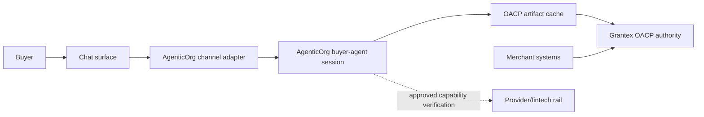
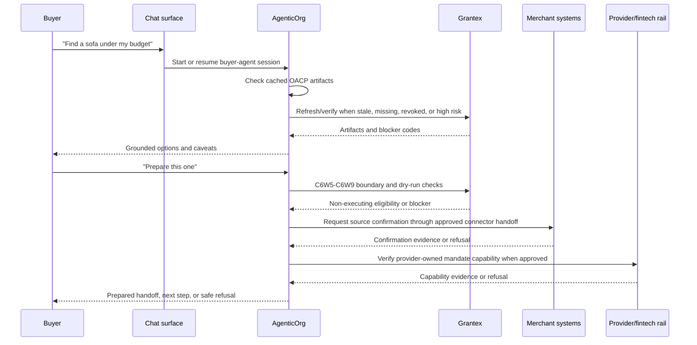

# End-To-End Agentic Commerce Flow

This document explains the AgenticOrg side of the OACP-powered agentic
commerce journey in plain English. It is documentation only. It does not enable
public discovery, production Commerce V1, checkout/payment creation, live
payments, live Plural, merchant approval, or any production allowlist.

## Current OACP Runtime Closure Boundary

The launch-closure runtime path is non-executing. AgenticOrg creates Seller
Commerce Agent onboarding packets, initiates merchant-approved read-only
Shopify Admin GraphQL sync, sends Grantex authority requests, caches internal
OACP artifacts, answers buyer product questions from cache with source and
freshness labels, exposes bridge adapters, and verifies provider-owned
capability metadata where approved. It does not create checkout, payment,
order, mandate, refund, return, shipment, inventory hold, public discovery
publication, live provider execution, or merchant-private API mutation.

Any cart, checkout, consent, Commerce Passport, order, return, refund, support,
fulfillment, or payment-control sections below describe separate future or
Grantex Commerce payment-control scope. They are not OACP runtime artifact
launch proof.

The consolidated cross-repo PRD is maintained in the Grantex repo at
`docs/guides/commerce-v1-agentic-commerce-prd.md`. This document is the
AgenticOrg buyer-agent companion view of that PRD.

## The Simple Mental Model

AgenticOrg is the buyer and seller AI-agent runtime. A seller starts in Seller
Commerce Agent and connects existing systems through approved connector custody.
A buyer starts from a familiar chat surface, such as ChatGPT, Claude, Gemini,
WhatsApp, Telegram, a merchant website chat widget, or an AgenticOrg-hosted
session. AgenticOrg turns those requests into OACP artifact-backed answers,
refreshes, refusals, and prepared handoffs.

Grantex remains the trust, protocol, policy, and canonical-artifact authority.
Merchant systems remain operational sources of record. Provider and fintech
rails own mandate and payment execution.

## One-Time Buyer Setup

A buyer should not need to understand MCP, UCP, ACP, AP2, schema.org, Commerce
Passports, provider adapters, or merchant backends. The one-time buyer setup
should feel like normal account linking and permission setup.

| Step | Buyer sees | AgenticOrg does | Grantex does |
| --- | --- | --- | --- |
| 1. Pick a channel | "Use AgenticOrg in ChatGPT/Claude/Gemini/WhatsApp/Telegram/web." | Starts the correct channel adapter. | Provides approved merchant/tool capability metadata. |
| 2. Sign in or link account | "Continue with AgenticOrg" or channel-specific account linking. | Creates or resumes a buyer-agent session and binds the channel user to that session. | Does not expose private merchant or provider data. |
| 3. Set basic preferences | Preferred locale, currency, delivery region, notification path, and optional spending comfort. | Stores only safe session preferences needed for conversation and handoff. | Uses preferences only for policy checks, consent copy, and supported commerce flows. |
| 4. Understand permissions | Buyer sees that the agent can browse, draft carts, request consent, and hand off checkout only when approved. | Shows channel-specific action labels and limitations. | Provides capability state and blocks unsupported actions. |
| 5. Mandate/payment readiness | Buyer may use a provider wallet, hosted checkout, or approved payment handoff later. | Does not store raw cards, provider credentials, Commerce Passport values, JWTs, or secrets; may verify provider-owned capability where approved. | Owns policy/artifact evidence rules, not provider mandate setup. |
| 6. Revocation and history | Buyer can revoke permissions or ask what happened. | Shows redacted session/evidence status. | Owns revocation, audit evidence, and protected action history. |

Buyer setup is not a blanket authorization. Every commitment-bound action still
requires fresh policy, source/freshness, revocation, provider capability,
consent, and audit evidence.

## One-Time Seller Setup

Seller setup begins in AgenticOrg Seller Commerce Agent and flows into Grantex
authority review. AgenticOrg must not approve the seller, bypass connector
custody rules, or treat cached artifacts as transaction authority.

| Step | Seller action | AgenticOrg responsibility |
| --- | --- | --- |
| 1. Create seller agent | Create seller commerce agent, onboarding packet, and authority request. | Explain status labels and show that the merchant is not live yet. |
| 2. Verify business | Provide private legal/compliance artifacts outside the repo and record non-secret references. | Never display private contracts, contacts, pricing terms, or signed approvals. |
| 3. Connect existing systems | Connect storefront, catalog, ERP/PIM, inventory/WMS, OMS, logistics, payment provider, and support systems through approved connector custody. | Initiate approved connector sync jobs and capture source/freshness evidence. |
| 4. Prepare catalog | Normalize products, variants, images, price, tax, warranty, return summary, availability, and category data. | Show only grounded product facts from OACP artifacts and approved evidence. |
| 5. Configure permissions | Choose whether agents may browse, draft carts, request checkout, read order status, or request support. | Render those capabilities to buyers only after Grantex approval. |
| 6. Run scans | Validate secrets, private data, stale inventory, overclaims, production-looking test IDs, and config/allowlist values. | Add refusal/eval coverage for unsafe claims and unsupported actions. |
| 7. Review gates | Legal, product, security, ops/support, rollback, smoke, and evidence owners approve. | Do not treat demo data or synthetic IDs as approval. |
| 8. Rehearse launch | Run sandbox/demo flows and confirm rollback, support, and evidence handling. | Provide demo scripts, buyer-agent walkthroughs, and blocked-path examples. |
| 9. Request rollout | Ask Grantex for the smallest approved surface, usually read-only discovery first. | Keep public discovery gated until Grantex approves the surface. |

## Regular Agentic Commerce Transaction

This is the intended transaction flow after a seller and buyer have completed
the relevant one-time setup and a specific merchant capability is approved.

## Normal Happy Path

1. Buyer asks for help in an existing chat interface.
2. AgenticOrg creates or resumes a buyer-agent session.
3. AgenticOrg reads valid cached OACP artifacts or refreshes/verifies with
   Grantex when required.
4. AgenticOrg explains options with grounded product IDs, prices, stock state,
   delivery caveats, return summary, and unknowns.
5. Buyer chooses an item or asks for a comparison.
6. Commitment-bound requests go through C6W5-C6W9 boundary, prepared envelope,
   response reconciliation, eligibility, and dry-run verifier checks.
7. Merchant confirmation uses approved connector handoff or merchant-owned
   systems.
8. Provider-owned mandate/payment capability verification stays with the
   provider/fintech rail and may be verified directly by AgenticOrg where
   approved.
9. Current OACP work remains prepared-only and non-executing.

## Failure And Recovery Paths

| Situation | AgenticOrg must do | Grantex must do |
| --- | --- | --- |
| Merchant not approved | Refuse public discovery or checkout and explain that the merchant is not live. | Keep capability fail-closed. |
| Channel cannot perform write actions | Offer read-only discovery and a safe handoff link. | Publish channel capability limits. |
| Product not found | Ask clarifying questions or show no-results response. | Return empty grounded search, not guessed products. |
| Price changed | Re-fetch item/cart, explain changed totals, request buyer confirmation again. | Recalculate and audit the change. |
| Inventory stale or unknown | Warn or refuse checkout promise. | Provide freshness timestamp and stale/unknown status. |
| Policy denied | Explain the safe blocker without leaking private policy. | Return blocker code and audit event. |
| Consent denied or expired | Stop checkout and offer browse/cart edit only. | Revoke or expire passport material. |
| Payment failed or pending | Show status and next supported step only. | Reconcile provider webhook and expose safe status. |
| Delivery/fulfillment unavailable | Refuse delivery promise. | Require verified logistics/OMS data before exposing status. |
| Return/refund requested | Use manual support handoff now; later call Grantex request/status APIs. | Own refund policy, provider handoff, and audit. |

## What AgenticOrg Must Never Do

- Do not call Plural, Stripe, Pine, or another provider for payment execution.
- Do not call Shopify, WooCommerce, Magento, ERP, OMS, WMS, logistics, support,
  or merchant private APIs outside approved connector sync workflows.
- Do not store provider credentials, raw payment data, Commerce Passport values,
  JWTs, idempotency key values, webhook secrets, DB/Redis URLs, private keys, or
  private merchant artifacts.
- Do not invent products, sellers, prices, discounts, stock, delivery promises,
  return eligibility, order status, payment status, or refund outcomes.
- Do not claim a buyer channel is launch-ready until account linking, session
  creation, Grantex capability discovery, consent handoff, fallback behavior,
  telemetry, smoke tests, and approval state exist.
- Do not treat synthetic/demo merchants or synthetic IDs as production approval.

## Implementation Backlog

| Slice | AgenticOrg output | Dependency |
| --- | --- | --- |
| Buyer session core | Stable buyer-agent session creation/resume across channels. | AgenticOrg auth/session model. |
| Web/mobile channel | Hosted buyer-agent session and embeddable merchant link/widget. | Grantex read-only approval. |
| ChatGPT/Claude channel | Remote MCP connector/app with scopes, action labels, and smoke tests. | Platform approval plus Grantex capabilities. |
| Gemini channel | Function-calling wrapper or approved native launch path. | Gemini platform design and Grantex capabilities. |
| WhatsApp/Telegram channel | Bot/webhook adapters, identity mapping, opt-out, consent links. | Channel credentials and webhook secret handling outside Git. |
| Buyer UX | Grounded comparison, source/freshness labels, prepared handoff, consent copy, refusal copy. | OACP artifacts, Grantex authority, connector evidence, provider capability verifier. |
| Post-purchase UX | Order/fulfillment/support/return/refund status display. | Grantex order, fulfillment, support, and refund APIs. |
| Merchant demo UX | Demo launch rehearsal and blocked-path explanations. | Grantex merchant onboarding/readiness docs. |
| Evals | Regression tests for no invention, stale data, policy denial, direct-provider attempts, and unsafe claims. | New channel and Grantex capability slices. |
