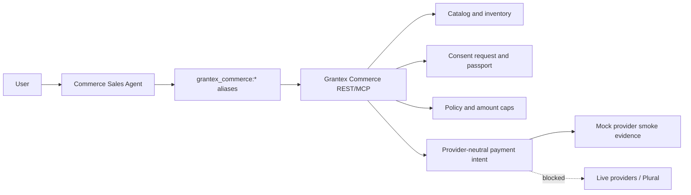
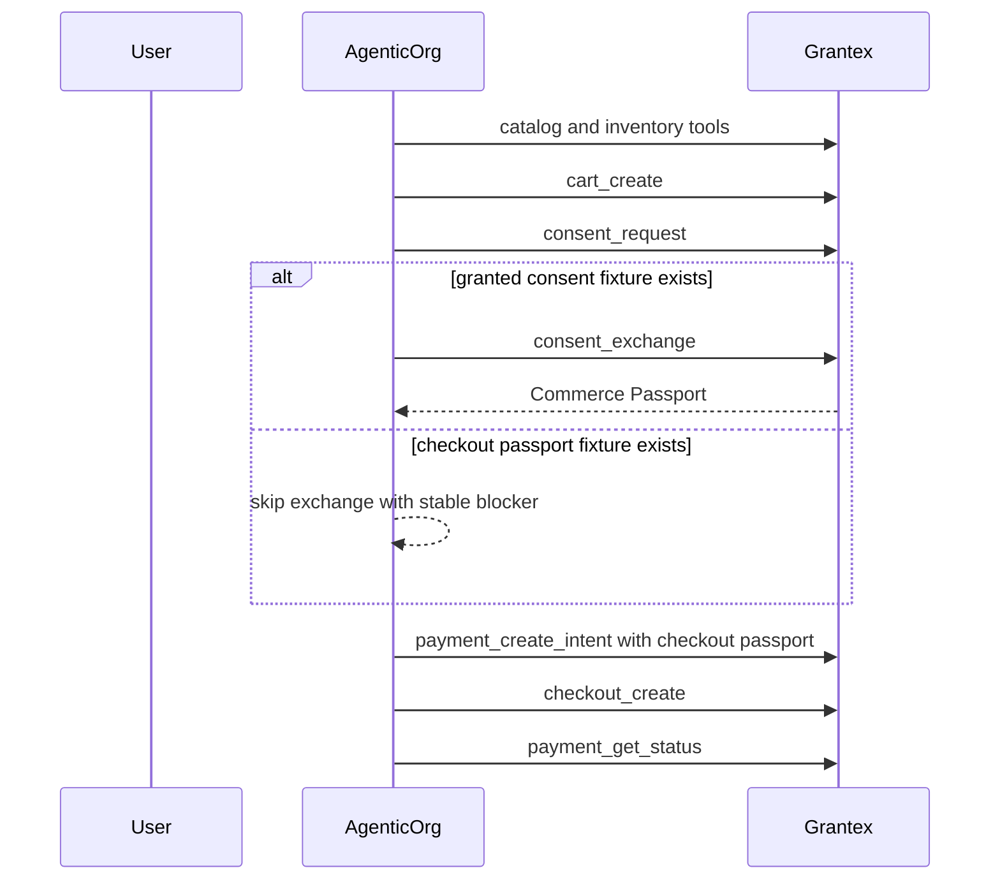

# Commerce Sales Agent Overview

The AgenticOrg Commerce Sales Agent is the agent and workflow layer for
Grantex-controlled commerce. It helps users discover products, draft carts,
request consent, use Commerce Passport fixtures during approved smoke runs, and
follow Grantex payment-intent and checkout status flows.

This page is documentation only. It does not deploy, change production config,
enable production Commerce V1, enable live payments, enable live Plural, or
approve production discovery.

## Current Posture

| Area | Status |
| --- | --- |
| Mock demo | Default local mode. |
| Real-staging eval | Explicitly gated; valid only against approved Grantex staging or exact temporary smoke URLs. |
| C2G local handoff evidence | 13 passed, 0 failed, 2 skipped, with `consent_exchange` skipped using the stable fixture blocker. |
| C3 hosted API-only smoke | 14 passed, 0 failed for liveness, health, MCP tools, A2A agent card, and A2A agents discovery. |
| Production discovery | Commerce metadata may be publicly visible, but it is not final production readiness. |
| Direct provider calls | Blocked for commerce. AgenticOrg commerce uses Grantex only. |
| Live checkout/payments/Plural | Blocked. |

## Architecture

AgenticOrg does not own catalog truth, consent grants, Commerce Passport
issuance, merchant policy enforcement, provider credentials, provider webhooks,
or payment reconciliation. Those controls stay in Grantex.

## Tool Aliases

| Alias | Purpose |
| --- | --- |
| `grantex_commerce:merchant_get_profile` | Read merchant and policy status. |
| `grantex_commerce:catalog_search` | Search grounded product data. |
| `grantex_commerce:catalog_get_item` | Fetch exact product or variant details. |
| `grantex_commerce:inventory_check` | Check availability, using a browse passport when required. |
| `grantex_commerce:cart_create` | Create a cart draft from grounded items. |
| `grantex_commerce:consent_request` | Request user consent with supported checkout scopes. |
| `grantex_commerce:consent_exchange` | Exchange granted consent only when granted consent fixture material exists. |
| `grantex_commerce:payment_create_intent` | Create Grantex provider-neutral payment intent with supported fields only. |
| `grantex_commerce:checkout_create` | Create Grantex checkout handoff. |
| `grantex_commerce:payment_get_status` | Poll Grantex payment status. |

## Consent And Fixture Behavior

Fixture-backed runs accept a skipped `consent_exchange` only with:

`preexported_checkout_passport_without_granted_consent_fixture`

If a future evidence report records `consent_exchange` as failed or skipped with
another code, the fixture-backed C2G behavior is not passing.

## Safety Guardrails

- Mock mode remains the default demo mode.
- Real-staging mode refuses production URLs.
- Arbitrary `run.app` URLs are refused unless the exact smoke URL is allowlisted.
- HTTP localhost and non-HTTPS are refused in real-staging.
- Exactly one Grantex auth source name is accepted.
- Fixture files must stay under `.tmp/` and values must not be printed.
- Evidence records names, statuses, latency, error/blocker codes, synthetic IDs,
  and redacted hashes only.
- Commerce code must not import or call direct Stripe, Plural, Pine, or provider
  credential paths.

## Production Discovery Caveat

`docs/reports/commerce-agent-production-discovery-readiness.md` records that
AgenticOrg production MCP/A2A discovery currently exposes commerce metadata.
That does not mean production commerce is ready. Grantex production Commerce V1
discovery remains disabled/fail-closed, and AgenticOrg commerce metadata should
remain gated, hidden, or explicitly reviewed until Grantex read-only production
discovery is approved.

## Evidence Links

- `docs/reports/commerce-agent-real-staging-evidence.md`
- `docs/reports/commerce-agent-hosted-smoke-evidence.md`
- `docs/reports/commerce-agent-production-discovery-readiness.md`
- `docs/commerce-agent-c3-hosted-smoke-runbook.md`
- `docs/commerce-agent-hosted-staging-e2e.md`
