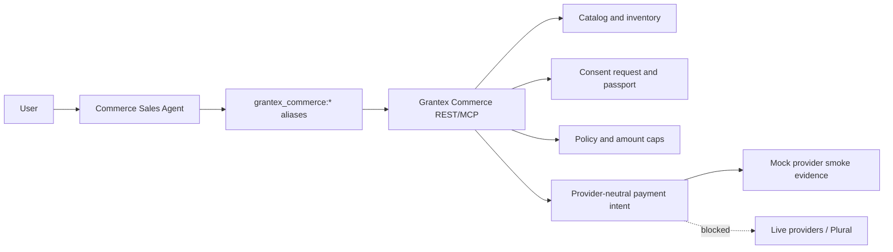
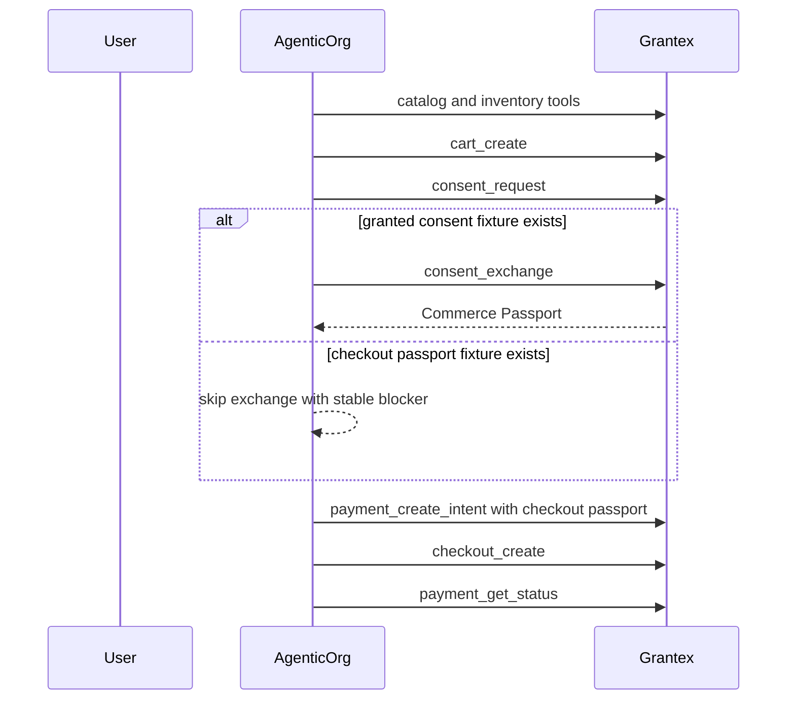

# Commerce Sales Agent Overview

The AgenticOrg Commerce Sales Agent is the agent and workflow layer for
Grantex-controlled commerce. It helps users discover products, draft carts,
request consent, use Commerce Passport fixtures during approved smoke runs, and
follow Grantex payment-intent and checkout status flows.

This page is documentation only. It does not deploy, change production config,
enable production Commerce V1, enable live payments, enable live Plural, or
approve production discovery.

For the full implementation gap plan, read
`docs/commerce-agent-agentic-commerce-implementation-prd.md`. That companion
PRD maps the current AgenticOrg implementation to the merchant self-serve gaps
that Grantex must close before real merchant launch.

The consolidated cross-repo PRD is maintained in the Grantex repo at
`docs/guides/commerce-v1-agentic-commerce-prd.md`. AgenticOrg docs should treat
that file as the product source of truth and this repo's docs as the buyer-agent
execution companion.

For a plain-language buyer and seller walkthrough, read
`docs/commerce-agent-end-to-end-agentic-commerce-flow.md`. It explains what a
buyer does once, what a seller does once in Grantex, and how a normal agentic
commerce transaction should work end to end.

## Current Posture

| Area | Status |
| --- | --- |
| Mock demo | Default local mode. |
| Real-staging eval | Explicitly gated; valid only against approved Grantex staging or exact temporary smoke URLs. |
| C2G local handoff evidence | 13 passed, 0 failed, 2 skipped, with `consent_exchange` skipped using the stable fixture blocker. |
| C3 hosted API-only smoke | 14 passed, 0 failed for liveness, health, MCP tools, A2A agent card, and A2A agents discovery. |
| Production discovery | Commerce metadata is gated by default behind `AGENTICORG_COMMERCE_PUBLIC_DISCOVERY_ENABLED`; it is not final production readiness. |
| Direct provider calls | Blocked for commerce. AgenticOrg commerce uses Grantex only. |
| Live checkout/payments/Plural | Blocked. |

## Architecture

AgenticOrg does not own catalog truth, consent grants, Commerce Passport
issuance, merchant policy enforcement, provider credentials, provider webhooks,
or payment reconciliation. Those controls stay in Grantex.

## Merchant Self-Serve Journey

For merchants, the intended product experience should be simple:

1. The merchant signs up in Grantex Commerce.
2. The merchant connects an existing store, catalog, ERP, inventory, OMS,
   payment provider, or support system.
3. Grantex normalizes that data into safe merchant profile, catalog, inventory,
   policy, consent, checkout, order, audit, and protocol-publishing records.
4. The merchant previews exactly what an AI agent can see.
5. The merchant chooses which actions agents may request, such as browse,
   cart draft, checkout request, order status, or support handoff.
6. Grantex runs validation scans and review gates.
7. AgenticOrg agents use only the approved Grantex tools.
8. Live discovery or checkout is enabled only after a separate approved rollout.

AgenticOrg should feel like the buyer-facing assistant and merchant-facing demo
layer, not the merchant system of record. If a merchant already uses Shopify,
WooCommerce, Magento, a custom store, an ERP, an OMS, a WMS, a payment provider,
or a support desk, those systems should connect to Grantex. AgenticOrg should
receive only the Grantex-approved, public-safe, policy-checked view.

## End-To-End Flow

The operational flow is:

1. Seller completes one-time setup in Grantex: workspace, verification,
   connected systems, catalog, inventory, policy, payment path, approvals,
   smoke evidence, and rollback ownership.
2. Buyer completes one-time setup in their preferred channel: account/session
   linking, safe preferences, and understanding that checkout requires Grantex
   consent.
3. Buyer asks the agent to find, compare, or buy.
4. AgenticOrg calls only Grantex aliases for merchant profile, catalog,
   inventory, cart, consent, payment intent, checkout, and status.
5. Grantex enforces source-of-truth, policy, consent, Commerce Passport,
   provider handoff, audit, order/fulfillment state, support/refund handoff, and
   rollback.
6. AgenticOrg explains the result to the buyer and refuses anything Grantex has
   not approved or cannot verify.

## Buyer Agent Launch Surfaces

The buyer agent must be easy to start from the places buyers already chat. The
current implementation does not yet make every surface launch-ready; this is a
tracked PRD gap.

| Surface | Intended launch model | Current readiness posture |
| --- | --- | --- |
| ChatGPT | Custom app/remote MCP backed by Grantex-only tools. | Planned; must respect ChatGPT app approval, action controls, and current write-action limits. |
| Claude | Remote MCP connector backed by Grantex-only tools. | Planned; must include auth, scopes, and smoke evidence. |
| Gemini | AgenticOrg-hosted Gemini API/function-calling wrapper or approved future native channel. | Planned; native consumer Gemini launch support must not be claimed until available and approved. |
| WhatsApp | WhatsApp Business Platform bot/webhook adapter. | Planned; requires WABA, phone number, templates, opt-out, webhook, and consent-link handling. |
| Telegram | Telegram Bot API webhook adapter. | Planned; requires bot token, webhook secret validation, chat identity mapping, and consent-link handling. |
| Web/mobile | AgenticOrg-hosted buyer-agent session or embedded merchant widget. | Best first controllable channel after Grantex approval. |

Every channel must create or resume a buyer-agent session, call only Grantex
commerce aliases, show clear consent/checkout handoff, and fall back to
read-only discovery when the platform or approval state does not allow write
actions.

## Standards And Protocol Fit

AgenticOrg should be ready to work with the standards ecosystem without claiming
unsupported certification:

| Surface | How AgenticOrg should use it |
| --- | --- |
| Native Grantex tools | Primary integration path for merchant profile, catalog, inventory, cart, consent, payment intent, checkout, and payment status. |
| MCP | Agent tool surface for safe commerce actions backed by Grantex policy and audit. |
| UCP | Future capability discovery and shopping capability mapping. AgenticOrg should consume Grantex-published UCP-style profiles only after Grantex approves them. |
| ACP | Future checkout/session compatibility. AgenticOrg may render checkout state, but Grantex remains the seller/control-plane endpoint. |
| AP2 | Future signed checkout/payment mandate evidence. AgenticOrg may present mandate status only when Grantex provides deterministic evidence. |
| schema.org | Public product, offer, shipping, and return-policy metadata generated from Grantex-approved merchant data. |

Do not claim UCP, ACP, AP2, A2A, or live-provider compliance unless the
corresponding Grantex implementation, conformance tests, approvals, and rollout
evidence exist.

## Pending Gaps Before Real Merchant Launch

AgenticOrg can demo the buyer-agent journey, but real merchant launch depends on
Grantex closing these gaps first:

- Self-serve merchant onboarding and approval workflow.
- Existing-system connectors for catalog, inventory, orders, fulfillment,
  payment status, and support.
- Hardened large catalog import jobs.
- Fresh inventory, stock holds, and delivery/pickup promise handling.
- Production order, fulfillment, shipment, cancellation, and return status APIs.
- Refund/return request workflow before any refund execution.
- Live provider approval, webhook signature verification, reconciliation, and
  rollback readiness.
- UCP/ACP/schema.org adapter generation from one canonical Grantex model.
- Order, fulfillment, delivery/pickup, cancellation, support, return, refund,
  settlement, and payout surfaces that agents can read without inventing facts.
- Product/landing copy that explains "agentic commerce readiness" without
  implying public discovery, checkout, payment, live provider, or certification
  approval.

Until those gaps close, AgenticOrg must refuse to invent sellers, products,
prices, discounts, delivery promises, return promises, checkout status, or
payment status.

## Tool Aliases

| Alias | Purpose |
| --- | --- |
| `grantex_commerce:merchant_get_profile` | Read merchant and policy status. |
| `grantex_commerce:catalog_search` | Search grounded product data. |
| `grantex_commerce:catalog_get_item` | Fetch exact product or variant details. |
| `grantex_commerce:inventory_check` | Check availability, using a browse passport when required. |
| `grantex_commerce:cart_create` | Create a cart draft from grounded items. |
| `grantex_commerce:consent_request` | Request user consent with supported checkout scopes. |
| `grantex_commerce:consent_exchange` | Exchange granted consent only when granted consent fixture material exists. |
| `grantex_commerce:payment_create_intent` | Create Grantex provider-neutral payment intent with supported fields only. |
| `grantex_commerce:checkout_create` | Create Grantex checkout handoff. |
| `grantex_commerce:payment_get_status` | Poll Grantex payment status. |

## Consent And Fixture Behavior

Fixture-backed runs accept a skipped `consent_exchange` only with:

`preexported_checkout_passport_without_granted_consent_fixture`

If a future evidence report records `consent_exchange` as failed or skipped with
another code, the fixture-backed C2G behavior is not passing.

## Safety Guardrails

- Mock mode remains the default demo mode.
- Real-staging mode refuses production URLs.
- Arbitrary `run.app` URLs are refused unless the exact smoke URL is allowlisted.
- HTTP localhost and non-HTTPS are refused in real-staging.
- Exactly one Grantex auth source name is accepted.
- Fixture files must stay under `.tmp/` and values must not be printed.
- Evidence records names, statuses, latency, error/blocker codes, synthetic IDs,
  and redacted hashes only.
- Commerce code must not import or call direct Stripe, Plural, Pine, or provider
  credential paths.

## Production Discovery Caveat

`docs/reports/commerce-agent-production-discovery-readiness.md` records the C4
finding that AgenticOrg production MCP/A2A discovery exposed commerce metadata
while Grantex production Commerce V1 discovery remained disabled/fail-closed.
C5A adds the fail-closed `AGENTICORG_COMMERCE_PUBLIC_DISCOVERY_ENABLED` public
discovery gate. Unless that non-secret setting is explicitly set to a safe true
value in an approved environment, public MCP/A2A discovery hides
`commerce_sales_agent` and `grantex_commerce:*` metadata. Do not enable that
gate for production until Grantex read-only production discovery is approved.

## Evidence Links

- `docs/commerce-agent-agentic-commerce-implementation-prd.md`
- `docs/reports/commerce-agent-real-staging-evidence.md`
- `docs/reports/commerce-agent-hosted-smoke-evidence.md`
- `docs/reports/commerce-agent-production-discovery-readiness.md`
- `docs/commerce-agent-c3-hosted-smoke-runbook.md`
- `docs/commerce-agent-hosted-staging-e2e.md`
