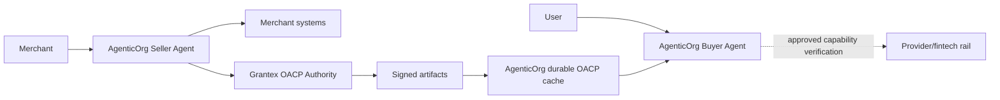
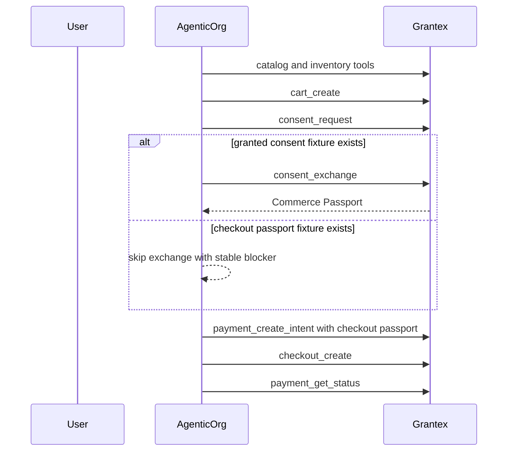

# Commerce Sales Agent Overview

The AgenticOrg Commerce Sales Agent is the buyer and seller AI-agent runtime for
OACP commerce. It helps merchants prepare seller agents and connector workflows,
helps buyers inspect artifact-grounded discovery previews, and consumes
Grantex-authorized OACP artifacts without becoming the merchant system of record
or the payment execution rail.

This page is documentation only. It does not deploy, change production config,
enable production Commerce V1, enable live payments, enable live Plural, or
approve production discovery.

For the full implementation gap plan, read
`docs/commerce-agent-agentic-commerce-implementation-prd.md`. That companion
PRD maps the current AgenticOrg implementation to the merchant self-serve gaps
that Grantex must close before real merchant launch.

The consolidated cross-repo PRD is maintained in the Grantex repo at
`docs/guides/commerce-v1-agentic-commerce-prd.md`. AgenticOrg docs should treat
that file as the product source of truth and this repo's docs as the buyer-agent
execution companion.

For a plain-language buyer and seller walkthrough, read
`docs/commerce-agent-end-to-end-agentic-commerce-flow.md`. It explains what a
buyer does once, what a seller does once in Grantex, and how a normal agentic
commerce transaction should work end to end.

## Current Posture

| Area | Status |
| --- | --- |
| Mock demo | Default local mode. |
| Real-staging eval | Explicitly gated; valid only against approved Grantex staging or exact temporary smoke URLs. |
| C2G local handoff evidence | 13 passed, 0 failed, 2 skipped, with `consent_exchange` skipped using the stable fixture blocker. |
| C3 hosted API-only smoke | 14 passed, 0 failed for liveness, health, MCP tools, A2A agent card, and A2A agents discovery. |
| Production discovery | Commerce metadata is gated by default behind `AGENTICORG_COMMERCE_PUBLIC_DISCOVERY_ENABLED`; it is not final production readiness. |
| C6I buyer discovery session | Channel-neutral read-only session wrapper around Grantex buyer preview data; no checkout/payment, provider, fulfillment, or refund execution. |
| C6W3-C6W9 OACP consumer foundation | Internal artifact schema, adapter preview, commitment boundary, prepared envelope, reconciliation, eligibility, and dry-run verifier consumer behavior. |
| C6X1-C6X3 OACP cache foundation | Verifier/runtime planning, fail-closed cache evaluator, repository port, and in-memory adapter for non-binding preview/prepare behavior. |
| C6X4 durable OACP cache | SQL-backed durable cache records scoped by buyer agent, seller agent, tenant, and merchant with TTL, freshness, revocation snapshot, risk tier, non-enablement flags, RLS, and tenant-safe indexes. |
| C6X5 cache maintenance planner | Deterministic local planner that classifies durable cache records into keep, refresh, evict, purge, quarantine, source refresh, or human-review outcomes. No scheduler and no side effects. |
| C6Z runtime vertical | Implemented, but production closure is blocked by Shopify token `401 Unauthorized` and Grantex `tenant_not_provisioned` for the configured AgenticOrg token. |
| Payment execution | Blocked. AgenticOrg may verify provider-owned mandate capability only through separately approved verifier flows. |
| Live checkout/payments/Plural | Blocked. |
| C6H buyer discovery consumer | Read-only sandbox consumer foundation; not public discovery or checkout/payment. |

## Architecture

AgenticOrg does not own catalog truth, provider payment execution, settlement,
or merchant operational state. Grantex owns artifact authority, policy and
refusal semantics, and evidence requirements. Merchant systems own operational
facts. Provider and fintech rails own mandates and payments.

## OACP Artifact Cache And Maintenance

C6X1-C6X5 add the AgenticOrg-side cache foundation for OACP artifacts. The
cache is a local runtime aid for non-binding preview, answer, and prepared-only
handoff behavior. It is not transaction authority and it does not replace
Grantex as the canonical OACP authority.

C6X4 adds durable storage through `oacp_artifact_cache_records`. Records are
scoped by buyer agent, seller agent, tenant, and merchant and store only
public-safe source refs, redacted evidence refs, artifact identity, issuer,
authority, TTL, freshness, revocation snapshot posture, risk tier, unsupported
capabilities, blocked capabilities, verifier result refs, and non-enablement
flags. The migration adds tenant-safe indexes, timestamp checks,
non-execution checks, duplicate artifact/scope guards, and tenant RLS.

C6X5 adds a planner over existing durable records. It can recommend
`keep_usable`, `refresh_recommended`, `refresh_required_before_commitment`,
`evict_expired`, `purge_revoked`, `quarantine_ambiguous_revocation`,
`quarantine_scope_mismatch`, `quarantine_private_or_raw_ref`,
`source_refresh_needed`, `human_review_required`, or `blocked_unsafe`.
It does not refresh, evict, purge, schedule, call Grantex live, call providers,
call merchant private APIs, or write a maintenance log.

The cache path fails closed for missing identity, missing scope, mismatched
scope, invalid timestamps, expired records, stale freshness, revoked or
ambiguous revocation posture, private/raw refs, executable flags, false
non-enablement flags, critical risk, unsupported transaction authority, and
stricter final-commitment freshness needs.

## Buyer Discovery Session

C6I lets a buyer-facing channel start a safe read-only discovery session. The
session wrapper classifies each request before doing anything else:
read-only discovery can call Grantex `buyer_discovery_preview`; checkout/payment,
live provider, fulfillment, refund/return, and unsupported requests are refused
without reaching any non-read-only path.

The response shape is the same for ChatGPT, Claude, Gemini, WhatsApp, Telegram,
web chat, and future channels. It includes status, message, merchant preview,
catalog samples, allowed and blocked capabilities, source reference, refusal
code, and evidence summary. It does not invent sellers, products, prices,
stock, delivery, refund, launch, or payment facts.

## Merchant Self-Serve Journey

For merchants, the intended product experience should be simple:

1. The merchant starts in AgenticOrg Seller Commerce Agent.
2. The merchant connects an existing store, catalog, ERP, inventory, OMS,
   payment provider, or support system through approved connector custody.
3. Grantex validates public-safe facts, source/freshness, policy, and evidence
   references into OACP artifacts.
4. The merchant previews exactly what an AI agent can see.
5. The merchant chooses which non-executing actions agents may request, such as
   browse, compare, product explanation, or support handoff. Checkout, order,
   payment, mandate, refund, return, shipment, and inventory hold execution
   require a separate future rollout and are not enabled by C6Z.
6. Grantex runs validation scans and review gates.
7. AgenticOrg agents use valid OACP artifacts, approved authority refresh, and
   approved provider/connector verifier flows.
8. Live discovery or checkout is enabled only after a separate approved rollout.

AgenticOrg should feel like the seller-agent and buyer-agent product, not the
merchant system of record. If a merchant already uses Shopify, WooCommerce,
Magento, a custom store, an ERP, an OMS, a WMS, a payment provider, or a support
desk, those systems should connect through approved connector custody and
produce public-safe evidence for Grantex/OACP validation.

## End-To-End Flow

The operational flow is:

1. Seller completes one-time setup in AgenticOrg Seller Commerce Agent and
   Grantex authority review: onboarding packet, connected systems, catalog,
   inventory, policy, capability metadata, approvals, smoke evidence, and
   rollback ownership.
2. Buyer completes one-time setup in their preferred channel: account/session
   linking, safe preferences, and understanding that current C6Z behavior is
   non-executing. Any future checkout path requires separate approval.
3. Buyer asks the agent to find, compare, or request a non-executing handoff.
4. AgenticOrg reads valid durable OACP cache records when TTL, freshness,
   revocation, scope, source, and risk rules allow; otherwise it blocks or
   asks Grantex for authority refresh in a separately approved path.
5. Commitment-bound actions require C6W5-C6W9 boundary, prepared envelope,
   reconciliation, eligibility, dry-run checks, and C6X cache posture checks.
6. AgenticOrg explains the result to the buyer and refuses anything artifacts,
   source evidence, provider capability, or policy cannot verify.

## Buyer Agent Launch Surfaces

The buyer agent must be easy to start from the places buyers already chat. The
current implementation does not yet make every surface launch-ready; this is a
tracked PRD gap.

| Surface | Intended launch model | Current readiness posture |
| --- | --- | --- |
| ChatGPT | Custom app/remote MCP backed by OACP artifacts and authority refresh. | Planned; must respect ChatGPT app approval, action controls, and current write-action limits. |
| Claude | Remote MCP connector backed by OACP artifacts and authority refresh. | Planned; must include auth, scopes, and smoke evidence. |
| Gemini | AgenticOrg-hosted Gemini API/function-calling wrapper or approved future native channel. | Planned; native consumer Gemini launch support must not be claimed until available and approved. |
| WhatsApp | WhatsApp Business Platform bot/webhook adapter. | Planned; requires WABA, phone number, templates, opt-out, webhook, and consent-link handling. |
| Telegram | Telegram Bot API webhook adapter. | Planned; requires bot token, webhook secret validation, chat identity mapping, and consent-link handling. |
| Web/mobile | AgenticOrg-hosted buyer-agent session or embedded merchant widget. | Best first controllable channel after Grantex approval. |

Every channel must create or resume a buyer-agent session, use OACP artifacts or
authority refresh, show clear source/freshness and consent/handoff copy, and
fall back to read-only discovery when the platform or approval state does not
allow write actions.

## Standards And Protocol Fit

AgenticOrg should be ready to work with the standards ecosystem without claiming
unsupported certification:

| Surface | How AgenticOrg should use it |
| --- | --- |
| OACP artifacts | Primary internal trust input for source/freshness, refusal, prepared handoff, and future controller checks. |
| Native Grantex tools | Authority refresh path for merchant profile, catalog, inventory, policy, and artifact verification. |
| MCP | Agent tool surface for safe commerce actions backed by OACP artifacts and Grantex authority. |
| UCP | Future capability discovery and shopping capability mapping. AgenticOrg should consume Grantex-published UCP-style profiles only after Grantex approves them. |
| ACP | Future checkout/session compatibility. AgenticOrg may render prepared or blocked checkout state, but execution remains separately gated. |
| AP2 | Future signed checkout/payment mandate evidence. AgenticOrg may present provider-owned mandate status only when deterministic evidence exists. |
| schema.org | Public product, offer, shipping, and return-policy metadata generated from Grantex-approved merchant data. |

Do not claim UCP, ACP, AP2, A2A, or live-provider compliance unless the
corresponding Grantex implementation, conformance tests, approvals, and rollout
evidence exist.

## Pending Gaps Before Real Merchant Launch

AgenticOrg can demo the buyer-agent journey, but real merchant launch depends on
Grantex closing these gaps first:

- Self-serve merchant onboarding and approval workflow.
- Existing-system connectors for catalog, inventory, orders, fulfillment,
  payment status, and support.
- Hardened large catalog import jobs.
- Fresh inventory, stock holds, and delivery/pickup promise handling.
- Production order, fulfillment, shipment, cancellation, and return status APIs.
- Refund/return request workflow before any refund execution.
- Live provider approval, webhook signature verification, reconciliation, and
  rollback readiness.
- UCP/ACP/schema.org adapter generation from one canonical Grantex model.
- Order, fulfillment, delivery/pickup, cancellation, support, return, refund,
  settlement, and payout surfaces that agents can read without inventing facts.
- Product/landing copy that explains "agentic commerce readiness" without
  implying public discovery, checkout, payment, live provider, or certification
  approval.

Until those gaps close, AgenticOrg must refuse to invent sellers, products,
prices, discounts, delivery promises, return promises, checkout status, or
payment status.

## Tool Aliases

The aliases below describe historical or adjacent Grantex commerce connector
surfaces. They are not proof that the C6Z OACP runtime artifact vertical has
completed, and they are not enabled by OACP C6Z launch evidence.

| Alias | Purpose |
| --- | --- |
| `grantex_commerce:merchant_get_profile` | Read merchant and policy status. |
| `grantex_commerce:catalog_search` | Search grounded product data. |
| `grantex_commerce:catalog_get_item` | Fetch exact product or variant details. |
| `grantex_commerce:inventory_check` | Check availability, using a browse passport when required. |
| `grantex_commerce:cart_create` | Historical payment-control pilot alias; not enabled by OACP C6Z runtime artifact proof. |
| `grantex_commerce:consent_request` | Historical payment-control pilot alias; not enabled by OACP C6Z runtime artifact proof. |
| `grantex_commerce:consent_exchange` | Historical fixture-backed alias; not enabled by OACP C6Z runtime artifact proof. |
| `grantex_commerce:buyer_discovery_preview` | Read Grantex C6G sandbox buyer discovery handoff preview data. |
| `grantex_commerce:payment_create_intent` | Historical Grantex payment-control pilot alias; not enabled by OACP C6Z runtime artifact proof. |
| `grantex_commerce:checkout_create` | Historical Grantex checkout handoff alias; not enabled by OACP C6Z runtime artifact proof. |
| `grantex_commerce:payment_get_status` | Historical Grantex payment-status alias; not enabled by OACP C6Z runtime artifact proof. |

## Historical Consent And Fixture Behavior

This section describes earlier fixture-backed Grantex payment-control pilot
behavior. It is not proof that the AgenticOrg C6Z OACP runtime artifact vertical
has completed, and it does not enable checkout, payment, mandate, order, refund,
return, shipment, public discovery, or live-provider execution.

Fixture-backed runs accept a skipped `consent_exchange` only with:

`preexported_checkout_passport_without_granted_consent_fixture`

If a future evidence report records `consent_exchange` as failed or skipped with
another code, the fixture-backed C2G behavior is not passing.

## Safety Guardrails

- Mock mode remains the default demo mode.
- Real-staging mode refuses production URLs.
- Arbitrary `run.app` URLs are refused unless the exact smoke URL is allowlisted.
- HTTP localhost and non-HTTPS are refused in real-staging.
- Exactly one Grantex auth source name is accepted.
- Fixture files must stay under `.tmp/` and values must not be printed.
- Evidence records names, statuses, latency, error/blocker codes, synthetic IDs,
  and redacted hashes only.
- Commerce code must not import or call direct Stripe, Plural, Pine, or provider
  credential paths.

## Production Discovery Caveat

`docs/reports/commerce-agent-production-discovery-readiness.md` records the C4
finding that AgenticOrg production MCP/A2A discovery exposed commerce metadata
while Grantex production Commerce V1 discovery remained disabled/fail-closed.
C5A adds the fail-closed `AGENTICORG_COMMERCE_PUBLIC_DISCOVERY_ENABLED` public
discovery gate. Unless that non-secret setting is explicitly set to a safe true
value in an approved environment, public MCP/A2A discovery hides
`commerce_sales_agent` and `grantex_commerce:*` metadata. Do not enable that
gate for production until Grantex read-only production discovery is approved.

## Evidence Links

- `docs/commerce-agent-agentic-commerce-implementation-prd.md`
- `docs/reports/commerce-agent-c6x1-oacp-cache-verifier-runtime-planning.md`
- `docs/reports/commerce-agent-c6x2-oacp-artifact-cache-runtime.md`
- `docs/reports/commerce-agent-c6x3-oacp-cache-repository.md`
- `docs/reports/commerce-agent-c6x4-durable-oacp-cache-repository.md`
- `docs/reports/commerce-agent-c6x5-oacp-cache-maintenance.md`
- `docs/reports/commerce-agent-real-staging-evidence.md`
- `docs/reports/commerce-agent-hosted-smoke-evidence.md`
- `docs/reports/commerce-agent-production-discovery-readiness.md`
- `docs/commerce-agent-c3-hosted-smoke-runbook.md`
- `docs/commerce-agent-hosted-staging-e2e.md`
