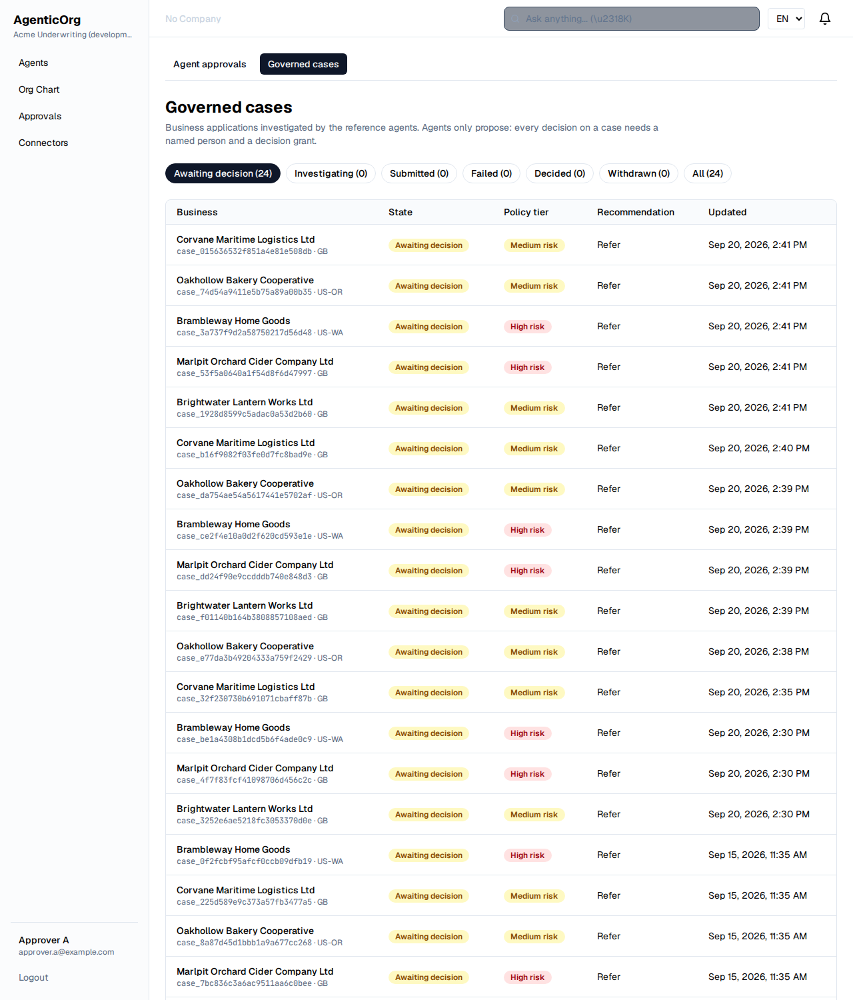
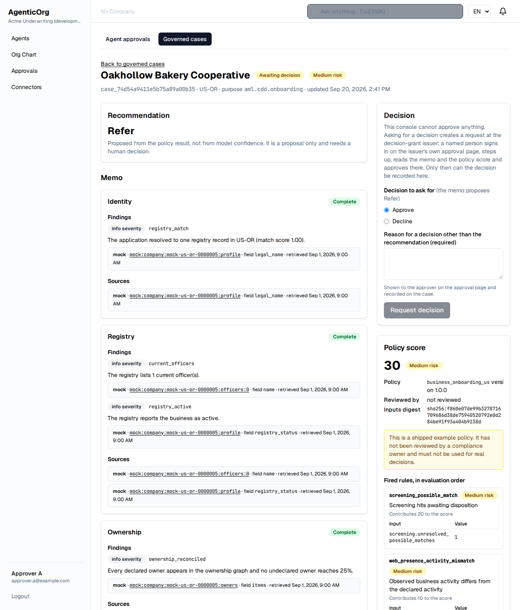
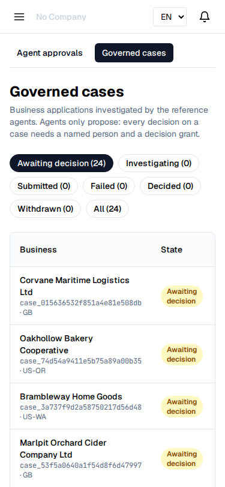

# Governed cases in the approvals console

The approvals console gained screens for governed business cases (PRD A-9): the
queue, the case with its cited memo and policy score, the screening
dispositions an analyst accepts or overrides, and the decision action. They are
screens over the governed case API (`/api/v1/governed-cases`) and add no
authority of their own: the API refuses anything the console must not do, and
the console only avoids offering controls that would always be refused.

> The console is one destination for a case. The signed
> [case hand-off](../governance/case-hand-off.md) delivers the same documents to
> whatever system of record an operator already uses.

**No agent decides.** Nothing in these screens approves, declines, closes or
files. A case reaches `decided` only through a human decision backed by decision
grants; see [governance](../governance/README.md).

## Where the screens are

| Screen | Path | Shows |
| --- | --- | --- |
| Queue | `/dashboard/approvals/cases` | cases by state with the policy tier and the memo's recommendation |
| Case | `/dashboard/approvals/cases/{case_ref}` | the cited memo, the policy score with every fired rule, the case history |

Both need a signed-in user with the approvals scopes, and the tenant's
`governed_cases.enabled` flag. A tenant without the flag sees "Governed cases are
not enabled for this organisation" rather than an empty queue: the API answers
404 `governed_cases_disabled`, and the console shows the reason code it was
given.

## The queue



The filter buttons carry the count of cases in each state (from
`GET /governed-cases/stats`); the default is the cases awaiting a decision. Each
row links to the case, and a failed investigation shows its failure reason
instead of a recommendation.

## The case



- **Recommendation** — what the memo proposes, stated as a proposal that needs a
  human decision, with the missing items the agent could not obtain.
- **Memo sections** — identity, registry, ownership, screening, web presence and
  activity. Each section shows its status:
  - *complete* or *partial* sections list their findings, each with a severity, a
    statement and the evidence behind it;
  - *not available* sections say why (the provider does not offer the data, or
    there was no registry match) and state plainly that nothing in the section
    was checked — missing evidence, not a clear result;
  - *provider error* sections name the provider error that stopped them.
- **Citations** — every evidence entry names the provider, the upstream record,
  the field within it and when it was retrieved. The record links to the cited
  records index at the foot of the memo, and an attached excerpt reference links
  to the excerpt's digest. An excerpt reference the memo does not carry is
  labelled as such rather than silently dropped.
- **Policy score** — the score, the tier, the policy id and version, the inputs
  digest, and every fired rule in evaluation order with the evidence field values
  it read. A shipped example policy is flagged as unreviewed.
- **Provenance** — the agent, its version, the prompt version, the model and the
  model's self-reported confidence, marked as metadata that gates nothing.

Agent-authored text is rendered as text. Nothing from a memo, a provider record
or an excerpt is ever rendered as markup.

## At phone width



The screens are usable at 375 pixels; only the queue table scrolls sideways
inside its own container.

## Trying it locally

```
make dev                                   # stack: API, console, mock provider, model stub, Grantex
AGENTICORG_SEED_PASSWORD='choose-a-local-passphrase' make seed
make seed-cases                            # governed_cases.enabled on, sample cases investigated
AGENTICORG_SEED_PASSWORD='choose-a-local-passphrase' make e2e
```

`make seed-cases` submits one case per mock provider fixture — a clean case, a
missing-owner case, a probable false-positive screening hit, a true match and a
thin file with no registry match — runs the reference agents against the mock
provider service and the model stub, and writes the new case references to
`ui/test-results/governed-cases-seed.json`. It refuses to run outside a
development runtime, and it never decides or reviews anything.

`make e2e` runs the browser suite (`ui/e2e/governed-cases*.spec.ts`) against the
running stack. It checks the screens with axe (WCAG 2.1 A and AA) at desktop and
phone width and regenerates every screenshot on this page into
`docs/console/images/`.
