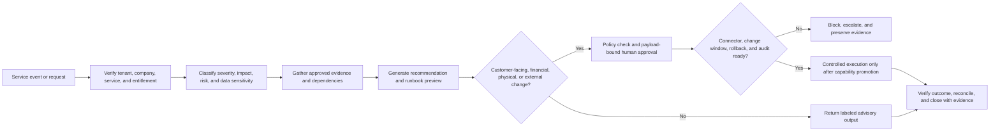

# COO Guide - Operations Evaluation Surface

**Status:** preview/evaluation only; mandatory operations readiness gates remain open
**Product version:** 4.8.0
**Repository baseline:** `384543788bcd1f66aed8cff8ab03699ae384926e`
**Accountable owner:** unassigned until roadmap item `W0-05` closes
**Last reviewed:** 2026-07-15
**Next review:** owner assignment or 2026-07-27, whichever occurs first
**Prerequisites:** isolated non-production tenant, synthetic operational records, reviewed role grants, and disabled external writes
**Limitations:** route, agent, runbook, and connector presence is not service, vendor, facility, supply-chain, continuity, or production proof
**Related test:** `tests/regression/test_readiness_documentation.py`
**Related runbook:** [build and release roadmap](readiness/BUILD_ROADMAP.md), especially `OPS-01` through `OPS-09`

## Readiness boundary

The COO surface is a planning and evaluation workspace. The [capability register](readiness/CAPABILITY_READINESS_REGISTER.md) marks the COO command center **Scaffolded / Blocked / Preview**. Operating model, support, IT service, vendor, operational-risk, and governed-automation paths are also blocked; supply-chain and customer-continuity capabilities are unavailable. Conditional facilities and quality scaffolds have not been assessed.

`/dashboard/coo` may expose role-filtered agent activity. Generic task counts, success rates, HITL counts, and model spend are platform telemetry, not trusted service, capacity, quality, cost, continuity, or customer KPIs.

## Evaluation scope

| Area | Safe evaluation use | Current boundary |
|---|---|---|
| Operating model | Draft service catalogs, ownership maps, capacity assumptions, and review queues | No approved service baseline, cost model, or capacity commitment |
| Customer support | Model intake, categorization, knowledge lookup, and escalation | No autonomous customer response, entitlement decision, credit, or closure |
| IT service operations | Draft incident, problem, change, and request workflows | No production remediation, infrastructure change, credential action, or incident declaration |
| Vendor and procurement | Draft intake, due diligence, evaluation, and renewal workflows | No purchase order, contract, vendor onboarding, payment, or suspension action |
| Facilities | Model inspections, maintenance, and safety queues | Conditional preview only; no physical-control execution or safety certification |
| Supply chain | Requirements and integration planning only | Unavailable; no fulfillment, inventory, logistics, or promise-date claim |
| Quality and CAPA | Draft nonconformance and corrective-action reviews | Conditional preview only; no quality release or regulatory certification |
| Continuity | Requirements, dependency mapping, and tabletop planning | Customer business-continuity capability is unavailable; no recovery assurance |

## Normative workflow

Evaluation must stop before external or production-changing execution.

## Command-center contract

A production COO dashboard must eventually provide governed, reconcilable views of:

- service availability, demand, backlog, capacity, unit cost, and entitlement;
- customer support volume, age, response, resolution, reopen, escalation, and satisfaction measures;
- incident, problem, change, request, and operational-risk state;
- vendor service, concentration, obligation, renewal, and exception state;
- facility, maintenance, safety, quality, and CAPA state where applicable;
- inventory, order, fulfillment, logistics, and continuity state only after those capabilities exist;
- KPI source, entity, window, formula, owner, freshness, reconciliation, target, and exception notes.

These are target data contracts. The current dashboard must not imply them from generic agent telemetry.

## Connector and automation posture

Connector names and registered tools are inventory. Production use requires tenant/company credential binding, least-privilege scopes, schema and entitlement mapping, health, retries, rate limits, idempotency, duplicate suppression, change controls, rollback, audit, and vendor-sandbox proof. An automation or runbook must remain advisory or shadow-only until its exact action taxonomy, approval policy, blast-radius control, stop condition, and outcome verification have passed the promotion transaction.

## Approval and safety rules

- SEV declarations, customer communications, credits, vendor actions, purchases, production changes, physical operations, and continuity declarations require accountable human control.
- Approval must bind to the exact tenant, company, service, resource, action, time window, and payload.
- The operator must see impact, dependencies, evidence, policy result, rollback/stop plan, and expected verification before approval.
- Cross-domain steps involving Finance, HR, CA, CBO, Security, or Legal remain blocked until each participating capability gate passes.
- Failed, timed-out, ambiguous, or unconfirmed writes must reconcile to an exception queue; they must never be treated as success.

## Safe local evaluation

1. Use synthetic incidents, requests, vendors, facilities, customers, and services in an isolated test tenant.
2. Confirm COO/admin access and company context before opening `/dashboard/coo`.
3. Inspect source lineage, severity logic, entitlement state, approval requirements, and missing-data behavior.
4. Confirm that production-changing tools and external messages are disabled or shadow-only.
5. Test rejection, timeout, retry, partial failure, duplicate event, rollback, and degraded-connector paths.
6. Retain only redacted test evidence and record results against the relevant `OPS-Cxx` capability.

## Evidence required for promotion

Promotion requires service and entitlement contracts; complete tenant/company isolation; real vendor sandbox evidence; policy and approval coverage; durable action-attempt and outcome audit; failure and chaos tests; reconciliation; security, accessibility, performance, privacy, and safety review; SLOs, alerts, on-call and escalation ownership; incident/change/rollback/DR runbooks; controlled pilot evidence; and COO, service owner, security, finance/legal where applicable, and operations sign-off.

## Troubleshooting and escalation

| Symptom | Required response |
|---|---|
| Dashboard shows activity rather than business KPIs | Treat it as telemetry and track the missing data contract under `OPS-08/09` |
| Entitlement or company scope is missing | Stop; do not disclose or act for the customer |
| External action lacks impact or rollback evidence | Reject the action and escalate as a release blocker |
| Connector reports success without a verifiable outcome | Mark it unconfirmed, reconcile, and prevent automatic retry without idempotency |
| Continuity or supply-chain outcome is advertised | Remove the claim; those capabilities are unavailable in the current register |

See the [gap analysis](readiness/GAP_ANALYSIS.md), [readiness standard](readiness/DOMAIN_READINESS_STANDARD.md), and [program memory](readiness/PROGRAM_MEMORY.md) for the current evidence boundary.
