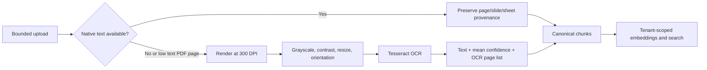

# Knowledge base document ingestion and OCR

The Knowledge Base accepts business documents only when AgenticOrg can extract
usable text before changing durable state. Accepted uploads pass through one
canonical extraction, chunking, provenance, embedding, and tenant-scoped search
pipeline.

## Supported documents

| Family | Extensions | Extraction |
| --- | --- | --- |
| Text and data | `txt`, `md`, `csv`, `tsv`, `json`, `yaml`, `xml`, `log` | Native decode/structured parser |
| Web and email | `html`, `htm`, `eml` | Active content removed; body text only |
| PDF | `pdf` | Native page text first; OCR for low-text/scanned pages |
| Microsoft Office | `docx`, `xlsx`, `pptx` | Native paragraph, sheet, slide, and table extraction |
| Legacy Office | `doc`, `xls`, `ppt` | Isolated headless LibreOffice conversion, then native extraction |
| OpenDocument | `odt`, `ods`, `odp` | Isolated headless LibreOffice conversion, then native extraction |
| Other documents | `rtf` | RTF text parser |
| Scans and images | `png`, `jpg`, `jpeg`, `tif`, `tiff`, `bmp`, `webp` | Tesseract OCR with confidence |

Audio and video are not document uploads and are explicitly rejected. The API
advertises the current matrix through `GET /api/v1/knowledge/supported-types`.

## OCR flow

The production image includes Poppler, LibreOffice, and Tesseract language data
for English, Hindi, Bengali, Gujarati, Kannada, Malayalam, Marathi, Punjabi,
Tamil, Telugu, and Urdu. By default, orientation/script detection chooses the
matching installed India-first language pack together with English. Operators
can set `AGENTICORG_OCR_LANGUAGES` to an explicit installed combination.

## Safety and accuracy rules

- Uploads are streamed with a hard size limit before parser invocation.
- OOXML/ODF ZIP members and expanded size are bounded to resist archive bombs.
- PDF pages, CPU-heavy OCR pages, and decompressed image pixels are bounded.
- Multi-page TIFF documents are OCRed frame by frame with page provenance.
- Replacement extraction runs before the old document is deleted.
- A corrupt, unsupported, or zero-text document returns an explicit 4xx error.
- The UI shows extraction method, whether OCR ran, and OCR confidence.
- Raw files are not interpreted as executable HTML, scripts, or macros.
- Retrieval preserves source page, slide, sheet, row, and freshness metadata.

## Local and production checks

Run the focused extractor tests and then build the production Docker image. The
image check must create an actual scanned image/PDF, execute Tesseract and
Poppler in the container, and assert the expected phrase is extracted. Mocked
OCR tests are useful for edge cases but are not sufficient release evidence.
