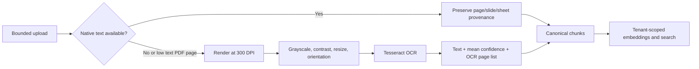

# Knowledge base document ingestion and OCR

Status: shipped runtime. Exact limits and extensions are advertised by the
authenticated `GET /api/v1/knowledge/supported-types` endpoint. See
[current product status](PRODUCT_STATUS.md) for the production boundary.

The Knowledge Base accepts business documents only when AgenticOrg can extract
usable text before changing durable state. Accepted uploads pass through one
canonical extraction, chunking, provenance, embedding, and tenant-scoped search
pipeline.

## Supported documents

| Family | Extensions | Extraction |
| --- | --- | --- |
| Text and data | `txt`, `md`, `csv`, `tsv`, `json`, `yaml`, `xml`, `log` | Native decode/structured parser |
| Web and email | `html`, `htm`, `eml` | Active content removed; body text only |
| PDF | `pdf` | Native page text first; OCR for low-text/scanned pages |
| Microsoft Office | `docx`, `xlsx`, `pptx` | Native paragraph, sheet, slide, and table extraction |
| Legacy Office | `doc`, `xls`, `ppt` | Isolated headless LibreOffice conversion, then native extraction |
| OpenDocument | `odt`, `ods`, `odp` | Isolated headless LibreOffice conversion, then native extraction |
| Other documents | `rtf` | RTF text parser |
| Scans and images | `png`, `jpg`, `jpeg`, `tif`, `tiff`, `bmp`, `webp` | Tesseract OCR with confidence |

Audio and video are not document uploads and are explicitly rejected. The API
advertises the current matrix through `GET /api/v1/knowledge/supported-types`.

## Layout and chunking

Extraction keeps the layout it can see. A PDF page is split into paragraphs at blank lines and
each paragraph is numbered through the document; a short line that reads as a section title
(numbered, in capitals, or in title case without a final stop) is a heading, and the paragraphs
under it carry its text. A Word document keeps its Heading and Title styles as headings, numbers
its paragraphs, and attaches table rows to the section they sit in. Every chunk records the
page, the paragraph number and the nearest heading of its first span in `knowledge_chunk_sources`
(`paragraph`, `heading`), beside the page, sheet, cell range and frame provenance it already had,
so a citation can name the place (`core/rag/extractors.py`).

How spans become chunks is a tenant setting, `chunk_strategy` in the tenant AI settings
(`core/rag/chunking.py`), with `chunk_size` (tokens, four characters a token here) as the size
band:

| Strategy | What it does |
|---|---|
| `sentence` (default) | The original behaviour: cut at sentence boundaries into a 120 to `chunk_size` band and merge short neighbours. Layout is not consulted. A tenant that has set nothing is chunked exactly as before. |
| `paragraph` | One chunk per paragraph, table row or list item; short consecutive paragraphs under the same heading merge up to the band; a long paragraph is cut at sentence boundaries. A chunk never crosses a heading. |
| `heading` | Spans are grouped under their nearest heading until the band is full, and each chunk starts with the heading's text, so a retrieved chunk says which section it came from. A chunk never crosses a heading. |

Changing the strategy affects documents ingested after the change; existing chunks are not
re-chunked (re-indexing is a later part of this package). Heading detection on PDFs is a
heuristic over line shape; a document whose titles end with a full stop or run to several lines
is read as paragraphs only, which the `sentence` and `paragraph` strategies handle as before.

## OCR flow

```mermaid
flowchart LR
    A[Bounded upload] --> B{Native text available?}
    B -->|Yes| C[Preserve page/slide/sheet provenance]
    B -->|No or low text PDF page| D[Render at 300 DPI]
    D --> E[Grayscale, contrast, resize, orientation]
    E --> F[Tesseract OCR]
    F --> G[Text + mean confidence + OCR page list]
    C --> H[Canonical chunks]
    G --> H
    H --> I[Tenant-scoped embeddings and search]
```

The production image includes Poppler, LibreOffice, and Tesseract language data
for English, Hindi, Bengali, Gujarati, Kannada, Malayalam, Marathi, Punjabi,
Tamil, Telugu, and Urdu. By default, orientation/script detection chooses the
matching installed India-first language pack together with English. Operators
can set `AGENTICORG_OCR_LANGUAGES` to an explicit installed combination.

## Safety and accuracy rules

- Uploads are streamed with a hard size limit before parser invocation.
- OOXML/ODF ZIP members and expanded size are bounded to resist archive bombs.
- PDF pages, CPU-heavy OCR pages, and decompressed image pixels are bounded.
- Multi-page TIFF documents are OCRed frame by frame with page provenance.
- Replacement extraction runs before the old document is deleted.
- A corrupt, unsupported, or zero-text document returns an explicit 4xx error.
- The UI shows extraction method, whether OCR ran, and OCR confidence.
- Raw files are not interpreted as executable HTML, scripts, or macros.
- Retrieval preserves source page, slide, sheet, row, and freshness metadata.

## Local and production checks

Run the focused extractor tests and then build the production Docker image. The
image check must create an actual scanned image/PDF, execute Tesseract and
Poppler in the container, and assert the expected phrase is extracted. Mocked
OCR tests are useful for edge cases but are not sufficient release evidence.

Production validation should use an approved smoke tenant and a synthetic,
non-sensitive document. A successful supported-types response proves the
capability matrix is deployed; it does not by itself prove extraction quality
for every language, layout, handwriting style, or damaged scan.

Run the [local multichannel simulation](local-multichannel-simulation.md) for a
real synthetic-image OCR proof alongside voice, email, and RPA checks. Its JSON
evidence records extraction method, confidence, and page count without storing
a customer document.
