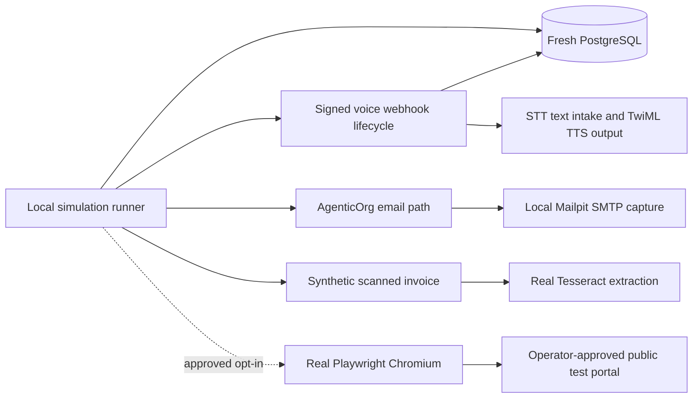

# Local voice, email, RPA, and OCR simulation

This runbook validates the four runtime paths with real local components before
a production release. It produces evidence under
`codex-pytest-artifacts/multichannel/` and removes its Docker containers and
volumes when it finishes.

## What the simulation proves



| Flow | Real components exercised | Deliberately not exercised |
| --- | --- | --- |
| Voice | Signed Twilio-shaped inbound and status webhooks, speech transcript input, agent turn, escaped TwiML TTS response, encrypted transcript storage, masked history, tenant isolation | Twilio network, PSTN delivery, microphone/audio quality, paid call |
| Email | Production `send_email` code, SMTP protocol, MIME message, local Mailpit receipt and inspection | External mailbox delivery, spam placement, provider reputation |
| OCR | Real Tesseract binary, image preprocessing, confidence and page provenance | Every language, handwriting, damaged scans, every scanner model |
| RPA | Real Python Playwright, bundled Chromium, egress guard, login form, extraction, screenshots | A merchant production account unless its owner separately approves a canary |

The simulation must not be presented as proof of a provider last mile. A real
phone canary, external email inbox, merchant portal, or damaged multilingual
document still requires an approved destination and non-sensitive test data.

## Prerequisites

- Python environment with `.[v4,dev]` installed.
- Docker Desktop with Compose.
- Tesseract on the host for the OCR leg.
- Chromium installed for optional RPA:

```bash
python -m playwright install chromium
```

The production Docker image installs Playwright and its version-matched
Chromium automatically.

## Run the safe local suite

```bash
python scripts/local_multichannel_simulation.py
```

This starts fresh PostgreSQL and a digest-pinned Mailpit container on random
host ports. The default email recipient is an address at an MX-valid domain,
but the message never leaves Mailpit.

Expected result:

- `voice.status = passed`
- `email.status = passed`
- `ocr.status = passed`
- `rpa.status = skipped` unless the explicit RPA option is used
- `production_mutation = false`
- `paid_phone_call = false`

## Add a real Playwright test-portal leg

Use only a portal whose owner permits automation and only credentials created
for testing. Keep them in the process environment, never in source or command
history shared with others.

```bash
export AGENTICORG_SIM_RPA_URL='https://approved-test.example/login'
export AGENTICORG_SIM_RPA_USERNAME='test-user'
export AGENTICORG_SIM_RPA_PASSWORD='test-password'
export AGENTICORG_SIM_RPA_WAIT_FOR='#post-login-marker'
export AGENTICORG_SIM_RPA_EXTRACT_SELECTOR='#safe-result'
python scripts/local_multichannel_simulation.py --with-public-rpa
```

The RPA route guard continues to reject loopback, private, link-local, metadata,
IP-literal, and DNS-rebinding targets. Do not weaken the guard to test a local
HTML server; use an approved publicly reachable test environment.

## Production canary inputs

Simulation covers nearly all deterministic application behavior. To finish the
provider last mile, an operator supplies:

| Canary | Minimum approved input | Cost or side effect |
| --- | --- | --- |
| Phone | One test phone number, calling window, Twilio tenant/agent config, and permission to incur a call charge | Paid call and stored provider call metadata |
| Email | One controlled inbox and permission to send a uniquely tagged message | External delivery and mailbox retention |
| RPA | Non-production portal account, approved domain, permitted actions, and expected success marker | External login and possible test-system mutation |
| OCR | Synthetic or cleared scan corpus with expected ground truth | Document upload and temporary evidence storage |

Never place a phone call or run a write-capable RPA action against a real account
without explicit approval for that destination and action.

## SMTP safety

Production defaults remain `smtp.gmail.com:465` with implicit TLS and required
credentials. `AGENTICORG_SMTP_SECURITY=plain` is accepted only when all of the
following are true:

1. `AGENTICORG_ENV` is `local`, `dev`, `development`, `test`, or `ci`.
2. `AGENTICORG_SMTP_HOST` is `localhost`, `127.0.0.1`, or `::1`.
3. The caller still passes normal recipient-domain validation.

Unknown modes, invalid ports, plaintext remote hosts, and plaintext strict
environments fail closed before opening a connection.
