# OACP End-To-End Flow

AgenticOrg owns the buyer/seller agent runtime. Grantex owns OACP trust,
protocol policy, canonical artifacts, signing, and verification. Shopify stays
the merchant source of record. Pine Labs Plural/P3P owns mandate and payment
rail execution.

This flow is implemented as a non-executing vertical path. AgenticOrg can
prepare a provider handoff or return an exact blocker; it does not fake payment
success or create checkout, order, payment, mandate, inventory hold, refund,
return, shipment, or public discovery publication.

```mermaid
flowchart LR
  seller[Shopify merchant] --> onboard[AgenticOrg Seller Commerce Agent onboarding]
  onboard --> sync[Read-only Shopify Admin GraphQL sync]
  sync --> evidence[Redacted catalog, price, inventory evidence refs]
  evidence --> grantex[Grantex C6Z OACP authority]
  grantex --> artifacts[Signed/internal OACP artifact families]
  artifacts --> cache[AgenticOrg tenant-scoped artifact cache]
  cache --> adapters[Schema.org/UCP/ACP/AP2/A2A/MCP/OpenAPI payloads]
  cache --> buyer[Buyer Q&A with source and freshness labels]
  buyer --> purchase[Purchase preparation]
  purchase --> pine[Pine Labs Plural/P3P capability verification]
  pine --> handoff[Prepared handoff or safe blocker]
```

## Seller Path

1. Create a Seller Commerce Agent onboarding packet in AgenticOrg.
2. Capture tenant, merchant, seller agent, Shopify shop domain, read-only
   connector mode, permitted sync actions, artifact cache scope, buyer channel
   preferences, and payment/mandate rail preference.
3. Store Shopify credentials in tenant-aware encrypted connector storage. Raw
   tokens are not logged or returned.
4. Sync products, variants, images, price, currency, inventory snapshot,
   product status, updated time, and redacted source refs from Shopify Admin
   GraphQL.
5. Request Grantex authority artifacts for all C6Z families.
6. Cache artifacts by tenant, merchant, seller agent, and buyer agent where
   relevant.

## Buyer Path

Buyer surfaces can ask product and catalog questions over web/API, MCP,
OpenAPI-style hosted/action clients, A2A metadata, WhatsApp, and Telegram. Each
surface routes through the same cached-artifact answer path and returns concise
source/freshness labels.

Unsupported commitments are refused unless fresh OACP artifacts and provider
capability evidence exist. Even then, the current AgenticOrg path prepares a
provider-owned handoff; it does not execute payment rails.

## What Can Be Asked

- Product availability from inventory snapshots.
- Product price from offer/price snapshots.
- Product images, variant titles, vendor, product type, and Shopify product
  status from public-safe cached evidence.
- Why an answer is stale, blocked, or missing source evidence.
- Which bridge channels are configured and what is missing.

## What Can Be Bought

AgenticOrg can prepare a purchase or mandate handoff only when:

- Required OACP artifacts are fresh, valid, scoped, and non-revoked.
- Product, variant, price, and inventory snapshots are present.
- Merchant policy and buyer/session scope allow preparation.
- Pine Labs Plural/P3P capability evidence is available and unexpired.
- Live execution flags and external approvals exist if a provider flow is to be
  used.

Without those conditions, the runtime returns a blocker with owner, action,
required config, doc reference, and unblock command.

