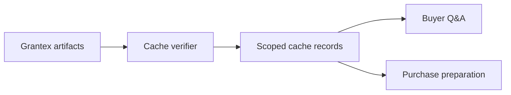

# Artifact Cache Guide

Canonical end-to-end flow: [OACP end-user flow](end-user-flow.md).

AgenticOrg caches Grantex OACP artifacts as public-safe refs scoped by tenant, merchant, seller agent, buyer agent, artifact family, and source refs.

## Cache Inputs

- Grantex artifact envelope and payload.
- Source refs and evidence refs.
- Issued/expires timestamps.
- Freshness summary.
- Risk tier and revocation posture.
- Blocked capabilities.
- `no_checkout_payment_enablement`.

## Cache And Buyer Q&A

## Grantex Unavailable

Valid cached artifacts can support non-binding answers. Stale, revoked, missing, ambiguous, or commitment-bound requests must refresh or refuse.

## Do Not Cache

Raw Shopify payloads, Shopify tokens, provider tokens, card data, bank data, checkout URLs, payment URLs, private merchant payloads, or executable provider targets.
