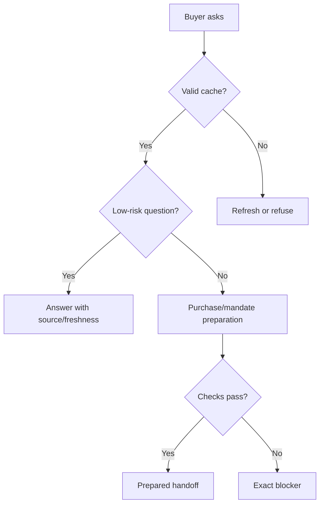

# Buyer Agent Flow Guide

Canonical end-to-end flow: [OACP end-user flow](end-user-flow.md).

Buyer agents answer from cached OACP artifacts. They do not query raw Shopify or provider secrets during buyer Q&A.

## What Buyers Can Ask

- Product discovery and comparison.
- Availability and source/freshness.
- Merchant policy questions from valid artifacts.
- Prepared handoff requests.

## What Must Be Blocked

Paid-state claims, order creation, checkout creation, stock holds, mandate setup, refunds, returns, shipment, and private merchant-system mutation must be blocked unless an approved execution path confirms the result.
