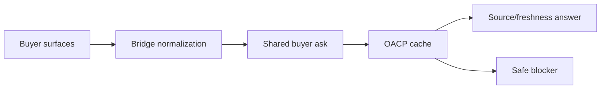

# Buyer-Surface Bridge Guide

Canonical end-to-end flow: [OACP end-user flow](end-user-flow.md).

All buyer surfaces must share the same OACP cache-backed answer path.

| Surface | Runtime path | Current posture |
| --- | --- | --- |
| Web | `/bridges/web/ask` and `/buyer-sessions/ask` | Implemented runtime route. |
| MCP for ChatGPT/Claude-style clients | MCP metadata from protocol adapters | Implemented metadata; client launch needs review. |
| OpenAPI for Gemini/Perplexity-style clients | `/bridges/openapi/schema` and `/bridges/openapi/ask` | Implemented runtime route. |
| A2A agent card | `/bridges/a2a/agent-card` | Implemented metadata route. |
| WhatsApp | `/bridges/whatsapp/webhook` | Requires webhook secret. |
| Telegram | `/bridges/telegram/webhook` | Requires webhook secret. |

## Rule

Channel differences must not create different commerce truth. If one channel is stale or blocked, all channels for the same scope should show the same safe posture.
