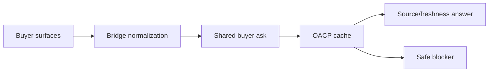

# Buyer-Surface Bridge Guide

Canonical end-to-end flow: [OACP end-user flow](end-user-flow.md).

All buyer surfaces must share the same OACP cache-backed answer path.

| Surface | Runtime path | Current posture |
| --- | --- | --- |
| Web | `/bridges/web/ask` and `/buyer-sessions/ask` | Implemented runtime route. |
| MCP for ChatGPT/Claude-style clients | `agenticorg-mcp-server` with `AGENTICORG_MCP_COMMERCE_ONLY=true` | Implemented restricted seller commerce tools; public client launch needs review. |
| OpenAPI for Gemini/Perplexity-style clients | `/bridges/openapi/schema` and `/bridges/openapi/ask` | Implemented runtime route. |
| A2A agent card | `/bridges/a2a/agent-card` | Implemented metadata route. |
| WhatsApp | `/bridges/whatsapp/webhook` | Requires webhook secret. |
| Telegram | `/bridges/telegram/webhook` | Requires webhook secret. |

## Rule

Channel differences must not create different commerce truth. If one channel is stale or blocked, all channels for the same scope should show the same safe posture.

## MCP Buyer Tool Set

Set `AGENTICORG_MCP_COMMERCE_ONLY=true` for ChatGPT/Claude-style buyer commerce
clients. The server then exposes only:

- `seller.list_products`
- `seller.search_products`
- `seller.get_product_facts`
- `seller.get_offer_snapshot`
- `seller.get_inventory_snapshot`
- `seller.get_mandate_capability`
- `seller.ask_product_question`

These tools read cached OACP artifacts and source/freshness labels. They do not
create checkout sessions, orders, payments, mandates, holds, refunds, returns,
shipments, inventory reservations, or provider/POS execution.

## External Launch Posture

ChatGPT, Claude, Gemini, Perplexity/search, WhatsApp, and Telegram can be
prepared repo-side, but each external surface still needs its own credential,
app review, public listing, webhook, or crawl approval where that platform
requires it. Mark those as ready for submission or blocked by exact setup
requirements until a successful live/sandbox smoke proves otherwise.
