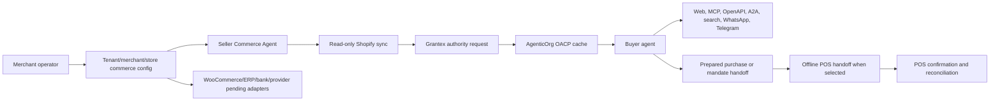

# OACP End-User Flow

This is the canonical AgenticOrg OACP end-to-end flow.

## Flow

1. Merchant saves tenant/merchant/seller scoped commerce config for source connector, buyer channels, provider-owned payment rails, public publishing, and Offline POS metadata.
2. Merchant creates or updates a Seller Commerce Agent.
3. Merchant connects Shopify through AgenticOrg credential custody.
4. AgenticOrg runs read-only sync for products, variants, price, images, status, and inventory.
5. AgenticOrg requests Grantex OACP authority artifacts.
6. AgenticOrg caches signed/internal OACP artifacts with source and freshness labels.
7. Buyer asks through a supported surface.
8. Buyer agent answers from valid cache, refreshes, prepares a non-executing handoff, or refuses.
9. If the buyer wants in-store pickup or payment, AgenticOrg can create a non-executing Offline POS handoff packet from the prepared purchase.
10. POS/provider confirmation intake records `accepted`, `price_changed`, `out_of_stock`, `expired`, `needs_staff_review`, `unsupported`, `payment_pending`, `payment_confirmed`, `payment_failed`, or `receipt_available`.
11. Provider/merchant/POS systems own final payment and order execution. AgenticOrg stores only non-sensitive evidence refs and buyer-safe reconciliation status.

WooCommerce, ERP, PIM, OMS, WMS, custom API, bank-owned rail, fintech rail, and custom provider configs can be saved during this journey. They stay pending-adapter and non-executing until approved adapters, tests, credentials, and rollout approvals exist.

## User Labels

Buyer-facing answers must show source and freshness. Example: `Source: Shopify via Grantex artifact`. If a request asks to purchase, the response must say whether it is a prepared handoff, POS accepted pending staff/payment confirmation, or an exact blocker.

## When Grantex Is Unavailable

If cached artifacts remain valid for a non-binding question, AgenticOrg can continue answering with source/freshness labels. Commitment-bound requests must refresh, prepare no execution, or refuse.

## When Artifacts Are Stale

The runtime must stop commitment-bound behavior and ask for Shopify sync plus Grantex refresh. It must not fall back to raw Shopify payloads, guessed prices, or simulated POS success.
