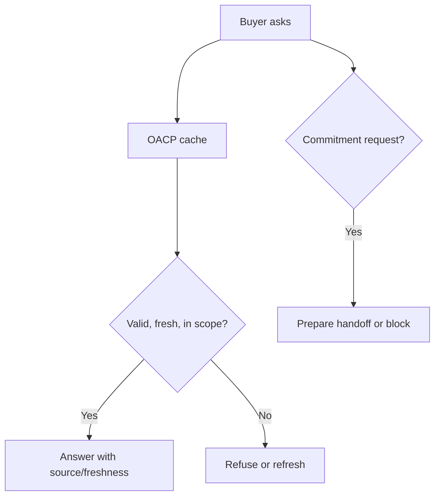

# How Buyer Agents Shop Safely With OACP

Canonical end-to-end flow: [OACP end-user flow](../end-user-flow.md).

Buyer agents shop safely when every answer comes from valid OACP artifacts and every risky action is prepared or refused.

## Can Do

Ask, compare, reason, explain source/freshness, and prepare a non-executing handoff.

## Cannot Do

Invent paid states, create order, create checkout, reserve stock, set up mandate, or call private merchant systems outside approved runtime.
