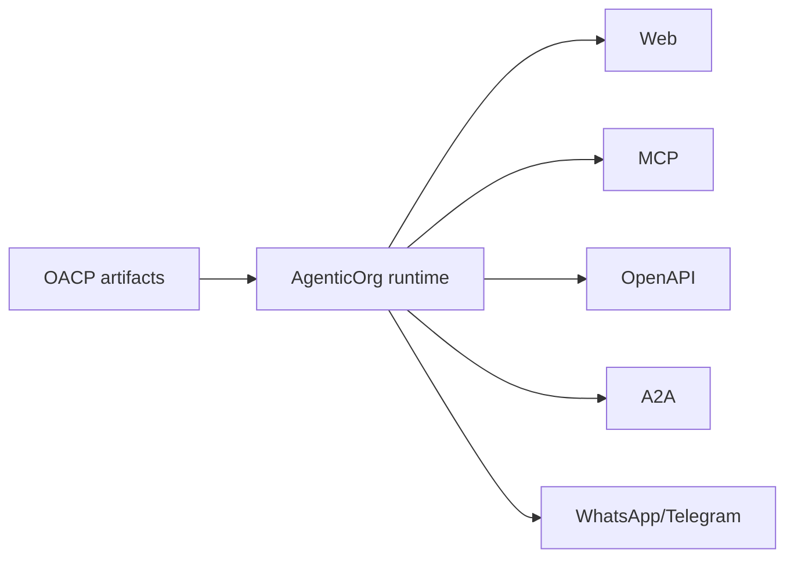

# Build Against OACP Artifacts And Bridges

Canonical end-to-end flow: [OACP end-user flow](../end-user-flow.md).

Developers build against AgenticOrg runtime endpoints and Grantex-authorized artifacts.

## API Surfaces

- `/api/v1/commerce/runtime/buyer-sessions/ask`
- `/api/v1/commerce/runtime/bridges/web/ask`
- `/api/v1/commerce/runtime/bridges/openapi/schema`
- `/api/v1/commerce/runtime/bridges/a2a/agent-card`
- `/api/v1/commerce/runtime/protocol-adapters`
- `/api/v1/commerce/runtime/purchase/prepare`

## Rule

Preserve source and freshness labels. Do not treat adapters as execution authority.
