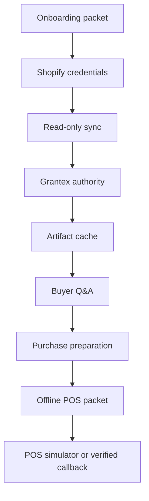

# Launch And Rollback Runbook

Canonical end-to-end flow: [OACP end-user flow](../end-user-flow.md).

## Launch Smoke

## Rollback

1. Disable buyer surfaces for the merchant.
2. Mark affected cache records stale.
3. Stop Shopify sync.
4. Remove Grantex tenant allowlist or rotate service token if needed.
5. Disable POS handoff for the merchant if callback evidence or store metadata is stale.
6. Re-enable only after smoke tests pass.

## POS Smoke

- Create a handoff packet from prepared purchase output.
- Run simulator `accepted` and verify buyer wording still requires staff/payment confirmation.
- Submit unverified `payment_confirmed` and verify it becomes staff review.
- Confirm fake packet ids return safe auth/404 responses, not server errors.
