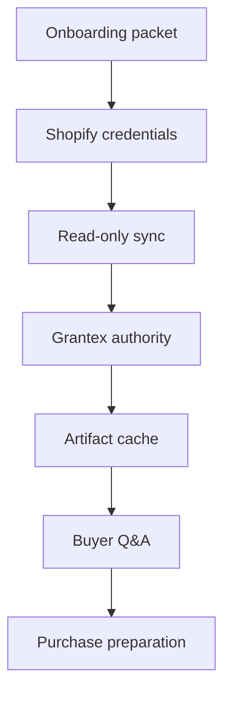

# Launch And Rollback Runbook

Canonical end-to-end flow: [OACP end-user flow](../end-user-flow.md).

## Launch Smoke

## Rollback

1. Disable buyer surfaces for the merchant.
2. Mark affected cache records stale.
3. Stop Shopify sync.
4. Remove Grantex tenant allowlist or rotate service token if needed.
5. Re-enable only after smoke tests pass.
