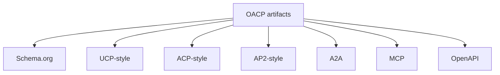

# How OACP Maps To Schema.org, UCP, ACP, AP2, A2A, MCP

Canonical end-to-end flow: [OACP end-user flow](../end-user-flow.md).

OACP is the canonical trust input. Adapter payloads are compatibility mappings for client and partner surfaces.

## Compatibility Vs Official Approval

Compatibility means deterministic field lineage from OACP artifacts. Official approval requires external program evidence and is not claimed by these docs.
