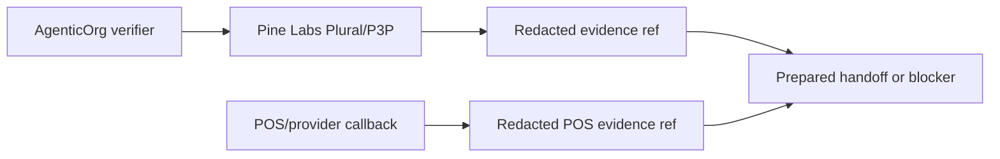

# Provider-Owned Mandate/Payment Evidence In OACP

Canonical end-to-end flow: [OACP end-user flow](../end-user-flow.md).

Pine Labs Plural/P3P owns mandate and payment rail execution. POS/payment providers own in-store payment and receipt confirmation. AgenticOrg verifies capability metadata, accepts verified POS/provider callbacks, and stores redacted evidence refs.

## No Raw Credential Storage

OACP artifacts and cache records must not contain provider tokens, POS secrets, card data, bank data, checkout URLs, payment URLs, raw POS payloads, or raw provider response bodies.

## Offline POS Evidence

Offline POS Bridge evidence is reference-only. `payment_confirmed` and `receipt_available` require verified callback evidence and a non-sensitive provider/POS evidence ref. Simulator confirmations are useful for tests but must not be described as live paid states.
