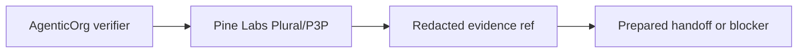

# Provider-Owned Mandate/Payment Evidence In OACP

Canonical end-to-end flow: [OACP end-user flow](../end-user-flow.md).

Pine Labs Plural/P3P owns mandate and payment rail execution. AgenticOrg verifies capability metadata and stores redacted evidence refs.

## No Raw Credential Storage

OACP artifacts and cache records must not contain provider tokens, card data, bank data, checkout URLs, payment URLs, or raw provider response bodies.
