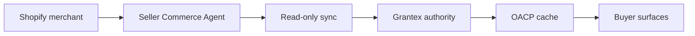

# Move Your Shopify Store To Agentic Commerce

Canonical end-to-end flow: [OACP end-user flow](../end-user-flow.md).

## Steps

1. Create a Seller Commerce Agent.
2. Connect Shopify with read-only Admin API access or approved OAuth.
3. Run read-only sync.
4. Request Grantex OACP artifacts.
5. Cache artifacts in AgenticOrg.
6. Enable buyer surfaces after source labels and blockers pass smoke tests.
7. Route purchase intent to prepared handoff or blocker.

## Requirements

Shopify domain, read-only credential/OAuth install, AgenticOrg tenant, Grantex allowlist, provider capability config when payment/mandate handoff is offered, and channel approvals.

## Timeline

Demo can run after credentials and allowlisting. Public launch requires channel secrets, provider evidence, support owner, rollback owner, and smoke evidence.
