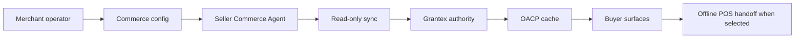

# Move Your Shopify Store To Agentic Commerce

Canonical end-to-end flow: [OACP end-user flow](../end-user-flow.md).

## Steps

1. Save tenant/merchant/seller commerce config in AgenticOrg.
2. Create or update a Seller Commerce Agent.
3. Connect Shopify with read-only Admin API access or approved OAuth.
4. Run read-only sync.
5. Request Grantex OACP artifacts.
6. Cache artifacts in AgenticOrg.
7. Enable public catalog and buyer surfaces after source labels and blockers pass smoke tests.
8. Route purchase intent to prepared provider/POS/merchant handoff or blocker.

## Requirements

Shopify domain, read-only credential/OAuth install, AgenticOrg tenant, merchant commerce config, Grantex allowlist, provider or bank capability config when payment/mandate handoff is offered, POS/store location metadata when in-store handoff is offered, and channel approvals.

WooCommerce, ERP, PIM, OMS, WMS, custom API, bank-owned rail, fintech rail, and custom provider setup can be saved as pending-adapter config. Do not call those runtime-live until their adapters and external approvals exist.

## Timeline

Demo can run after credentials and allowlisting. Public launch requires channel secrets, provider evidence, POS callback approval where applicable, support owner, rollback owner, and smoke evidence.
